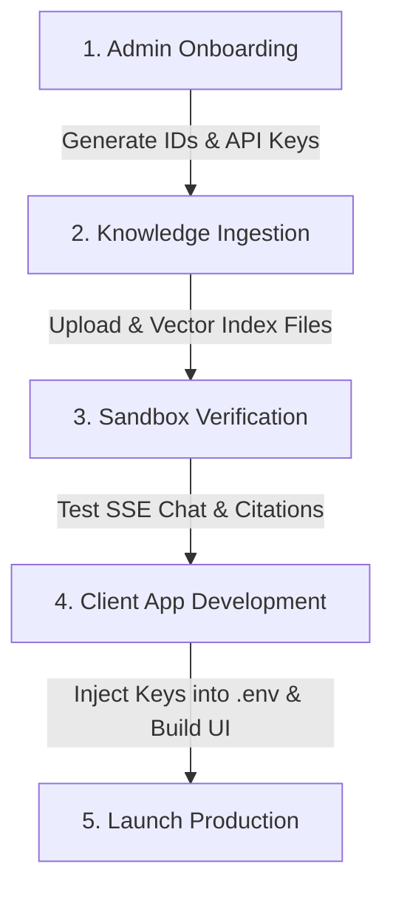

# Client Onboarding & Development Workflow

This document outlines the standard step-by-step workflow for onboarding a new client onto the Retriever Platform and building their custom frontend application.

The platform is deployed at:

| Service | URL |
|---------|-----|
| API (Render) | `https://retriever-gnns.onrender.com` |
| Admin Dashboard | (local: `http://localhost:3001`) |
| Developer Console | (local: `http://localhost:3002`) |
| Client Proxy | `https://retriever-client-proxy.retriever.workers.dev` |



---

## Step 1: Tenant Onboarding (Admin Dashboard)
First, log into the **Admin Dashboard** (`http://localhost:3001` or your production domain) using the `ADMIN_MASTER_KEY` to register the new tenant workspace.

1. Navigate to **Tenants** and click **Create Tenant**.
2. Input the client name (e.g., `acme-hospital`) and select the plan tier.
3. Click **Save**. This will register the tenant and generate a unique `RETRIEVER_TENANT_ID` (UUID).
4. Go to the tenant's profile, navigate to **API Keys**, and click **Generate Key**. Copy the raw key string (`ret_live_...`). This is the `RETRIEVER_API_KEY`.
5. **Billing Strategy Check:**
   - **BYOK (Bring Your Own Key):** Under the tenant settings, input the client's own Gemini or OpenAI API key.
   - **Managed Platform Keys:** If the client wants you to manage billing, leave their key blank and toggle the `allow_platform_key` flag to `True` inside their tenant settings, then set their monthly budget limits.

---

## Step 2: Knowledge Ingestion
Before writing code, upload the client's knowledge base so the search engine has data to retrieve.

1. In the **Admin Dashboard**, select the tenant and navigate to **Documents**.
2. Upload the client's PDFs, text documents, or code files.
3. The background worker will automatically:
   - Slice the documents into text chunks.
   - Call the local Ollama embedding engine (`nomic-embed-text`) or cloud API to calculate vectors.
   - Store the vectors and chunks in Postgres isolated by Row-Level Security.

---

## Step 3: Playground Verification
Use the **Developer Console** (`http://localhost:3002` or your private staging dev console) to run a sanity check on the tenant's data.

1. Open the Developer Console settings panel.
2. Enter the client's `RETRIEVER_TENANT_ID` and their standard `RETRIEVER_API_KEY`.
3. Try asking a few questions in the chat panel related to the files you uploaded in Step 2.
4. Verify that:
   - The response streams back character-by-character.
   - The citations page correctly maps references to source chunks.
   - The citation click popup opens and shows the correct text snippet.

---

## Step 4: Client Frontend Development
Now that the backend is fully configured and the data is verified, you can develop the client's application in its own separate repository.

1. Initialize a new frontend project (e.g. Next.js, React, or mobile application).
2. Install the JavaScript/TypeScript client SDK:
   ```bash
   npm install @prat3010/retriever-client-js
   ```
3. Create a `.env` file in the root of the client project:
   ```env
   NEXT_PUBLIC_RETRIEVER_URL=https://api.your-platform-domain.com
   RETRIEVER_API_KEY=ret_live_client_key_from_step_1
   RETRIEVER_TENANT_ID=uuid_from_step_1
   ```
4. Initialize the SDK in the code:
   ```typescript
   import { RetrieverClient } from "@prat3010/retriever-client-js";

   const client = new RetrieverClient({
     baseUrl: process.env.NEXT_PUBLIC_RETRIEVER_URL!,
     apiKey: process.env.RETRIEVER_API_KEY!,
     tenantId: process.env.RETRIEVER_TENANT_ID!,
   });
   ```
5. Implement your custom UI (chat windows, search lists, citation renderers) by invoking the client methods like `client.chatStream` or `client.search`.
