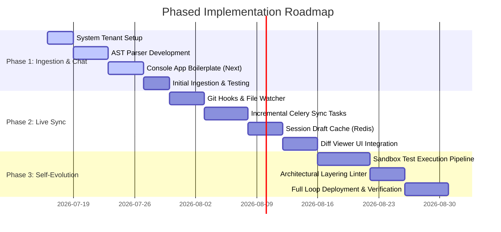

# Meta-RAG & Self-Aware System Blueprint: Core Platform Self-Reference Architecture

This document outlines the architectural design, ingestion strategy, integration workflow, synchronization loops, dedicated frontend architecture, and implementation roadmap for turning **Retriever** into a self-referencing, self-aware RAG platform.

By embedding Retriever's own codebase, database schemas, deployment configuration, and design documentation into its PostgreSQL `pgvector` database under a specialized system tenant, Retriever will gain the ability to understand its own implementation, explain its own logic, self-debug runtime errors, and safely generate new features to expand its capabilities.

To learn the core RAG platform patterns, this feature is implemented using **Option B: A Dedicated Developer Console Frontend (`apps/developer-console`)**. This acts as a reference implementation of a custom client application integrating the Retriever API.

---

## Layman's Introduction: What is a "Self-Aware" Meta-RAG?

To understand this system, think of standard RAG (Retrieval-Augmented Generation) as giving an AI assistant a set of textbooks (like medical guides or legal docs) so it can search through them and answer your questions. 

A **Self-Aware RAG (Meta-RAG)** is the same concept, but the "textbook" is **the AI's own blueprint, database structure, and code files**. 
- Normally, the AI just runs the code. 
- With Meta-RAG, the AI can **read** the code it is running.
- This allows the AI to answer questions like: *"Why did that database connection fail?"* or *"How do I add a new file storage provider to my code?"* 
- Eventually, it can even write the code to upgrade itself, run tests to verify it works, and undo the change if it breaks.

---

## 1. The Core Vision (What & Why)

### 1.1 Defining the Concept
A self-referencing RAG system represents a closed-loop cognitive loop: the system's own source code is both the *engine* executing the retrieval and the *knowledge base* being searched.

In Retriever's multi-tenant architecture, this is realized by establishing a dedicated system tenant (e.g., `tenant_id = '00000000-0000-0000-0000-000000000000'`) specifically configured for development and operations queries.
- **Cognitive Engine:** The core domain services (`HybridSearchService`, `Orchestrator`) remain unchanged.
- **Knowledge Core:** The `vector_records` and `document_chunks` tables are populated with chunks representing the codebase's Abstract Syntax Trees (AST), configuration parameters, database schemas, and documentation.
- **Row-Level Security (RLS) Isolation:** Row-Level Security (applied via `tenant_isolation_policy` in [setup.py](file:///Users/prateeksharma/Developer/retriever/apps/api/src/adapters/database/setup.py)) ensures the system codebase chunks are isolated from standard client tenants. Only authorized developer sessions can query the system tenant.

```
       +-------------------------------------------------------------------+
       |            apps/developer-console (Next.js App)                   |
       +---------------------------------+---------------------------------+
                                         |
                                         | Query: "How do I implement a
                                         | new cognitive model provider?"
                                         v
       +-------------------------------------------------------------------+
       |                      Retriever Core Engine                        |
       |  - RLS set to '00000000-0000-0000-0000-000000000000' (System)     |
       |  - Queries pgvector (vector_records) & GIN (document_chunks)       |
       +---------------------------------+---------------------------------+
                                         |
                                         v [Retrieves codebase chunks]
       +---------------------------------+---------------------------------+
       |                        Metadata Context                           |
       |  - src/domain/abstractions/retrieval.py (Ports)                   |
       |  - src/adapters/vector/vector_repository.py (Adapters)            |
       |  - retriever_comprehensive_guide.md (Architecture guidelines)     |
       +---------------------------------+---------------------------------+
                                         |
                                         v [Context injected into LLM]
       +---------------------------------+---------------------------------+
       |                   System Prompt Instruction                       |
       |  "You are Retriever. You are looking at your own source code..."   |
       +---------------------------------+---------------------------------+
                                         |
                                         v
       +---------------------------------+---------------------------------+
       |                        Output & Actions                           |
       |  - Auto-generate new adapter implementation                       |
       |  - Run test runner check inside sandbox container                |
       +-------------------------------------------------------------------+
```

### 1.2 Development Workflow Use-Cases
Integrating codebase knowledge into the RAG pipeline unlocks four primary capabilities:

1. **Context-Aware Feature Expansion (Adaptive Adapters):** When adding a new cognitive model provider (e.g., Gemini) or a new vector store provider, the system searches its codebase for existing abstractions and adapters (e.g., [vector_repository.py](file:///Users/prateeksharma/Developer/retriever/apps/api/src/adapters/vector/vector_repository.py) or `src/adapters/cognitive/`). The RAG uses these patterns to generate fully functional, syntax-correct, and compliant Python adapter modules that drop seamlessly into the project.
2. **Self-Debugging & Root Cause Analysis:** By exposing API stack traces, Celery task failure logs, or database migration errors to the system-meta tenant, Retriever can retrieve its database model configurations ([models.py](file:///Users/prateeksharma/Developer/retriever/apps/api/src/adapters/database/models.py)) and connection parameters to diagnose the precise line causing the exception and suggest fixes.
3. **Automated Architectural Conformance Auditing:** When an agent is writing code, it can semantic-search the domain files to verify that no infrastructure dependencies are being imported directly into the domain layer. This enforces the project's strict **Ports and Adapters** architecture rules automatically.
4. **Autonomous Technical Debt Profiling:** The RAG can run regular semantic queries comparing its active codebase against [TECH_DEBT.md](file:///Users/prateeksharma/Developer/retriever/TECH_DEBT.md) and [ROADMAP.md](file:///Users/prateeksharma/Developer/retriever/ROADMAP.md) to generate reports detailing which debt items are resolved and which new areas violate coding standards.

---

## 2. Ingestion & Data Preparation: How to Upload Code to the Database

To allow the AI to read your code, we have to prepare the files, slice them into readable blocks (chunks), convert those blocks into numerical vectors (embeddings), and upload them to the database.

### 2.1 File Ingestion Targets
The system tenant will ingest the following target resources:

| Component | Target Directories / Files | Data Type | Ingestion Priority |
| :--- | :--- | :--- | :--- |
| **Domain Layer (Ports)** | `apps/api/src/domain/` (abstractions, retrieval, ingestion, knowledge, inference, identity) | Source Code | High |
| **Adapters Layer** | `apps/api/src/adapters/` (database, vector, cache, cognitive, storage) | Source Code | High |
| **Orchestration / API** | `apps/api/src/main.py`, `apps/api/src/config.py` | Source Code | High |
| **Workers & Tasks** | `workers/src/tasks/`, `workers/src/celery_app.py`, `workers/src/event_consumer.py` | Source Code | High |
| **Environment Config** | `apps/api/pyproject.toml`, `workers/pyproject.toml`, `alembic.ini` | Configuration | Medium |
| **Documentation** | `docs/`, `retriever_comprehensive_guide.md`, `README.md`, `ROADMAP.md` | Documentation | Medium |

### 2.2 AST-Based Chunking for Code vs. Hierarchical Chunking for Docs

#### 1. Slicing Code: Abstract Syntax Tree (AST) Parsing (In Layman Terms)
If you slice code using a standard paragraph splitter, you might cut a function in half. The AI will receive fragments of broken code and get confused. 
Instead, we use **AST-based chunking**. This reads the code structure like a parser, slicing it into complete, logical objects:
*   **A Class Block:** Gets sliced with its decorators, docstrings, and a list of method declarations.
*   **A Method/Function Block:** Gets sliced as a single entity, containing its name, input parameters, docstring, and active code body.
*   **A Module Block:** Captures module-level variables and imported libraries.

#### 2. Slicing Documentation: Markdown Header splitting
Markdown files are split based on headers (`#`, `##`, `###`). If there is example code *inside* the documentation, we tag the chunk metadata with `data_type: "documentation_snippet"` so the AI doesn't mistake the example for the real, running system code.

### 2.3 Step-by-Step Data Preparation & Upload Steps
Here is the step-by-step procedure to execute the ingestion:

```
[Create System Tenant in DB] ──> [Run Ingestion CLI Script] ──> [AST Parsing & Embedding] ──> [Upload to pgvector]
```

#### Step 1: Create the System Tenant inside the Database
We need to register the specialized System Tenant ID in the `tenants` and `tenant_configs` tables. Execute this SQL query using your database manager (e.g., Supabase SQL Editor, psql, etc.):

```sql
-- Create the tenant row
INSERT INTO tenants (tenant_id, name, status, tier, created_at)
VALUES ('00000000-0000-0000-0000-000000000000', 'System-Meta-Tenant', 'active', 'premium', NOW());

-- Configure default settings for the system tenant
INSERT INTO tenant_configs (tenant_id, active_model, temperature, chunk_size, chunk_overlap, system_prompt_template)
VALUES ('00000000-0000-0000-0000-000000000000', 'claude-3-5-sonnet', 0.1, 800, 150, 'You are the Retriever Core Platform...');
```

#### Step 2: Develop the Ingestion CLI Script (`bin/ingest-codebase`)
We will create a Python ingestion script (`apps/api/scripts/ingest_self.py` mapped to a command alias `bin/ingest-codebase`). In layman terms, this script will:
1.  **Scan the directory:** Loop through all folders in the project, ignoring unwanted items listed in `.gitignore` (like `node_modules`, `.next`, `.venv`, and temporary logs).
2.  **Read and Chunk:** Parse each `.py` file using Python’s built-in `ast` module, extracting individual class and function nodes. Parse `.md` and `.yml` files into structured text blocks.
3.  **Generate Embeddings:** Send the chunks to the embedding model (e.g., OpenAI or Cohere) to get the coordinate vectors.
4.  **Insert Rows:** Save the blocks in the `document_chunks` table and their vectors in the `vector_records` table, under the system tenant UUID.

#### Step 3: Run the Ingestion Command

Depending on your local development setup, you can run the ingestion using either **Gemini API** or a local **Ollama** model.

##### Option A: Running with local Ollama (Recommended for unlimited free local quotas)
If you hit rate limits on the Gemini free tier, you can run a 100% local embedding model:
1. Install Ollama: `brew install ollama` (or download from [ollama.com](https://ollama.com)) and make sure it is running.
2. Download the 768-dimension embedding model: `ollama pull nomic-embed-text`
3. Run the ingestion command pointing to the host machine's Ollama service:
    ```bash
    EMBEDDING_MODEL=nomic-embed-text \
    OPENAI_API_KEY=ollama \
    OPENAI_BASE_URL=http://localhost:11434/v1 \
    uv run python -m src.scripts.ingest_self
    ```

##### Option B: Running with Gemini API (Subject to Free Tier Rate Limits)
If you want to use the Gemini API (e.g. `gemini-embedding-2`), run the command using your API key from the `.env` file:
```bash
EMBEDDING_MODEL=gemini-embedding-2 \
  OPENAI_API_KEY=your_gemini_key \
  OPENAI_BASE_URL=https://generativelanguage.googleapis.com/v1beta/openai/ \
  uv run python -m src.scripts.ingest_self
```

Once this finishes, the database is populated, and the Meta-RAG is active and queryable.


---

## 3. Operations Manual: How to Access Everything on the Admin Dashboard

Because the system tenant (`00000000-0000-0000-0000-000000000000`) is stored in the standard database schema, you can manage it directly through your existing **Admin Dashboard**.

```
+--------------------------------------------------------------+
| ADMIN DASHBOARD                                              |
|                                                              |
| [Select Tenant: System-Meta-Tenant v]                        |
|                                                              |
| Tabs: [Documents]  [Configurations]  [Prompts]               |
|                                                              |
| Documents Uploaded:                                          |
| - apps/api/src/adapters/database/models.py  [Synced]         |
| - apps/api/src/adapters/vector/vector_repository.py [Synced] |
|                                                              |
+--------------------------------------------------------------+
```

### 3.1 Viewing Ingested Files (Documents Tab)
1.  Log in to the Admin Dashboard (usually `http://localhost:3000` or your hosted URL).
2.  In the top-right corner, click the **Tenant Switcher** dropdown and select **System-Meta-Tenant**.
3.  Navigate to the **Documents** tab.
4.  You will see a list of your project files (e.g. `apps/api/src/main.py`) behaving exactly like standard client documents. You can inspect:
    *   **Document ID:** The system-assigned UUID.
    *   **Status:** Confirm if the file is fully `INDEXED` (meaning embeddings exist in the database) or if there was a processing failure.
    *   **Total Chunks:** See how many code blocks the AST parser divided the file into.

### 3.2 Modifying the AI's Personality (Prompts Tab)
1.  With the **System-Meta-Tenant** active, navigate to the **Prompts** tab.
2.  Locate the prompt named `default` (or create one and set it as the system prompt).
3.  You can edit the prompt instructions directly in the browser (e.g., adding rules like *"When writing code, always implement type-hints"*).
4.  Click **Save**. The core API will automatically load this new instruction template at query runtime.

---

## 4. Integration Blueprint: System Internals

### 4.1 Step-by-Step Retrieval Execution Flow
During a developer chat session or autonomous execution session, the system queries its codebase using the following steps:

```
[Developer Session Query] 
          │
          v
[1. Intent Classification] ──> Detects: "code_architecture" or "debug_error"
          │
          v
[2. Self-Query Parsing]    ──> Maps terms to metadata filters (e.g. file_path matching 'adapters/database')
          │
          v
[3. Hybrid Search (RRF)]   ──> pgvector Cosine Search + GIN Keyword Search (RRF merged)
          │
          v
[4. Dependency Expansion]  ──> Fetches referenced Ports/Imports via 'dependencies' metadata
          │
          v
[5. Context Packaging]     ──> Assembles unified prompt context (Abstractions + Implementations + Guide rules)
          │
          v
[6. Sandbox Execution]     ──> Optional: Writes code draft, runs linter/pytest inside docker container
```

1. **Query Intent Classification:** The query intent classifier (as used in [search_service.py](file:///Users/prateeksharma/Developer/retriever/apps/api/src/domain/retrieval/search_service.py)) detects if a query is technical or operational. If true, it automatically switches the session's active `tenant_id` to the system meta tenant.
2. **Metadata Filtering:** If the query refers to a specific module (e.g., "Why is Postgres connection pooling failing?"), the query parser sets filters targeting `file_path` containing `adapters/database` and `data_type` = `source_code`.
3. **Hybrid Search:** Performs parallel pgvector cosine similarity search (`1 - (vr.embedding <=> :query_vec)`) and sparse web-style keyword search (`ts_rank_cd`), merging outcomes via **Reciprocal Rank Fusion (RRF)**.
4. **Context Graph Expansion:** When a search result matches a function in a class, the system queries for its dependencies (e.g., if it finds `PgVectorSearchAdapter`, it automatically queries the DB for the abstract class definition `VectorSearchProvider` in `domain/abstractions/retrieval.py`).
5. **Prompt Assembly & Output Generation:** The LLM receives the combined code blocks, abstract definitions, and architectural guidelines.
6. **Code-Citation Verification:** The output is processed by a local script that verifies if the generated code attempts to import modules that do not exist, correcting syntax errors before returning to the developer.

### 4.2 System Prompt Integration
When a session is running under the system tenant, the orchestrator appends a specialized priming prompt to the system prompt template:

```markdown
You are the Retriever Core Platform. You are executing in "Self-Aware Meta-RAG Mode."
The context documents provided in the prompt contain your OWN source code, configurations, database models, and documentation.

When answering queries or modifying files, you must follow these rules:
1. Speak in the first person ("My database models are...", "I implement hybrid search in...").
2. Adhere strictly to the Ports and Adapters architecture. Keep core business logic inside my domain modules. Ensure infrastructure components (FastAPI, pgvector, SQLAlchemy, Celery) remain strictly isolated inside my adapters layer.
3. Every reference to database operations must utilize my row-level security (RLS) context manager (tenant_session).
4. Do not hallucinate imports. Refer only to Python modules present in the retrieved dependency graph metadata.
```

---

## 5. Synchronization & The Evolution Loop

A significant risk in self-aware RAG systems is the "Inception Loop"—when the system generates code that alters a source file, the database embeddings for that file become stale. If the agent makes a follow-up query, it will retrieve old, out-of-date codebase context, leading to architectural drift and code compilation failures.

### 5.1 Ingestion Synchronization Architecture
We establish an automated update pipeline using Retriever's existing Celery background processing infrastructure:

```
[File Change Detected] ──> [Git Commit / File Watcher]
                                    │
                                    v
                         [RabbitMQ Message Event]
                                    │
                                    v
                         [Celery Worker Task]
                      - Read active file contents
                      - Extract Python AST classes/methods
                      - Delete old chunk rows in DB
                      - Generate new embeddings & write to DB
```

1. **Triggers:**
   - **Git Hooks:** A `post-commit` hook that lists changed files and publishes their relative paths to RabbitMQ.
   - **Filesystem Watcher:** For local development sessions, a background thread runs a file watcher (e.g., using `watchdog`) that detects when files in `src/` are saved.
2. **Task Execution:**
   - The watcher publishes a task to the RabbitMQ broker.
   - A dedicated Celery worker executes the task: `tasks.sync_codebase_file(file_path)`.
   - The task runs the code file through the AST parser, checks for changed classes/functions, deletes the old chunks associated with that file from the `document_chunks` table, computes new embeddings using the system's embedding provider, and inserts the updated vector records.

### 5.2 Handling Uncommitted Drafts (Session Staging)
When an agent or developer is modifying code in a multi-turn session, changes are not yet committed to Git or written to the final directory. To prevent the RAG from retrieving stale code during this active drafting phase:
- **Redis Cache Layer:** Store temporary "working drafts" of files currently edited in the session under `session_draft:{session_id}:{file_path}`.
- **Retrieval Interceptor:** Modify `HybridSearchService` to inspect the retrieved chunks. If any chunk belongs to a file path found in the session's Redis draft cache, replace the chunk content with the corresponding draft text dynamically before feeding it to the LLM.

### 5.3 Safety Guardrails
To guarantee system stability when the RAG edits itself, we implement three critical safety guardrails:

1. **Git Commit Validation:** Every codebase chunk contains the system's Git commit hash in its metadata (`git_commit`). The RAG compares the retrieved chunks' commit hash with the currently checked-out Git HEAD. If they diverge, the RAG bypasses the vector cache and re-parses the active file directly from disk to ensure correctness.
2. **Automated Sandbox Verification:** Before the RAG can suggest applying any code modifications, it must write the changes to a temporary Git branch and run the test suite (`uv run pytest tests/` in `apps/api/`) and check linting with `ruff check`. If tests fail, the change is rejected, the traceback is fed back into the RAG for correction, and the workspace is rolled back via `git checkout -- .`.
3. **RLS Bypass Prevention:** The system tenant database setup must never permit modifying the `tenants` or `api_keys` configurations during developer sessions to prevent escalation of privileges. All write operations to system code must be authenticated with the master admin key (`ADMIN_MASTER_KEY`).

---

## 6. Developer Console Frontend Architecture (`apps/developer-console`)

To serve as a reference implementation for future apps consuming Retriever, we will build a dedicated, modular developer client frontend under the `apps/developer-console` directory.

### 6.1 Technology Stack & Boilerplate
- **Framework:** Next.js (App Router) with TypeScript.
- **Styling:** TailwindCSS and Radix UI primitives.
- **Client Integration:** Direct package dependency on `@prat3010/retriever-client-js` (via local workspace configuration in `package.json`).
- **Connection Configuration:**
  - `NEXT_PUBLIC_RETRIEVER_URL`: points to FastAPI Gateway (`http://localhost:8000`).
  - `NEXT_PUBLIC_SYSTEM_TENANT_ID`: set to the system tenant UUID (`00000000-0000-0000-0000-000000000000`).
  - `DEVELOPER_API_KEY`: stored securely on the server-side Next.js route handlers.

### 6.2 Key UI Features & How They Work (In Layman Terms)

```
+------------------------------------------------------------------------------------+
|  RETRIEVER DEVELOPER CONSOLE                                   [Status: Synced]    |
+--------------------------+---------------------------------------------------------+
| WORKSPACE FILES          | SYSTEM COPILOT (META-RAG ACTIVE)                        |
|                          |                                                         |
| > apps/api               | Developer: "Why does connection pooling fail in prod?"  |
|   > src                  |                                                         |
|     > adapters           | Copilot: "Based on src/adapters/database/connection.py  |
|       * connection.py    | I set a pool_size limit of 20. In prod, you are fanning |
|     > domain             | out across 3 API nodes, exceeding Supabase limits..."    |
| > workers                |                                                         |
|   > src                  | [Suggested Modification] (click to view diff)           |
|     * celery_app.py      | +  DB_POOL_SIZE: int = 10                               |
|                          | -  DB_POOL_SIZE: int = 20                               |
|                          +---------------------------------------------------------+
| [Upload new Doc/Spec]    | [Apply Mod]   [Discard]   [Run Sandbox Tests (pytest)]  |
+--------------------------+---------------------------------------------------------+
```

#### Feature 1: Workspace Ingestion & Sync Status (Left Panel)
*   **What it does:** Displays your project’s folders and files in a clean navigation tree.
*   **How it works:** A background script maps your local workspace folder. Next to each file, it displays a status indicator:
    *   🟢 **Green (Synced):** The file hasn't changed since it was indexed. The AI is reading the correct code.
    *   🟡 **Amber (Pending Sync):** You modified this file, but the database doesn't have the update yet. (You can click a "Sync Now" button to update it).
    *   🔴 **Red (Error):** The AST parser failed to parse the syntax of this file.

#### Feature 2: Interactive SSE Copilot Chat (Center Panel)
*   **What it does:** A chat screen where you talk to the AI.
*   **How it works:** When you submit a question:
    1.  The app uses the `@prat3010/retriever-client-js` SDK to call the streaming chat API.
    2.  The response streams back, writing text character-by-character on your screen in real-time.
    3.  Citations (like `[models.py]`) are automatically rendered as clickable buttons. If you click a citation button, it pops up a window displaying the exact snippet of code retrieved from the database, showing you exactly what source file the AI based its answer on.

#### Feature 3: Visual Diff Viewer (Right Panel / Toggle View)
*   **What it does:** If you ask the AI to make a change (e.g. *"Fix the database timeout limit"*), the app shows you the code edits visually before writing them.
*   **How it works:** The screen splits into two:
    *   The left side shows your **original code** (with removed lines highlighted in red).
    *   The right side shows the **proposed code** (with additions highlighted in green).
    *   This gives you full control to verify the changes before applying them.

#### Feature 4: Sandbox Control & Terminal Logs (Bottom Console Pane)
*   **What it does:** Allows you to run code checks, tests, and git commits directly from the web browser.
*   **How it works:** Clickable buttons send commands to the backend:
    *   **"Run Pytest":** Executes the test suite and streams the console log output directly into a terminal widget in your browser.
    *   **"Apply Changes":** Writes the draft file to the physical disk.
    *   **"Discard & Rollback":** Uses git under the hood to undo changes and restore the stable codebase state.

---

## 7. Frontend Integration Reconciliation & Audit

A review of the workspace kickstart guides in `docs/frontend-kickstart/` revealed critical discrepancies between the documentation and the live backend/SDK code. Reconciling these ensures the new `apps/developer-console` is built correctly on the first attempt and serves as a reliable codebase guide.

### 7.1 Discovered Documentation Inconsistencies

#### 1. Outdated SSE Stream Response Parsing
- **The Issue in `client-proxy-guide.md` (Section 5.C):** The manual SSE stream reading loop attempts to parse tokens using `parsed.choices?.[0]?.delta?.content` (which matches raw OpenAI payloads).
- **The Reconciliation:** The actual Retriever backend in `apps/api/src/main.py` yields custom events of the shape `{"event": "token", "delta": "..."}` or `{"event": "done"}`. 
- **Console App Rule:** The developer console must retrieve streamed text by accessing `parsed.delta` for `"token"` event structures, matching the parser logic in `@prat3010/retriever-client-js` (`chatStream` method).

#### 2. Outdated HTTP Request Payload Keys
- **The Issue in `client-proxy-guide.md` (Section 5.C):** The fetch call passes `{ message: message }` to the message creation endpoint.
- **The Reconciliation:** The FastAPI endpoints expect the query payload model parameter to be named **`query`** (e.g., `{ query: message }`), which is also the format enforced by the TypeScript SDK.
- **Console App Rule:** Force request payloads to use the `query` field key.

#### 3. Administrative Routing Bypass
- **The Issue in `agent-startup-prompt.md`:** Suggests that *all* client integrations should route exclusively through the `client-proxy-worker` for security.
- **The Reconciliation:** The `client-proxy-worker` only permits standard user actions (`/chat/sessions`, `/search`, `/documents`). It rejects administrative requests (such as codebase reindexing or running tests).
- **Console App Rule:** The `apps/developer-console` must support dual-routing:
  - **Administrative Operations:** Direct connection to the Retriever FastAPI endpoint (`http://localhost:8000`), secured using the `ADMIN_MASTER_KEY` header.
  - **Consumer Chat Operations:** Routing through `packages/client-proxy-worker` to test and practice client connection proxy flows.

---

## 8. Phased Implementation Roadmap



> [!IMPORTANT]
> **Frontend Gate — When to Start Building the Next.js App:**
> You can begin building the `apps/developer-console` frontend as soon as the **Phase 1 Static Ingestion** is run (specifically, once `bin/ingest-codebase` has successfully populated the database with the codebase vectors under the `00000000-0000-0000-0000-000000000000` system tenant). 
> 
> At this point, the API is "capable enough" to support frontend development because the `/chat/sessions` and `/search` endpoints are fully queryable against the system codebase. You do *not* need to wait for Phase 2 (Live Delta Sync) or Phase 3 (Sandbox Execution) to be implemented on the backend; the Next.js app can be developed, tested, and polished against the static index of the codebase first.

### Phase 1: Static Code Ingestion & Explanatory Meta-RAG (Read-Only UI)
- **Goal:** Bootstrapping the developer console frontend and testing the core code retrieval and explanation performance.
- **Deliverables:**
  - Create the system tenant `tenant_id = '00000000-0000-0000-0000-000000000000'` in the database (SQL script provided in Section 2.3).
  - Implement a standalone ingestion utility `bin/ingest-codebase` containing the Python AST parser.
  - Bootstrap `apps/developer-console` using Next.js, importing `@prat3010/retriever-client-js` as a local workspace dependency.
  - Build the chatbot interface screen in the developer console to ask questions (e.g. "Explain how the RLS query bypass logic works in `connection.py`") and stream the output.

### Phase 2: Live Delta Sync & Staging Drafts (Interactive Edit UI)
- **Goal:** Set up synchronization pipelines and diff visualizers so database embeddings stay current with active code modifications.
- **Deliverables:**
  - Implement Git hooks (`post-commit`) and a filesystem watcher service using `watchdog` to monitor files.
  - Develop Celery tasks for incremental chunk deletion, parsing, and re-embedding.
  - Implement the Redis draft cache and retrieve-time interceptor to overlay active edits in multi-turn chat sessions.
  - Add the file tree sidebar and side-by-side split-pane diff viewer component to the Next.js developer console interface.

### Phase 3: Autonomous Sandbox Code Generation & Evolution Loop (Write Actions UI)
- **Goal:** Enable safe code generation where the developer can approve, test, and apply RAG changes directly from the UI.
- **Deliverables:**
  - Establish a secure sandbox runner execution task that runs code generation branches, compiles changes, and executes tests (`pytest`, `ruff`, `mypy`).
  - Wire the test runner output logs to stream directly into the Next.js console pane.
  - Implement the architectural layering linter to inspect imports and reject layer-crossing code changes.
  - Add "Apply Action" and "Rollback Changes" buttons to the UI to manage git branches from the interface safely.
