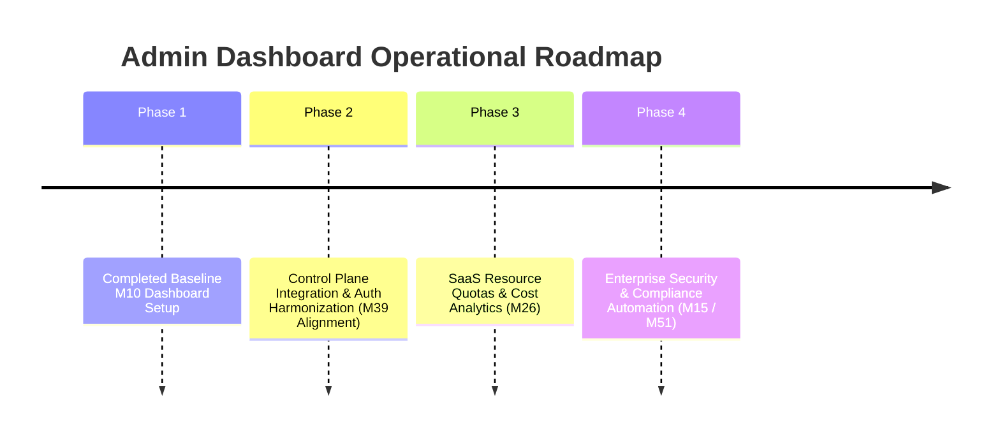

# Admin Dashboard Architecture & Operational Roadmap
**System:** Retriever RAG Engine — Control Panel (`apps/web`)  
**Deployment URL:** `https://admin.rag.prateeq.in`  
**Target Audience:** Platform Administrator (Prateek Sharma)  
**Cross-Reference:** Linked directly with the **[Client Dashboard & SaaS Studio Ecosystem Roadmap](../../Prateek_website/docs/CLIENT_DASHBOARD_ROADMAP.md)** in `Prateek_website`.

---

## 1. Executive Overview & Strategic Purpose

The **Admin Dashboard** (`apps/web` in the `retriever` repository) is a dedicated Next.js 16 web application engineered to serve as the **Single Operational Helm** for managing the global multi-tenant infrastructure, configuration, and security bounds of the Retriever platform.

### Strategic Boundaries
* **Decoupled Control Panel:** The Admin Dashboard is restricted to platform administrators. End-user clients and RAG subscribers never access this dashboard; they interact exclusively through the **Client SaaS Studio** (`prateeq.in/rag/app`) and **Client Workspace** (`prateeq.in/dashboard`).
* **Root System Oversight:** Operating with administrative master privileges, the dashboard can monitor, configure, suspend, or provision any customer workspace across the entire platform.

---

## 2. Cross-Repository Integration Contract

```
┌────────────────────────────────────────────────────────────────────────────────────────┐
│ CONTROL PLANE: Prateek_website (prateeq.in) on Vercel                                 │
│ ┌───────────────────────────┐   ┌─────────────────────────┐   ┌─────────────────────┐  │
│ │ Supabase Auth             │   │ Razorpay Subscriptions  │   │ Supabase DB         │  │
│ │ (Google OAuth / Session)  │   │ (Starter / Growth / Ent)│   │ rag_tenants/members │  │
│ └─────────────┬─────────────┘   └────────────┬────────────┘   └──────────┬──────────┘  │
└───────────────┼──────────────────────────────┼───────────────────────────┼─────────────┘
                │                              │                           │
                │ Webhook Tenant Provisioning  │ Administrative Sync       │
                ▼                              ▼                           ▼
┌────────────────────────────────────────────────────────────────────────────────────────┐
│ RESOURCE SERVER & ADMIN GATEWAY: retriever (rag.prateeq.in) on Oracle VPS              │
│ ┌───────────────────────────────────────────────────────────────────────────────────┐  │
│ │ FastAPI Admin Gateway (apps/api/src/routers/admin.py)                             │  │
│ │ • Security Header: X-Admin-Master-Key                                             │  │
│ │ • Execution Context: app.bypass_rls = 'true' (Bypasses PostgreSQL RLS)            │  │
│ └─────────────────────────────────────┬─────────────────────────────────────────────┘  │
│                                       ▼                                                │
│ ┌───────────────────────────────────────────────────────────────────────────────────┐  │
│ │ Admin Dashboard UI (apps/web) ──► admin.rag.prateeq.in                            │  │
│ │ • KPI Metrics, 4-Step Onboard, 8-Tab Tenant Cockpit, GraphRAG, AI Config, Logs    │  │
│ └───────────────────────────────────────────────────────────────────────────────────┘  │
└────────────────────────────────────────────────────────────────────────────────────────┘
```

### Authorization & Security Model
1. **Master Secret Header:** All requests from the Admin UI include the HTTP header:
   ```http
   X-Admin-Master-Key: <ADMIN_MASTER_KEY>
   ```
2. **RLS Bypass Context:** The backend FastAPI gateway catches this header via [`verify_admin_key`](../apps/api/src/adapters/api/security.py#L233) and sets `app.bypass_rls = 'true'` on the database session context. This grants root visibility across all tenant boundaries in `TenantDb`, `UserDb`, `ApiKeyDb`, and `DocumentDb`.
3. **Control Plane Provisioning Webhook:** When a client purchases a subscription on `prateeq.in`, `prateeq.in`'s server-side Razorpay webhook handler calls `POST /v1/admin/tenants` using the `X-Admin-Master-Key` to automatically bootstrap the tenant in `retriever`.

---

## 3. Core Feature Directory & System Capabilities

The Admin Dashboard provides **100% administrative control** through 7 main route sections:

### 1. 🚪 `/login` — System Authentication Gate
* **Inputs:** Admin Master Key (Password Input).
* **Behavior:** Validates key against backend `GET /v1/admin/verify-key`. Stores token in `sessionStorage` and redirects to overview.

### 2. 📊 `/` — Platform Operational Overview
* **KPI Metrics Cards:** Real-time totals for **Active Tenants**, **Indexed Document Chunks**, **Total Vector Records**, and **Generated API Keys**.
* **System Infrastructure Health:** Live ping monitors checking PostgreSQL connection pools, Redis cache status, and Celery worker health via `/health/readiness`.

### 3. 🚀 `/onboard` — 4-Step Guided Client Onboarding Wizard
* **Step 1: Workspace Profile:** Input business name and select tier (`standard`, `premium`, `enterprise`).
* **Step 2: Generate API Key:** Create initial client key with custom label and scope (`client` vs `admin`).
* **Step 3: Register Root User:** Create primary user (`display_name`, `external_id`).
* **Step 4: Credentials Summary:** Pre-filled `curl` commands and copyable credentials (`apiUrl`, `tenantId`, `userId`, `apiKey`).

### 4. 🏢 `/tenants` — Platform Tenant Directory
* Live searchable table of all customer workspaces with status indicators (`active`, `suspended`, `pending`).

### 5. 🔍 `/tenants/[id]` — 12-Tab Tenant Control Cockpit
* **Tab 1: Overview:** Workspace UUID, tier, creation date, and **Instant Kill-Switch** buttons (**Suspend Workspace** / **Re-activate**). Suspending instantly blocks all API requests for that tenant.
* **Tab 2: Documents:** Raw file grid with processing status (`PENDING`, `INDEXED`, `FAILED`), file upload, delete, and **Dual Target Engine Embedding**:
  * **⚡ Laptop Button:** Runs parsing & vector embedding on your local laptop via Ollama (`http://localhost:11434`), fetching file bytes from Oracle VM to preserve low VPS RAM.
  * **☁️ Cloud Button:** Runs embedding directly on the Oracle Cloud VPS.
* **Tab 3: Users:** List, register, edit roles (`admin`, `developer`, `client`), or deactivate tenant user profiles.
* **Tab 4: API Keys:** Issue new token pairs, inspect key prefixes (`ret_live_...`), and instantly revoke key hashes.
* **Tab 5: System Prompts:** Custom system prompt editor (e.g., *"You are an expert contract lawyer..."*), variable substitution, and preview mode without incurring LLM cost.
* **Tab 6: Sandbox:** Interactive administrative RAG chat window to test tenant vector indexes in real-time.
* **Tab 7: Knowledge Graph (GraphRAG):** Hardware capabilities banner (`oracle_vm_lean` vs `macbook`), storage engine toggle (PostgreSQL SQL vs Neo4j Cypher), multi-hop entity graph inspector (1–5 hops), and triple deletion.
* **Tab 8: Configuration:** Provider selector (12 AI Providers), `top_k`, reranking thresholds, OCR toggles, Safety Guardrails (Llama Guard 3 policy toggle & block log), Multi-Agent Consensus rounds, RLM REPL sandbox limits, and Context Compression sliders.
* **Tab 9: Hallucinations & Quality (M50):** Real-time Faithfulness & Context Relevance analytics cockpit, unfaithful response log table with diff inspector, and min-faithfulness threshold slider.
* **Tab 10: Compliance & Sovereignty (M51):** PII anonymization rule toggles, One-Click GDPR Hard Purge trigger button, Data Retention SLA scheduler, and PII audit log.
* **Tab 11: Billing & Payment Ledger (M52):** Commercial transaction ledger table (Stripe/Razorpay/PhonePe), active quota allocation meters, and manual deposit Checkout Link Generator.
* **Tab 12: n8n & Workflow Automation (M53):** Outbound n8n Webhook URL configuration, Test Webhook Ping trigger, copyable n8n OpenAPI spec JSON, and inbound webhook log viewer.

### 6. 🛠️ `/settings` — Global Default Configuration Editor
* Set platform-wide defaults for LLM models, embedding dimensions (768, 1536, 3072), default vector distance metrics (Cosine/Euclidean), and default security policies.

### 7. 📝 `/audit-log` — Immutable Security Audit Log
* Append-only compliance log tracking API key creation, tenant suspension/reactivation, document deletion, and configuration overrides across all tenants.

---

## 4. Operational Roadmap & Development Phases



### Phase 1: Completed Baseline Dashboard (Current State - M10)
- ✅ Next.js 16 scaffold with shadcn/ui, Tailwind v4, TanStack Query, and Zustand.
- ✅ Full implementation of all 7 routes and 8 tenant cockpit tabs.
- ✅ Dual Target Engine embedding integration (Laptop local Ollama vs Cloud VPS).
- ✅ Knowledge Graph (GraphRAG) tab with Neo4j/Postgres engine toggles.

### Phase 2: Control Plane Integration & Auth Harmonization (M39 Alignment)
- **Deprecate Independent Auth:** Remove standalone Google login from `/v1/auth/google` in `retriever`.
- **Supabase OIDC/JWKS Verification:** Configure FastAPI security middleware to validate Supabase Auth RS256 JWTs using public keys from `https://<project-ref>.supabase.co/auth/v1/.well-known/jwks.json`.
- **Control Plane Provisioning Webhook Receiver:** Ensure `POST /v1/admin/tenants` handles automated provisioning calls triggered by Razorpay subscription webhooks from `prateeq.in`.

### Phase 3: SaaS Resource Quotas & Cost Analytics (M26)
- **Resource Limits UI:** Add quota management controls in the Tenant Config tab (`max_storage_mb`, `max_documents`, `monthly_token_budget`).
- **Real-Time Token & Cost Breakdown:** Visual graphs displaying input/output token usage per tenant, monthly spend calculations (`cost_usd`), and semantic cache hit rates.
- **Quota Exceeded Hook Controls:** Configure tenant behavior upon reaching 100% quota (return `HTTP 402 Payment Required` vs auto-overage billing).

### Phase 4: Enterprise Security & Compliance Automation (M15 / M51)
- **GDPR Vector Purge Scheduler:** One-click hard delete cascade removing tenant documents across PostgreSQL, vector indexes, Redis semantic cache, and local storage.
- **Immutable Audit Trail Verification:** Cryptographic hash-chain verification for audit log entries.
- **SOC 2 Evidence Package Exporter:** Export system security posture and compliance audit logs as a downloadable ZIP package.

### Phase 5: 2026 World-Class RAG Controls (M54–M60 Alignment)
- **Contextual Retrieval Ingestion Controls (M56):** UI toggles for async Contextual Pre-Chunking headers during document upload.
- **ColBERT Late-Interaction Engine Selector (M57):** Admin selector for Token-Level MaxSim Reranker (Local TEI container vs. Cloud API).
- **Corrective RAG (CRAG) Threshold Configurator (M58):** Confidence score slider for triggering auto-query rewriting and web search fallbacks.
- **Closed-Loop Telemetry Cockpit (M60):** Real-time dashboard panel mapping M50 faithfulness scores directly to automated retrieval parameter auto-tuning (`top_k`, `reranking_threshold`, `rrf_k`).

---

## 5. Admin API Reference Table

| Endpoint | Method | Security | Purpose |
| :--- | :--- | :--- | :--- |
| `/v1/admin/verify-key` | `GET` | `X-Admin-Master-Key` | Validate admin password credential |
| `/v1/admin/tenants` | `GET` / `POST` | `X-Admin-Master-Key` | List all tenants / Provision new customer tenant |
| `/v1/admin/tenants/{id}` | `GET` / `PUT` | `X-Admin-Master-Key` | Fetch tenant details / Update tenant status or tier |
| `/v1/admin/tenants/{id}/users` | `GET` / `POST` | `X-Admin-Master-Key` | List / Register users within a tenant workspace |
| `/v1/admin/tenants/{id}/api-keys` | `GET` / `POST` | `X-Admin-Master-Key` | List / Generate tenant client API keys |
| `/v1/admin/tenants/{id}/documents` | `GET` / `POST` | `X-Admin-Master-Key` | List / Upload raw documents for tenant |
| `/v1/admin/tenants/{id}/documents/{docId}/process` | `POST` | `X-Admin-Master-Key` | Trigger vector embedding (`?targetEngine=laptop\|oracle`) |
| `/v1/admin/tenants/{id}/prompts` | `GET` / `POST` | `X-Admin-Master-Key` | List / Create tenant system prompt templates |
| `/v1/admin/tenants/{id}/config` | `GET` / `PUT` | `X-Admin-Master-Key` | Fetch / Update tenant LLM settings, rates & quotas |
| `/v1/admin/tenants/{id}/graph` | `GET` / `POST` | `X-Admin-Master-Key` | Query GraphRAG entities & triples / Toggle storage engine |
| `/v1/admin/audit-log` | `GET` | `X-Admin-Master-Key` | Retrieve system compliance mutation logs |

---
*Refer to `Prateek_website/docs/CLIENT_DASHBOARD_ROADMAP.md` for the corresponding Client Dashboard & SaaS Studio specifications.*

---

## **Related Architecture & Cross-References**

- [Admin Dashboard User Guide](ADMIN_DASHBOARD_GUIDE.md)
- [Client Dashboard Specification](../../Prateek_website/docs/CLIENT_DASHBOARD_ROADMAP.md)
- [Retriever Backend Roadmap](../ROADMAP.md)
- [Unified Master Roadmap (SSoT)](../../Prateek_website/docs/UNIFIED_MASTER_ROADMAP.md)
