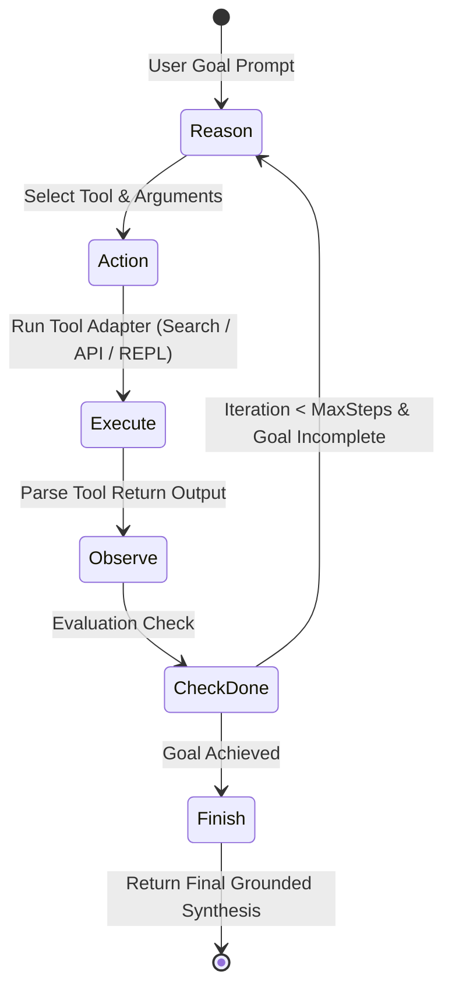

# API Specification: Autonomous Tool Execution & Agentic ReAct Loops (`/v1/agentic`)

#api #agentic #react #tools #reasoning #retriever

> **Authoritative specification for multi-step autonomous tool-calling execution loops, dynamic tool reflection, and structured plan generation.**

---

## 1. Agentic ReAct Architecture



---

## 2. API Endpoints

### 2.1 Execute Agentic Goal

- **HTTP Method:** `POST`
- **Path:** `/v1/tenants/{tenantId}/agentic/execute`
- **Authentication:** `Bearer <TOKEN>`
- **Request Body:**
```json
{
  "goal": "Find all cloud services mentioned in Q2 roadmap and calculate total projected monthly infrastructure cost.",
  "maxSteps": 5,
  "allowedTools": ["hybrid_search", "python_repl_calc", "graph_query"],
  "temperature": 0.1
}
```

#### Response Schema (`200 OK`)
```json
{
  "status": "completed",
  "totalSteps": 3,
  "steps": [
    {
      "stepNumber": 1,
      "thought": "I need to search for cloud services in the Q2 roadmap document.",
      "toolUsed": "hybrid_search",
      "toolInput": {"query": "cloud infrastructure services Q2 roadmap"},
      "observation": "Found AWS RDS ($450/mo), Cloudflare Enterprise ($200/mo), Vercel Pro ($40/mo)."
    },
    {
      "stepNumber": 2,
      "thought": "I will calculate the sum of 450 + 200 + 40 using the Python REPL.",
      "toolUsed": "python_repl_calc",
      "toolInput": {"code": "print(450 + 200 + 40)"},
      "observation": "690\n"
    }
  ],
  "finalAnswer": "The Q2 roadmap includes AWS RDS ($450), Cloudflare Enterprise ($200), and Vercel Pro ($40). The total projected monthly infrastructure cost is $690/month.",
  "totalDurationMs": 1840
}
```

---

## 🔗 Related Architecture & Cross-References
- [Agentic Workflows & REPL Deep-Dive](../cognitive/agentic_workflows_and_repl.md)
- [RLM & Python REPL Specification](rlm.md)
- [Hybrid Search Specification](search.md)
