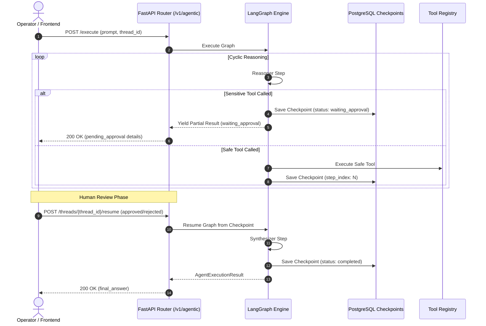

# API Specification: LangGraph Multi-Agent Workflows & Cognitive Orchestration (`/v1/tenants/{tenantId}/agentic`)

#api #agentic #langgraph #checkpoints #hitl #timetravel #retriever

> **Authoritative specification for stateful cyclic computation graphs, human-in-the-loop (HITL) approval gateways, PostgreSQL checkpoint persistence, and time-travel rollback APIs in Retriever.**

---

## 1. Architecture & Execution Flow



---

## 2. API Endpoints

All endpoints are scoped by `tenant_id` and require `X-Admin-Master-Key` header authentication.

### 2.1 Execute Agent Workflow
- **HTTP Method:** `POST`
- **Path:** `/v1/tenants/{tenantId}/agentic/execute`
- **Request Body:**
```json
{
  "tenant_id": "tn_demo_enterprise",
  "prompt": "Calculate 18% GST on $4500 and search our refund terms",
  "thread_id": "thr_optional_uuid",
  "max_steps": 6,
  "allowed_tools": ["calculator", "hybrid_search", "document_reader"]
}
```

#### Response: Completed Execution (`200 OK`)
```json
{
  "thread_id": "thr_e5d129a0",
  "status": "completed",
  "steps": [
    {
      "step_number": 1,
      "thought": "I will calculate 18% GST on 4500.",
      "tool_used": "calculator",
      "tool_input": {"expression": "4500 * 0.18"},
      "observation": "810.0"
    }
  ],
  "final_answer": "18% GST on $4,500 is $810.00.",
  "pending_approval": null,
  "checkpoint_id": "chk_c9a184b2",
  "total_steps": 1,
  "total_duration_ms": 1240
}
```

#### Response: Suspended for HITL Approval (`200 OK`)
```json
{
  "thread_id": "thr_e5d129a0",
  "status": "waiting_approval",
  "steps": [
    {
      "step_number": 1,
      "thought": "User wants to revoke an API key.",
      "tool_used": "api_key_revoke",
      "tool_input": {"key_id": "key_prod_99"},
      "observation": "PAUSED: Action requires operator confirmation."
    }
  ],
  "final_answer": null,
  "pending_approval": {
    "action_id": "act_88b17c09",
    "tool_name": "api_key_revoke",
    "tool_args": {"key_id": "key_prod_99"},
    "risk_level": "critical",
    "description": "Revoke API key: key_prod_99"
  },
  "checkpoint_id": "chk_88b17c09",
  "total_steps": 1,
  "total_duration_ms": 650
}
```

---

### 2.2 Resume Suspended Thread (HITL Gate)
- **HTTP Method:** `POST`
- **Path:** `/v1/tenants/{tenantId}/agentic/threads/{threadId}/resume`
- **Request Body:**
```json
{
  "tenant_id": "tn_demo_enterprise",
  "thread_id": "thr_e5d129a0",
  "action_id": "act_88b17c09",
  "decision": "approved",
  "feedback": "Approved by security team.",
  "modified_args": null
}
```

#### Response Schema (`200 OK`)
Returns updated `AgentExecutionResult` containing either the final completed synthesis or the next pending HITL checkpoint.

---

### 2.3 Inspect Thread Checkpoint History
- **HTTP Method:** `GET`
- **Path:** `/v1/tenants/{tenantId}/agentic/threads/{threadId}/history`

#### Response Schema (`200 OK`)
```json
{
  "thread_id": "thr_e5d129a0",
  "tenant_id": "tn_demo_enterprise",
  "checkpoints": [
    {
      "checkpoint_id": "chk_01",
      "thread_id": "thr_e5d129a0",
      "tenant_id": "tn_demo_enterprise",
      "node_name": "reasoner",
      "step_index": 0,
      "state_snapshot": {"status": "running", "iterations": 0},
      "created_at": "2026-09-04T10:00:00Z"
    },
    {
      "checkpoint_id": "chk_02",
      "thread_id": "thr_e5d129a0",
      "tenant_id": "tn_demo_enterprise",
      "node_name": "tool_executor",
      "step_index": 1,
      "state_snapshot": {"status": "running", "iterations": 1},
      "created_at": "2026-09-04T10:00:02Z"
    }
  ],
  "total_checkpoints": 2
}
```

---

### 2.4 Rollback Thread to Previous Checkpoint
- **HTTP Method:** `POST`
- **Path:** `/v1/tenants/{tenantId}/agentic/threads/{threadId}/rollback`
- **Request Body:**
```json
{
  "tenant_id": "tn_demo_enterprise",
  "thread_id": "thr_e5d129a0",
  "target_checkpoint_id": "chk_01",
  "fork": false
}
```

#### Response Schema (`200 OK`)
```json
{
  "checkpoint_id": "chk_01",
  "thread_id": "thr_e5d129a0",
  "tenant_id": "tn_demo_enterprise",
  "node_name": "reasoner",
  "step_index": 0,
  "state_snapshot": {"status": "running", "iterations": 0},
  "created_at": "2026-09-04T10:00:00Z"
}
```

---

### 2.5 List Registered Tools
- **HTTP Method:** `GET`
- **Path:** `/v1/tenants/{tenantId}/agentic/tools`

#### Response Schema (`200 OK`)
```json
[
  {
    "name": "calculator",
    "description": "Evaluates safe mathematical arithmetic expressions.",
    "parameters_schema": {"type": "object", "properties": {"expression": {"type": "string"}}},
    "requires_approval": false,
    "risk_level": "low",
    "category": "math"
  },
  {
    "name": "api_key_revoke",
    "description": "Permanently revokes an active tenant API key.",
    "parameters_schema": {"type": "object", "properties": {"key_id": {"type": "string"}}},
    "requires_approval": true,
    "risk_level": "critical",
    "category": "security"
  }
]
```

---

## 🔗 Related Architecture & Cross-References
- [Cognitive Deep-Dive: LangGraph Orchestration](../cognitive/agentic_workflows_and_repl.md)
- [Operational Runbook: LangGraph Agentic Engine](../runbooks/RUNBOOK_LANGGRAPH_AGENTIC_ORCHESTRATION.md)
- [RLM API Specification](rlm.md)
- [Hybrid Search Specification](search.md)

