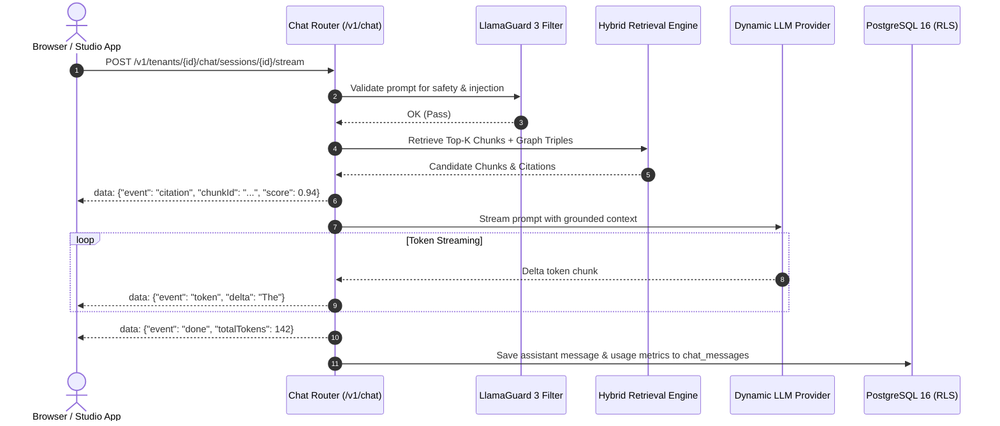

# API Specification: Chat & Streaming Grounded Inference (`/v1/chat`)

#api #chat #streaming #sse #citations #feedback #retriever

> **Authoritative specification for stateful chat sessions, Server-Sent Events (SSE) grounded token streaming, inline citation resolution, and RLHF message ratings.**

---

## 1. Overview & Streaming Architecture

The Chat router manages conversational memory, orchestrates hybrid vector retrieval, applies prompt safety guardrails, queries configured LLM providers (OpenAI, Gemini, Anthropic, Ollama), and streams tokens back to client frontends via HTTP SSE.



---

## 2. API Endpoints

### 2.1 Create Chat Session

Initializes a new stateful conversation thread isolated by tenant and user ID.

- **HTTP Method:** `POST`
- **Path:** `/v1/tenants/{tenantId}/chat/sessions`
- **Authentication:** `Bearer <TOKEN>`
- **Request Body:**
```json
{
  "title": "Commercial Contract Review",
  "userId": "user_alex_123",
  "metadata": {
    "category": "legal",
    "project": "Alpha"
  }
}
```
- **Response Schema (`200 OK`):**
```json
{
  "sessionId": "4a1d8e9f-5b2c-4e3a-8f1d-9c8e7a6b5c4d",
  "tenantId": "c9a28c30-e34d-4871-bc01-e9451d6c8b09",
  "userId": "user_alex_123",
  "title": "Commercial Contract Review",
  "createdAt": "2026-08-25T05:20:00Z",
  "updatedAt": "2026-08-25T05:20:00Z"
}
```

---

### 2.2 Stream Grounded Chat Completion (SSE)

Streams tokens from the generative model in real-time with grounded citations and semantic cache indicators.

- **HTTP Method:** `POST`
- **Path:** `/v1/tenants/{tenantId}/chat/sessions/{sessionId}/stream`
- **Headers:** `Accept: text/event-stream`
- **Request Body:**
```json
{
  "message": "What is the termination clause under the 2026 agreement?",
  "temperature": 0.2,
  "maxTokens": 1024,
  "enableHyde": true,
  "filter": {
    "field": "category",
    "operator": "eq",
    "value": "contracts"
  }
}
```

#### SSE Stream Protocol
The server emits chunked text frames conforming to the SSE specification:

```text
data: {"event": "status", "stage": "retrieving"}

data: {"event": "citation", "chunkId": "chk_987", "documentId": "doc_123", "filename": "Commercial_Agreement.pdf", "score": 0.94, "content": "Either party may terminate upon 30 days written notice..."}

data: {"event": "token", "delta": "Under"}
data: {"event": "token", "delta": " the"}
data: {"event": "token", "delta": " 2026"}
data: {"event": "token", "delta": " agreement,"}
data: {"event": "token", "delta": " either"}
data: {"event": "token", "delta": " party"}
data: {"event": "token", "delta": " may"}
data: {"event": "token", "delta": " terminate"}
data: {"event": "token", "delta": " [Source: doc_123]."}

data: {"event": "done", "finishReason": "stop", "promptTokens": 512, "completionTokens": 38, "totalLatencyMs": 420, "cached": false}
```

---

### 2.3 List Chat Message History

Retrieves historical messages for a session with cursor-based pagination.

- **HTTP Method:** `GET`
- **Path:** `/v1/tenants/{tenantId}/chat/sessions/{sessionId}/messages`
- **Query Parameters:** `limit` (default: 50), `cursor` (string)
- **Response (`200 OK`):**
```json
{
  "items": [
    {
      "messageId": "msg_01",
      "sessionId": "4a1d8e9f-5b2c-4e3a-8f1d-9c8e7a6b5c4d",
      "tenantId": "c9a28c30-e34d-4871-bc01-e9451d6c8b09",
      "role": "user",
      "content": "What is the warranty period?",
      "name": null,
      "createdAt": "2026-08-25T05:21:00Z"
    },
    {
      "messageId": "msg_02",
      "sessionId": "4a1d8e9f-5b2c-4e3a-8f1d-9c8e7a6b5c4d",
      "tenantId": "c9a28c30-e34d-4871-bc01-e9451d6c8b09",
      "role": "assistant",
      "content": "The warranty period is 30 calendar days [Source: doc_987].",
      "name": null,
      "createdAt": "2026-08-25T05:21:02Z"
    }
  ],
  "pagination": {
    "nextCursor": null,
    "limit": 50,
    "hasMore": false
  }
}
```

---

### 2.4 Submit Message Feedback

Submit user satisfaction feedback (thumbs up/down, detailed criteria scores) for RLHF and online evaluation.

- **HTTP Method:** `POST`
- **Path:** `/v1/tenants/{tenantId}/chat/sessions/{sessionId}/messages/{messageId}/feedback`
- **Request Body:**
```json
{
  "rating": "up",
  "feedback_text": "Accurate citations and concise summary.",
  "scores": {
    "accuracy": 1.0,
    "clarity": 0.9
  }
}
```
- **Response (`200 OK`):**
```json
{
  "status": "success",
  "message": "Feedback submitted successfully."
}
```

---

## 3. Error Responses & Status Codes

| Status Code | Code | Reason / Description |
|:---|:---|:---|
| `400 Bad Request` | `SAFETY_GUARDRAIL_VIOLATION` | Prompt blocked by Llama Guard 3 policy (e.g. injection attempt). |
| `401 Unauthorized` | `INVALID_AUTH` | Missing Bearer token or invalid API key. |
| `404 Not Found` | `SESSION_NOT_FOUND` | Specified `sessionId` does not exist for this tenant. |
| `429 Too Many Requests` | `RATE_LIMIT_EXCEEDED` | Exceeded tenant chat generation rate limit (30 req/min). |

---

## 🔗 Related Architecture & Cross-References
- [Hybrid Search Specification](search.md)
- [Query Intelligence & CRAG](../cognitive/query_intelligence.md)
- [Evaluation & Hallucinations](../cognitive/evaluation_and_hallucinations.md)
- [TypeScript Client SDK](../integrations/typescript_sdk.md)
