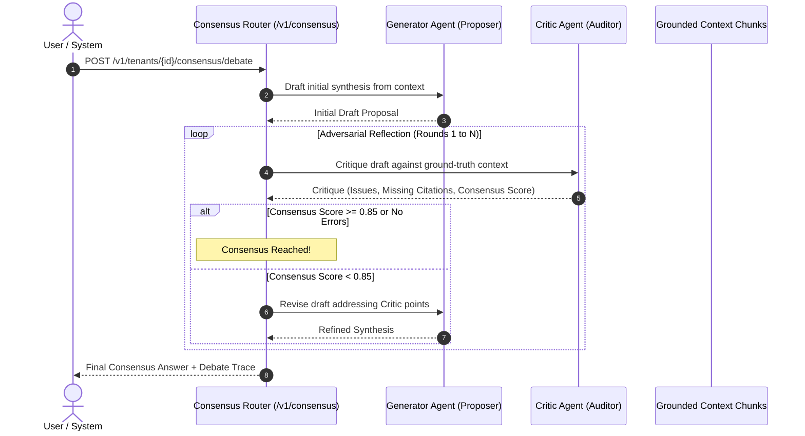

# API Specification: Multi-Agent Consensus & Adversarial Reflection (`/v1/consensus`)

#api #consensus #reflection #critic #adversarial #retriever

> **Authoritative specification for Generator-Critic multi-agent debate loops, hallucination detection, and grounded consensus scoring.**

---

## 1. Adversarial Debate Loop Flow



---

## 2. API Endpoints

### 2.1 Run Multi-Agent Consensus Debate

- **HTTP Method:** `POST`
- **Path:** `/v1/tenants/{tenantId}/consensus/debate`
- **Authentication:** `Bearer <TOKEN>`
- **Request Body:**
```json
{
  "query": "Is the middleman commission payment refundable after 14 days?",
  "maxRounds": 3,
  "minConsensusScore": 0.85
}
```

#### Response Schema (`200 OK`)
```json
{
  "status": "consensus_achieved",
  "roundsExecuted": 2,
  "finalConsensusScore": 0.94,
  "finalAnswer": "No, middleman commission disbursements become fully non-refundable after the 14-calendar-day escrow review period expires [Source: agreement_sec_4].",
  "debateRounds": [
    {
      "round": 1,
      "generatorDraft": "Commission disbursements cannot be refunded after 14 days.",
      "criticScore": 0.70,
      "critique": "Draft lacks reference to Section 4 escrow review conditions."
    },
    {
      "round": 2,
      "generatorDraft": "No, middleman commission disbursements become fully non-refundable after the 14-calendar-day escrow review period expires [Source: agreement_sec_4].",
      "criticScore": 0.94,
      "critique": "Fully grounded and cites authoritative section."
    }
  ]
}
```

---

## 🔗 Related Architecture & Cross-References
- [Consensus & Reflection Deep-Dive](../cognitive/consensus_and_reflection.md)
- [Evaluation & Hallucinations](../cognitive/evaluation_and_hallucinations.md)
