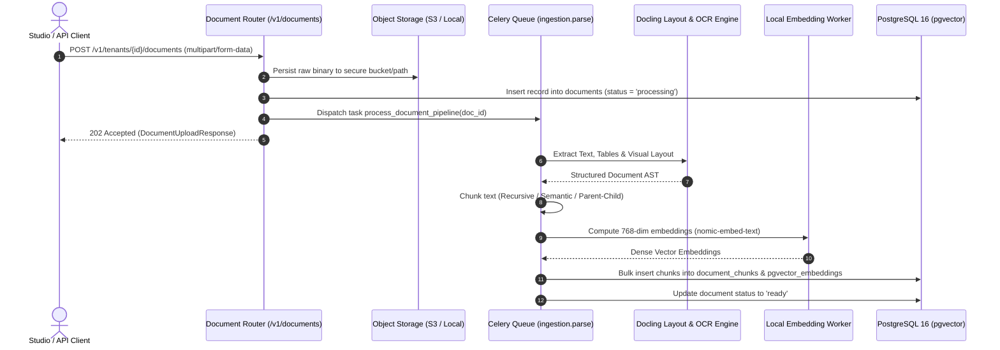

# API Specification: Document Ingestion & Vision OCR Pipeline (`/v1/documents`)

#api #document #ocr #docling #chunking #embeddings #s3 #retriever

> **Authoritative specification for multipart document uploads, Docling multimodal layout analysis & OCR, hierarchical token chunking, and presigned download URL generation.**

---

## 1. Document Ingestion Pipeline

When a file is uploaded, Retriever schedules an asynchronous Celery task or processes it inline depending on file size and OCR requirements:



---

## 2. API Endpoints

### 2.1 Upload Document

Uploads a single or multiple documents (`.pdf`, `.docx`, `.xlsx`, `.pptx`, `.txt`, `.md`, `.json`, `.csv`, `.py`, `.ts`, `.go`, `.rs`) with custom metadata and automatic zero-config chunking strategy.

- **HTTP Method:** `POST`
- **Path:** `/v1/tenants/{tenantId}/documents`
- **Content-Type:** `multipart/form-data`
- **Authentication:** `Bearer <TOKEN>`

#### Form Parameters
| Field | Type | Required | Description |
|:---|:---|:---:|:---|
| `file` | `binary` | **Yes** | File binary stream (up to 100MB) |
| `chunk_strategy` | `string` | Optional | `recursive`, `semantic`, `parent_child`, `docling_layout`, `code_ast` (default: `recursive`) |
| `chunk_size` | `integer` | Optional | Max token count per chunk (default: `512`, range: `128`–`2048`) |
| `chunk_overlap` | `integer` | Optional | Token overlap between consecutive chunks (default: `64`) |
| `metadata` | `string` | Optional | JSON string with custom document tags & classification |

#### Example Request (`curl`)
```bash
curl -X POST "https://rag.prateeq.in/v1/tenants/c9a28c30-e34d-4871-bc01-e9451d6c8b09/documents" \
  -H "Authorization: Bearer ret_live_..." \
  -F "file=@/Users/prateeksharma/Documents/Quarterly_Report_2026.pdf" \
  -F "chunk_strategy=docling_layout" \
  -F "chunk_size=512" \
  -F "metadata={\"department\":\"finance\",\"confidentiality\":\"internal\"}"
```

#### Response Schema (`202 Accepted` / `200 OK`)
```json
{
  "documentId": "doc_01928374-e5f6-4a3b-9c8d-1234567890cd",
  "tenantId": "c9a28c30-e34d-4871-bc01-e9451d6c8b09",
  "filename": "Quarterly_Report_2026.pdf",
  "fileSizeBytes": 2489120,
  "contentType": "application/pdf",
  "status": "processing",
  "chunkCount": 0,
  "createdAt": "2026-08-25T05:36:00Z"
}
```

---

### 2.2 Get Document Status & Ingestion Metadata

Check processing status, token count, page count, and generated chunk summaries.

- **HTTP Method:** `GET`
- **Path:** `/v1/tenants/{tenantId}/documents/{documentId}`
- **Response Schema (`200 OK`):**
```json
{
  "documentId": "doc_01928374-e5f6-4a3b-9c8d-1234567890cd",
  "filename": "Quarterly_Report_2026.pdf",
  "status": "ready",
  "pageCount": 24,
  "chunkCount": 86,
  "totalTokens": 38400,
  "processingDurationMs": 1420,
  "errorMessage": null,
  "metadata": {
    "department": "finance",
    "confidentiality": "internal"
  }
}
```

---

### 2.3 Get Presigned Download URL

Generates an HMAC-SHA256 signed temporary download URL expiring in 3600 seconds.

- **HTTP Method:** `GET`
- **Path:** `/v1/tenants/{tenantId}/documents/{documentId}/download-url`
- **Response Schema (`200 OK`):**
```json
{
  "documentId": "doc_01928374-e5f6-4a3b-9c8d-1234567890cd",
  "downloadUrl": "https://rag.prateeq.in/v1/storage/signed/doc_01928374?expires=1787635200&signature=a9f8b7...",
  "expiresAt": "2026-08-25T06:36:00Z"
}
```

---

### 2.4 Delete Document & Cascade Chunks

Permanently deletes a document, removing all associated raw binaries from storage, chunks from PostgreSQL, vector embeddings from HNSW indexes, and triples from GraphRAG.

- **HTTP Method:** `DELETE`
- **Path:** `/v1/tenants/{tenantId}/documents/{documentId}`
- **Response Schema (`200 OK`):**
```json
{
  "status": "success",
  "deletedDocumentId": "doc_01928374-e5f6-4a3b-9c8d-1234567890cd",
  "deletedChunks": 86,
  "message": "Document and all downstream vector embeddings deleted successfully."
}
```

---

## 3. Error Responses & Status Codes

| Status Code | Code | Reason / Description |
|:---|:---|:---|
| `400 Bad Request` | `UNSUPPORTED_FILE_TYPE` | File extension not supported by parser. |
| `413 Payload Too Large` | `FILE_SIZE_EXCEEDED` | File exceeds maximum allowable tenant size (100MB). |
| `404 Not Found` | `DOCUMENT_NOT_FOUND` | Document ID not found under authenticated tenant. |

---

## 🔗 Related Architecture & Cross-References
- [Chunking & Parsing Whitepaper](../cognitive/chunking_and_parsing.md)
- [Storage & Zero-Trust Encryption](../infrastructure/storage_and_encryption.md)
- [Celery Async Workers](../infrastructure/async_workers_and_queues.md)
- [TypeScript Client SDK](../integrations/typescript_sdk.md)
