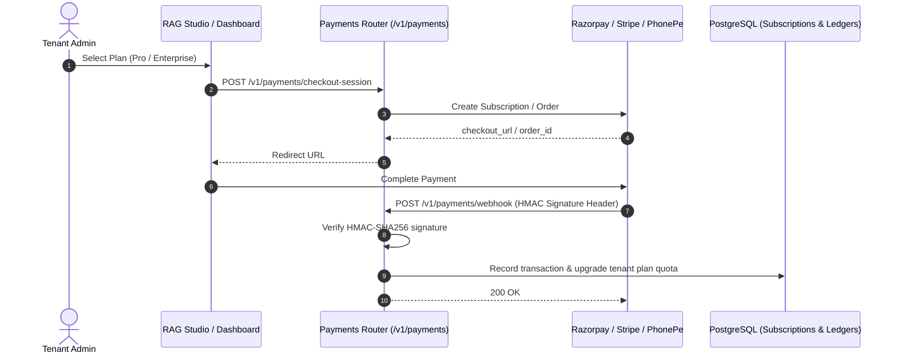

# API Specification: Commercial Billing & Webhook Gateway (`/v1/payments`)

#api #payments #razorpay #stripe #phonepe #billing #retriever

> **Authoritative specification for multi-gateway SaaS checkout sessions, recurring subscription lifecycle management, and HMAC-verified webhooks.**

---

## 1. Billing Lifecycle & Webhook Architecture



---

## 2. API Endpoints

### 2.1 Create Checkout Session

- **HTTP Method:** `POST`
- **Path:** `/v1/payments/checkout-session`
- **Authentication:** `Bearer <TOKEN>`
- **Request Body:**
```json
{
  "tenantId": "c9a28c30-e34d-4871-bc01-e9451d6c8b09",
  "planId": "tier_pro_annual",
  "gateway": "razorpay",
  "currency": "INR",
  "successUrl": "https://rag.prateeq.in/dashboard?payment=success",
  "cancelUrl": "https://rag.prateeq.in/dashboard?payment=cancelled"
}
```

#### Response Schema (`200 OK`)
```json
{
  "orderId": "order_Rzp1029384756",
  "checkoutUrl": "https://api.razorpay.com/v1/checkout/embedded/...",
  "amount": 299000,
  "currency": "INR",
  "status": "created"
}
```

---

### 2.2 Inbound Payment Webhooks

Processes asynchronous status updates from payment gateways with cryptographic validation.

- **HTTP Method:** `POST`
- **Path:** `/v1/payments/webhook/{gateway}` (`razorpay`, `stripe`, `phonepe`)
- **Headers:** `X-Razorpay-Signature: <hmac_hex>` or `Stripe-Signature: <sig>`
- **Response Schema (`200 OK`):**
```json
{
  "status": "processed",
  "event": "payment.captured",
  "transactionId": "tx_891029384",
  "tenantId": "c9a28c30-e34d-4871-bc01-e9451d6c8b09"
}
```

---

## 🔗 Related Architecture & Cross-References
- [Commercial Billing Integration](../integrations/commercial_billing_integration.md)
- [Pricing Catalog Specification](pricing.md)
- [Database Invoices & Ledgers](../infrastructure/database_and_schemas.md)
