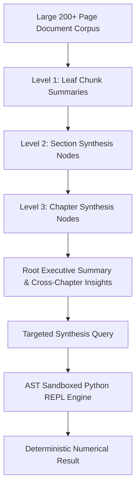

# API Specification: Recursive Language Model & Sandboxed Python REPL (`/v1/rlm`)

#api #rlm #repl #sandbox #python #treesynthesis #retriever

> **Authoritative specification for recursive hierarchical document tree synthesis and zero-hallucination sandboxed Python REPL computation.**

---

## 1. RLM Hierarchical Synthesis Architecture



---

## 2. API Endpoints

### 2.1 Execute Sandboxed Python REPL Code

Executes arbitrary math, statistical aggregation, or deterministic transformations in a hardened sandbox.

- **HTTP Method:** `POST`
- **Path:** `/v1/tenants/{tenantId}/rlm/repl`
- **Authentication:** `Bearer <TOKEN>`
- **Request Body:**
```json
{
  "code": "data = [1200, 3400, 5600, 1900]\nmean = sum(data) / len(data)\nprint(f'Mean: {mean:.2f}')"
}
```

#### Response Schema (`200 OK`)
```json
{
  "status": "success",
  "stdout": "Mean: 3025.00\n",
  "stderr": "",
  "executionDurationMs": 14.2,
  "exitCode": 0
}
```

---

## 🔗 Related Architecture & Cross-References
- [Agentic Workflows & REPL Sandbox](../cognitive/agentic_workflows_and_repl.md)
- [Agentic Tool Execution](agentic.md)
