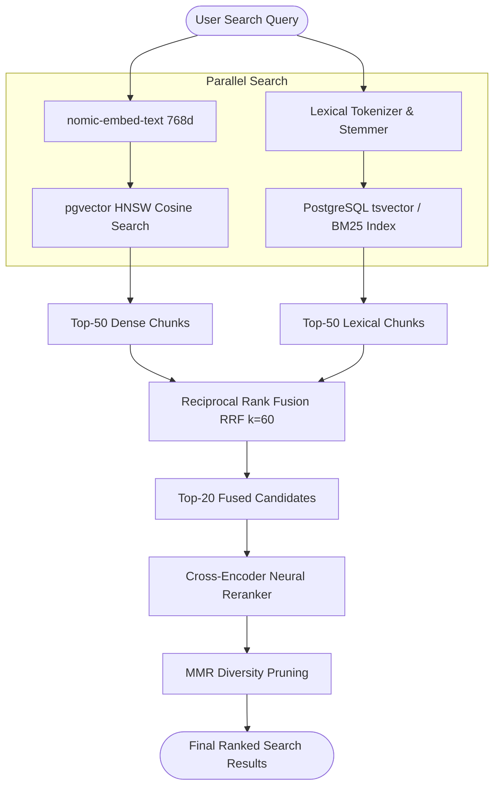

# API Specification: Hybrid Search & AST Metadata Filtering (`/v1/search`)

#api #search #hybrid #rrf #crossencoder #ast #pgvector #retriever

> **Authoritative specification for hybrid dense vector (pgvector HNSW) and sparse lexical (BM25/SPLADE) search with Reciprocal Rank Fusion (RRF) and Cross-Encoder neural reranking.**

---

## 1. Retrieval Architecture & Fusion Flow

Retriever executes hybrid retrieval across dual query paths in parallel, merging and reranking candidates through a 4-stage pipeline:



---

## 2. API Endpoints

### 2.1 Execute Hybrid Search

Executes dense, sparse, or hybrid search across tenant documents with AST metadata filtering and optional neural reranking.

- **HTTP Method:** `POST`
- **Path:** `/v1/tenants/{tenantId}/search`
- **Authentication:** `Bearer <TOKEN>`
- **Request Body:**
```json
{
  "query": "What are the performance SLA requirements for cloud deployments?",
  "mode": "hybrid",
  "limit": 5,
  "denseWeight": 0.7,
  "sparseWeight": 0.3,
  "enableReranking": true,
  "rerankerModel": "bge-reranker-base",
  "filter": {
    "and": [
      {
        "field": "category",
        "operator": "in",
        "value": ["infra", "sla", "agreements"]
      },
      {
        "field": "year",
        "operator": "gte",
        "value": 2024
      }
    ]
  }
}
```

#### Supported Filter Operators
| Operator | Description | Example SQL Translation |
|:---|:---|:---|
| `eq` / `neq` | Field equals / does not equal | `metadata->>'status' = 'published'` |
| `gt` / `gte` | Greater than / greater than or equal | `(metadata->>'year')::int >= 2024` |
| `lt` / `lte` | Less than / less than or equal | `(metadata->>'version')::numeric < 2.0` |
| `in` | Value in array | `metadata->>'category' = ANY(:arr)` |
| `contains` | Substring contains / array contains | `metadata->>'tags' ILIKE '%security%'` |
| `exists` | Field key exists in metadata JSONB | `metadata ? 'author'` |

---

#### Response Schema (`200 OK`)
```json
{
  "query": "What are the performance SLA requirements for cloud deployments?",
  "totalMatches": 42,
  "returnedCount": 2,
  "tookMs": 38.4,
  "results": [
    {
      "chunkId": "chk_89127391-a1b2-4c3d-8e9f-0123456789ab",
      "documentId": "doc_01928374-e5f6-4a3b-9c8d-1234567890cd",
      "filename": "Cloud_Architecture_SLA_2026.pdf",
      "content": "The production cluster guarantees 99.95% monthly uptime with p95 API response times under 250ms.",
      "score": 0.9654,
      "denseScore": 0.8921,
      "sparseScore": 0.9140,
      "rerankScore": 0.9842,
      "pageNumber": 14,
      "metadata": {
        "category": "sla",
        "year": 2026,
        "author": "Infrastructure Guild"
      }
    },
    {
      "chunkId": "chk_10293847-b2c3-4d5e-9f0a-2345678901de",
      "documentId": "doc_01928374-e5f6-4a3b-9c8d-1234567890cd",
      "filename": "Cloud_Architecture_SLA_2026.pdf",
      "content": "Database replicas must achieve zero data loss (RPO = 0) and recovery time objective (RTO) under 60 seconds.",
      "score": 0.8412,
      "denseScore": 0.8120,
      "sparseScore": 0.7850,
      "rerankScore": 0.8920,
      "pageNumber": 15,
      "metadata": {
        "category": "sla",
        "year": 2026
      }
    }
  ]
}
```

---

## 3. Error Responses & Status Codes

| Status Code | Code | Reason / Description |
|:---|:---|:---|
| `400 Bad Request` | `INVALID_FILTER_AST` | Malformed JSON in filter expression or invalid operator. |
| `401 Unauthorized` | `INVALID_AUTH` | Missing Bearer token or invalid API key. |
| `422 Unprocessable` | `INVALID_DENSE_WEIGHT` | `denseWeight + sparseWeight` must sum to positive real numbers. |
| `500 Server Error` | `EMBEDDING_PROVIDER_ERROR` | Local Ollama embedding service unreachable or timeout. |

---

## 🔗 Related Architecture & Cross-References
- [Hybrid Search & Fusion Deep-Dive](../cognitive/hybrid_search_and_fusion.md)
- [Query Intelligence & Intent Routing](../cognitive/query_intelligence.md)
- [Database Schemas & pgvector Indexing](../infrastructure/database_and_schemas.md)
- [TypeScript Client SDK](../integrations/typescript_sdk.md)
