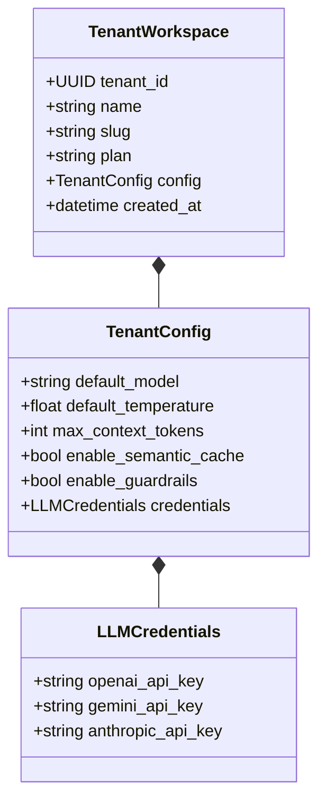

# API Specification: Tenant Workspaces & Configuration-as-Data (`/v1/tenants`)

#api #tenant #cad #config #multitenancy #retriever

> **Authoritative specification for tenant workspace lifecycle, Configuration-as-Data (CAD) schemas, dynamic LLM provider binding, and live API key validation probes.**

---

## 1. Overview & CAD Schema

Retriever implements a Configuration-as-Data (CAD) architecture where every tenant workspace maintains an isolated configuration profile specifying default LLM providers, temperature, chunking strategies, and retrieval thresholds.



---

## 2. API Endpoints

### 2.1 Provision Tenant Workspace

- **HTTP Method:** `POST`
- **Path:** `/v1/tenants`
- **Authentication:** `Bearer <TOKEN>`
- **Request Body:**
```json
{
  "name": "Enterprise Client Workspace",
  "slug": "enterprise_client",
  "plan": "pro",
  "config": {
    "defaultModel": "gpt-4o",
    "defaultTemperature": 0.3,
    "maxContextTokens": 4096,
    "enableSemanticCache": true,
    "enableGuardrails": true
  }
}
```

#### Response Schema (`201 Created`)
```json
{
  "tenantId": "c9a28c30-e34d-4871-bc01-e9451d6c8b09",
  "name": "Enterprise Client Workspace",
  "slug": "enterprise_client",
  "plan": "pro",
  "status": "active",
  "createdAt": "2026-08-25T05:38:00Z"
}
```

---

### 2.2 Validate External LLM API Key Probe

Tests a user-provided LLM API key against the provider's upstream health API before saving.

- **HTTP Method:** `POST`
- **Path:** `/v1/tenants/{tenantId}/validate-key`
- **Request Body:**
```json
{
  "provider": "openai",
  "apiKey": "sk-proj-abc123xyz..."
}
```
- **Response Schema (`200 OK`):**
```json
{
  "status": "valid",
  "provider": "openai",
  "availableModels": ["gpt-4o", "gpt-4o-mini", "text-embedding-3-small"],
  "latencyMs": 182
}
```

---

## 🔗 Related Architecture & Cross-References
- [Auth & Identity Specification](auth.md)
- [Database Schemas & RLS](../infrastructure/database_and_schemas.md)
- [TypeScript Client SDK](../integrations/typescript_sdk.md)
