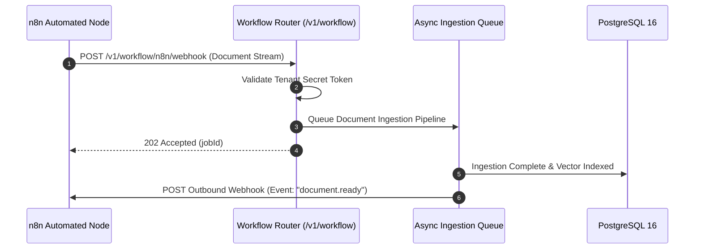

# API Specification: n8n Workflow Automation & Webhooks (`/v1/workflow`)

#api #workflow #n8n #automation #webhooks #retriever

> **Authoritative specification for n8n workflow integration, auto-ingest webhooks, event triggers, and OpenAPI 3.0 schema exports.**

---

## 1. Workflow Automation Flow



---

## 2. API Endpoints

### 2.1 Inbound n8n Auto-Ingest Webhook

- **HTTP Method:** `POST`
- **Path:** `/v1/workflow/n8n/webhook`
- **Headers:** `X-Tenant-Key: <SECRET_KEY>`
- **Request Body:**
```json
{
  "tenantId": "c9a28c30-e34d-4871-bc01-e9451d6c8b09",
  "source": "gmail",
  "documentUrl": "https://drive.google.com/uc?id=...",
  "filename": "Client_Invoice_July.pdf"
}
```

#### Response Schema (`202 Accepted`)
```json
{
  "status": "queued",
  "jobId": "job_98127391823",
  "tenantId": "c9a28c30-e34d-4871-bc01-e9451d6c8b09"
}
```

---

## 🔗 Related Architecture & Cross-References
- [n8n Workflow Integration Guide](../integrations/n8n_workflow_integration.md)
- [Document Ingestion Pipeline](document.md)
