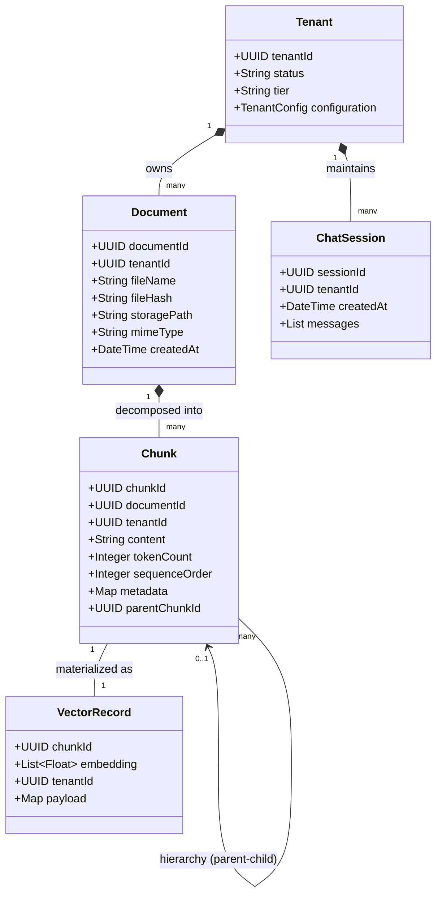
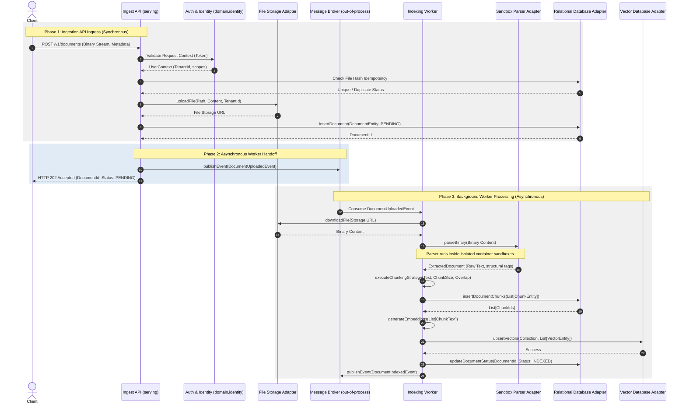
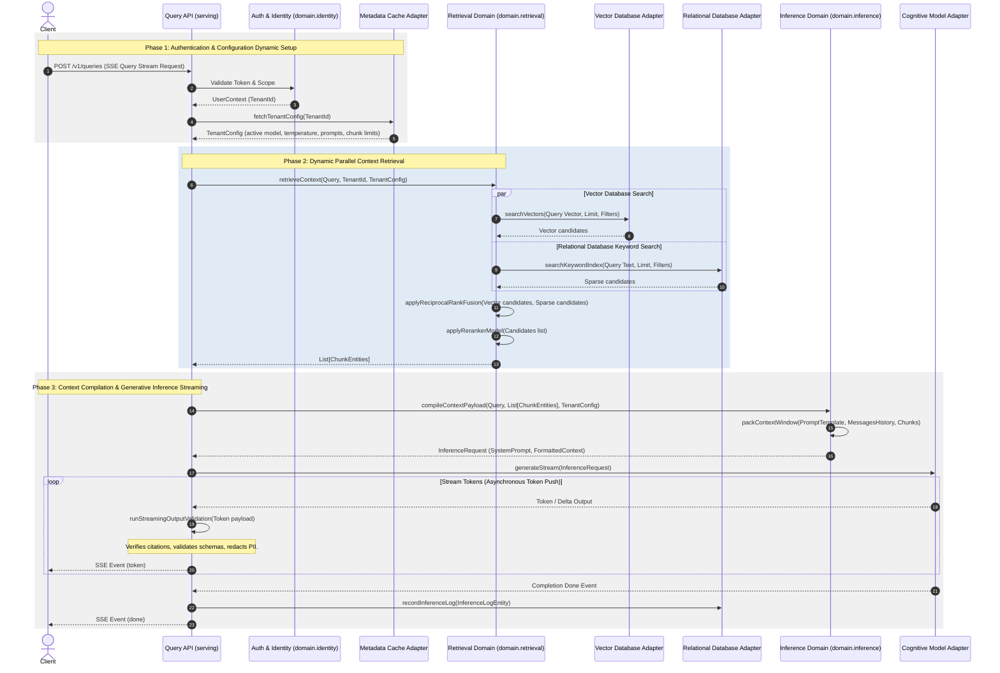
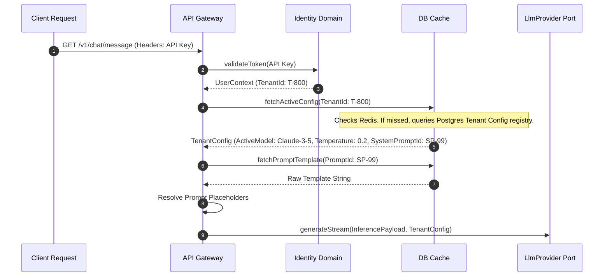
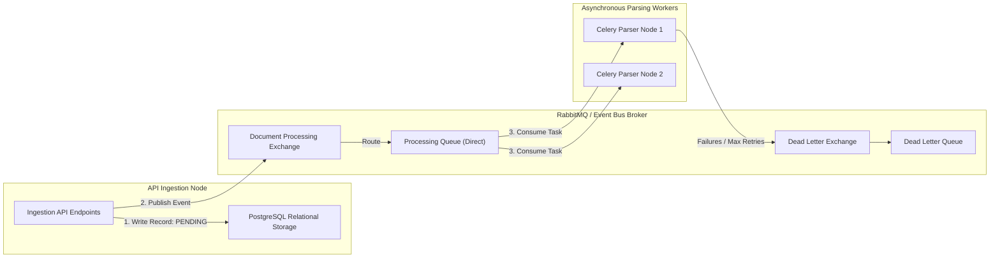
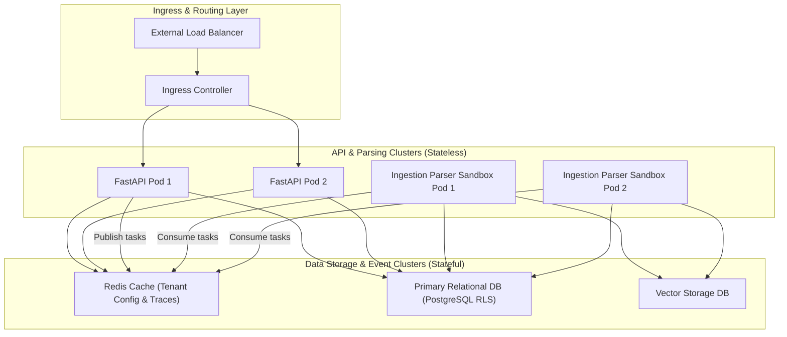

# System Architecture Design Blueprint: Retriever Platform

---

## Part I: Logical Architecture

Part I defines the conceptual models, bounded contexts, domain dependencies, interface ports, and logical data flow paths of the Retriever platform. These designs are technology-neutral and MUST remain valid regardless of the physical deployment environment.

---

### 1. Architectural System Overview

The core architecture of Retriever is based on the **Ports and Adapters (Hexagonal)** model. The central application contains the core domain logic, completely isolated from communication frameworks, database systems, third-party libraries, and execution runtimes.

By maintaining a strict hexagonal boundary, we ensure that changes in external infrastructure (such as moving from a cloud-hosted vector database to a self-hosted vector database cluster) do not require a single line of modification to the business rules. The application core exposes formal "Ports" (Interfaces). External systems connect to these ports using "Adapters".

```
                                  PORTS & ADAPTERS ARCHITECTURE
               
               +-------------------------------------------------------------+
               |                       Adapters Layer                        |
               |                                                             |
               |   +-------------+      +-------------+      +-----------+   |
               |   |   FastAPI   |      |  Next.js    |      | CLI Tool  |   |
               |   +-------------+      +-------------+      +-----------+   |
               +----------|--------------------|-------------------|---------+
                          |                    |                   |
                          | (HTTP/SSE)         | (JSON/RPC)        | (Exec)
                          v                    v                   v
               +-------------------------------------------------------------+
               |                         Ports Layer                         |
               |                                                             |
               |     [IngestionPort]  [RetrievalPort]  [InferencePort]       |
               +-----------------------------|-------------------------------+
                                             |
                                             v
               +-------------------------------------------------------------+
               |                          Core Domain                        |
               |                                                             |
               |    +------------+      +------------+      +------------+   |
               |    | Ingestion  |      | Retrieval  |      | Inference  |   |
               |    |   Logic    |      |   Logic    |      |   Logic    |   |
               |    +------------+      +------------+      +------------+   |
               |          |                   |                   |          |
               |          +-------------------+-------------------+          |
               |                              |                              |
               |                              v                              |
               |                     [Identity Boundary]                     |
               +------------------------------|------------------------------+
                                              |
                                              v
               +-------------------------------------------------------------+
               |                  Infrastructure Ports                       |
               |                                                             |
               |    [VectorPort]      [IdentityPort]     [CognitivePort]     |
               +-----------------------------|-------------------------------+
                                             |
                                             v
               +-------------------------------------------------------------+
               |                  Infrastructure Adapters                    |
               |                                                             |
               |   +-------------+      +-------------+      +-----------+   |
               |   |  pgvector   |      | Supabase Auth|     |OpenAI/Anth|   |
               |   +-------------+      +-------------+      +-----------+   |
               +-------------------------------------------------------------+
```

---

### 2. Bounded Contexts & Domain Dependency Map

Retriever is organized into five isolated bounded contexts, each owning its models, rules, and logic boundaries.

#### 2.1 Bounded Context Definitions



*   **Ingestion Bounded Context (`domain.ingestion`):** Transforms binary data payloads (e.g., PDF, DOCX, HTML streams) into structured plaintext schemas. This context MUST remain isolated from indexing systems.
    *   *Key Entities:* `Document` (Entity), `FileHash` (Value Object).
*   **Knowledge Bounded Context (`domain.knowledge`):** Manages structural models of text chunks, embedding associations, tag assignments, parent-child relationships, and hierarchical structures.
    *   *Key Entities:* `Chunk` (Entity), `Embedding` (Value Object), `ChunkTree` (Value Object).
*   **Retrieval Bounded Context (`domain.retrieval`):** Merges vector similarity results and sparse keyword search queries. It executes metadata filtering, semantic matching, and reranking.
    *   *Key Entities:* `SearchQuery` (Value Object), `QueryResult` (Value Object).
*   **Inference Bounded Context (`domain.inference`):** Coordinates interactions with cognitive engines. It handles conversation history compression, prompt packaging, system prompt injection, tool calling orchestration, and token calculation.
    *   *Key Entities:* `ChatSession` (Entity), `ChatMessage` (Value Object), `PromptTemplate` (Value Object).
*   **Identity Bounded Context (`domain.identity`):** Enforces tenancy rules, resolves API keys, and validates access levels.
    *   *Key Entities:* `Tenant` (Entity), `UserContext` (Value Object).

#### 2.2 Bounded Context Dependency Map
To prevent architectural drift and maintain logical isolation, we enforce a strict dependency hierarchy between the core domains:

```mermaid
graph TD
    subgraph CoreDomains["Bounded Context Boundaries"]
        Identity["domain.identity"]
        Ingestion["domain.ingestion"]
        Knowledge["domain.knowledge"]
        Retrieval["domain.retrieval"]
        Inference["domain.inference"]
    end

    %% Dependency flows
    Ingestion -->|Resolves Tenant Identity| Identity
    Knowledge -->|References Document References| Ingestion
    Retrieval -->|Queries Chunk Schemas| Knowledge
    Inference -->|Requests Grounded Context| Retrieval

    %% Constraints Style
    classDef readOnly fill:#ffe6e6,stroke:#f85149,stroke-width:2px;
    classDef independent fill:#e6f2ff,stroke:#0066cc,stroke-width:2px;
    class Retrieval readOnly;
    class Identity independent;
```



The dependency relationships MUST comply with these rules:
1.  **Identity Bounded Context (`domain.identity`) MUST Remain Independent:** It MUST NOT import models or refer to logic from any other bounded context.
2.  **Ingestion Bounded Context (`domain.ingestion`) MAY Depend on Identity:** It resolves tenant details during document uploads to verify quotas and access.
3.  **Knowledge Bounded Context (`domain.knowledge`) MAY Depend on Ingestion:** Chunks are derived from, and link directly to, Document entities owned by Ingestion.
4.  **Retrieval Bounded Context (`domain.retrieval`) MAY Depend on Knowledge:** Retrieval query services search over Chunk indices managed by Knowledge.
5.  **Inference Bounded Context (`domain.inference`) MAY Depend on Retrieval:** Inference requires Retrieval ports to fetch grounding contexts for prompt assembly.
6.  **Retrieval MUST Remain Read-Only:** Retrieval MUST NOT perform write operations on Knowledge or Ingestion states.
7.  **Inference MUST NOT Directly Modify Knowledge:** All modifications to chunk indexing states MUST route through core commands in the Knowledge context.
8.  **Cross-Context Communication SHOULD Occur Through Ports or Domain Events** rather than direct implementation coupling.

---

### 3. Ports & Adapters (Hexagonal) Architecture Contracts

No third-party SDK or infrastructure library may leak into the core domains. Decoupling is enforced by mapping ports to adapters.

```
       +-----------------------------------------------------------------+
       |                         Core Domain                             |
       |                                                                 |
       |  [LlmProvider Port]   [VectorDatabasePort]   [StorageProvider]  |
       +----------|----------------------|----------------------|--------+
                  |                      |                      |
  ================|======================|======================|========= Dependency Boundary
                  v                      v                      v
       +-----------------------------------------------------------------+
       |                       Adapters Layer                            |
       |                                                                 |
       |  +---------------+.   +---------------+.     +---------------+  |
       |  | OpenAIAdapter |    | pgvectorAdap. |     |  S3Adapter    |  |
       |  +---------------+    +---------------+     +---------------+  |
       |  +---------------+.   +---------------+.                       |
       |  | AnthropicAdap |    | QdrantAdapter |                        |
       |  +---------------+    +---------------+                        |
       +-----------------------------------------------------------------+
```

#### 3.1 Cognitive Service Interface (`domain.abstractions.llm`)
```typescript
export interface ChatMessage {
  readonly role: 'system' | 'user' | 'assistant' | 'tool';
  readonly content: string;
  readonly name?: string;
  readonly toolCalls?: readonly ToolCall[];
}

export interface ToolCall {
  readonly id: string;
  readonly type: 'function';
  readonly function: {
    readonly name: string;
    readonly arguments: string;
  };
}

export interface InferenceRequest {
  readonly messages: readonly ChatMessage[];
  readonly temperature: number;
  readonly maxTokens?: number;
  readonly jsonSchema?: Record<string, any>;
  readonly tools?: readonly Record<string, any>[];
}

export interface InferenceResponse {
  readonly content: string;
  readonly usage: {
    readonly inputTokens: number;
    readonly outputTokens: number;
    readonly totalTokens: number;
  };
  readonly finishReason: 'stop' | 'length' | 'tool_calls' | 'content_filter';
}

export interface LlmProvider {
  generate(request: InferenceRequest, configuration: Record<string, any>): Promise<InferenceResponse>;
  generateStream(request: InferenceRequest, configuration: Record<string, any>): AsyncIterable<string>;
}
```

#### 3.2 Vector Store Interface (`domain.abstractions.vector`)
```typescript
export interface VectorEntity {
  readonly id: string;
  readonly vector: readonly number[];
  readonly payload: Record<string, any>;
  readonly tenantId: string;
}

export interface VectorQuery {
  readonly vector: readonly number[];
  readonly limit: number;
  readonly tenantId: string;
  readonly filters?: Record<string, any>;
  readonly minSimilarityScore?: number;
}

export interface VectorDatabaseProvider {
  upsertVectors(collection: string, entities: readonly VectorEntity[]): Promise<void>;
  searchVectors(collection: string, query: VectorQuery): Promise<readonly VectorEntity[]>;
  deleteVectors(collection: string, ids: readonly string[]): Promise<void>;
  createCollectionIfMissing(collection: string, dimensions: number): Promise<void>;
}
```

#### 3.3 File Storage Interface (`domain.abstractions.storage`)
```typescript
export interface FileUploadRequest {
  readonly path: string;
  readonly content: Buffer;
  readonly contentType: string;
  readonly tenantId: string;
}

export interface StorageProvider {
  uploadFile(request: FileUploadRequest): Promise<string>;
  downloadFile(path: string, tenantId: string): Promise<Buffer>;
  deleteFile(path: string, tenantId: string): Promise<void>;
  getPresignedUrl(path: string, tenantId: string, ttlSeconds: number): Promise<string>;
}
```

#### 3.4 Identity & Access Interface (`domain.abstractions.identity`)
```typescript
export interface TenantIdentity {
  readonly tenantId: string;
  readonly status: 'active' | 'suspended' | 'terminated';
  readonly tier: 'standard' | 'enterprise';
  readonly allowedModels: readonly string[];
}

export interface UserContext {
  readonly userId: string;
  readonly tenantId: string;
  readonly roles: readonly string[];
  readonly scopes: readonly string[];
}

export interface IdentityProvider {
  validateToken(token: string): Promise<UserContext>;
  getTenantContext(tenantId: string): Promise<TenantIdentity>;
}
```

---

### 4. CQRS Read/Write Path Separation

To optimize system resource usage and ensure performance budgets are met, Retriever implements Command Query Responsibility Segregation (CQRS). The write path is optimized for consistency, validation, and metadata extraction, while the read path is optimized for minimal latency.

```
                      CQRS DATA PATH ARCHITECTURE
                      
   [WRITE PATH - COMMANDS]
   User Action -> Ingest API -> DB: Ingestion Job -> Worker -> Parsers -> Chunking -> Vectorizing -> Vector DB & relational store
   
   [READ PATH - QUERIES]
   User Action -> Query API -> Parallel Search (Vector + BM25) -> Reranking -> Prompt Assembly -> LLM Output -> Validator -> Client Stream (SSE)
```

#### 4.1 Write Path (Commands Pipeline)
1.  **Ingestion Request:** Client issues `UploadDocumentCommand` containing file streams and metadata.
2.  **Validation:** API Gateway checks tenant authentication and storage quotas. The command is recorded in the relational database with status `PENDING`.
3.  **Event Broadcast:** The system publishes a `DocumentUploadedEvent` containing storage endpoints and tenant context.
4.  **Parsing (Asynchronous Worker):** Workers parse the document inside sandbox containers, generating normalized text and layout indexes.
5.  **Chunking & Indexing:** The system runs tenant-specific chunking guidelines (e.g., semantic splits or fixed sliding windows) to write `Chunk` entities to the relational store.
6.  **Vectorization:** Embeddings are generated for new chunks and saved to the vector database.
7.  **Finalize:** The document status transitions to `INDEXED`, and the system publishes `DocumentIndexedEvent`.

#### 4.2 Read Path (Queries Pipeline)
1.  **Inquiry Request:** Client issues `ResolveQuery` via HTTP/SSE.
2.  **Context Resolution:** The API resolves the active tenant's `TenantConfig` dynamically from database cache memory.
3.  **Parallel Query Execution:**
    *   **Vector Search Port:** The query is vectorized, and the system executes similarity search on the vector database.
    *   **Keyword Search Port:** Relational tables run keyword matching against chunk content.
4.  **Merging & Reranking:** The retrieval engine merges matches using Reciprocal Rank Fusion (RRF), filters by tenant metadata, and routes candidates to the reranking model adapter.
5.  **Prompt Construction:** The system merges the top candidates into prompt templates resolved from the tenant configuration registry.
6.  **Model Dispatch:** The prompt is dispatched to the active `LlmProvider` adapter.
7.  **Stream Validation:** Generations stream via Server-Sent Events (SSE). The validation engine checks citations and JSON formatting constraints on the fly.

---

### 5. Detailed System Data Flows

#### 5.1 Ingestion & Indexing Flow (Write Path)



#### 5.2 Retrieval & Inference Generation Flow (Read Path)



---

### 6. Configuration-as-Data (CAD) Flow

To keep the platform headless and customizable, all tenant-specific behaviors are stored as structured configuration in the database. Prompt templates, LLM routes, chunk sizes, and retrieval weights are resolved dynamically at runtime.



---

### 7. Extension Points & Platform Contracts

Retriever is designed as an extensible platform. Custom integrations MUST connect to the core through the following Ports. Implementation details are decoupled from the application domain.

| Extension Name | Port Contract Interface | Primary Responsibility |
|---|---|---|
| **Parser Plugin** | `IngestionParser` | Decodes custom binary file formats into normalized plaintext payloads. |
| **OCR Plugin** | `OcrExtractor` | Extracts text layouts from layout images when parsing documents. |
| **Embedding Provider** | `EmbeddingsService` | Maps plaintext blocks to numeric vectors using specific cognitive models. |
| **Vector Store Provider** | `VectorDatabaseProvider` | Manages vector persistence, indexing, metadata filtering, and semantic query matching. |
| **LLM Provider** | `LlmProvider` | Orchestrates generation API completions and real-time Server-Sent Event streaming. |
| **Authentication Provider** | `IdentityProvider` | Decodes JWTs or API keys, resolving tenant identities and request scopes. |
| **Storage Provider** | `StorageProvider` | Manages raw document storage and handles presigned URL generation. |
| **Tool Provider** | `ExternalToolExecutor` | Executes actions requested by agentic inference loops (e.g., fetching weather, running APIs). |
| **Guardrail Provider** | `SafetyGuardrail` | Inspects input queries (block injections) and checks outputs (redact PII). |
| **Reranker Provider** | `ContextReranker` | Re-orders retrieved candidates based on cross-encoder similarity scoring. |
| **Citation Validator** | `CitationValidator` | Verifies that claims in generated tokens match source chunk identifiers. |
| **Domain Event Consumer** | `DomainEventHandler` | Subscribes to transaction events on the message bus (e.g., generating alerts). |
| **Evaluation Pipeline** | `ContextEvaluator` | Computes faithfulness, answer relevance, and context recall scores. |
| **Telemetry Exporter** | `TelemetryExporter` | Forwards performance spans, token usages, and logs to external targets. |

---
---

## Part II: Physical & Deployment Architecture

Part II defines the physical components, folder structures, deployment topologies, multi-tenancy mappings, and operational telemetry designs required to deploy and run the platform.

---

### 8. Monorepo Folder & Package Structure

Retriever is structured as a monorepo to maintain strong typing across client-server boundaries while isolating build environments:

```
/Users/prateeksharma/Developer/retriever/
├── apps/
│   ├── api/                     # API Serving Node (FastAPI implementation example)
│   │   ├── src/
│   │   │   ├── domain/          # Hexagonal Application Core (Logical Domains)
│   │   │   │   ├── ingestion/
│   │   │   │   ├── knowledge/
│   │   │   │   ├── retrieval/
│   │   │   │   ├── inference/
│   │   │   │   └── identity/
│   │   │   ├── adapters/        # Database, LLM, and storage adapters (Physical)
│   │   │   └── main.py          # API entrypoint
│   │   ├── pyproject.toml
│   │   └── uv.lock
│   │
│   └── web/                     # Frontend Reference Interface (Next.js/shadcn example)
│       ├── src/
│       │   ├── app/             # Web Router layouts and pages
│       │   ├── components/      # UI components (Tailwind/CSS modules)
│       │   └── hooks/
│       ├── package.json
│       └── package-lock.json
│
├── packages/
│   ├── core-types/              # Shared JSON Schema & TypeScript interfaces
│   ├── sdk-js/                  # TypeScript client SDK
│   └── sdk-python/              # Python client SDK
│
├── docs/
│   ├── constitution/            # Master Vision and engineering rules
│   │   └── master-vision.md
│   ├── adr/                     # Architecture Decision Records
│   └── architecture.md          # Canonical Architectural Blueprint
```

---

### 9. Multi-Tenancy Mappings & Security Architecture

#### 9.1 Tenant Isolation Levels
Retriever supports three runtime isolation levels, configured in the platform registry:
1.  **Logical Isolation:** All tenant records reside in shared tables. PostgreSQL Row-Level Security (RLS) is enabled on all tables. Queries MUST execute through a transaction context setting `app.current_tenant_id`.
2.  **Schema Isolation:** Each tenant is assigned a distinct logical database schema (e.g., `tenant_a`, `tenant_b`). The database adapter switches the connection search path dynamically per request.
3.  **Physical Isolation:** Enterprise tenants utilize distinct database connection strings. The infrastructure router maps incoming request headers to dedicated database instances.

```
       TENANT DATA ISOLATION PATTERNS
       
       1. LOGICAL ISOLATION (Shared DB, RLS Protection)
          API Client (Tenant: A) -> Set Tenant Context Variable -> Postgres (RLS checks TenantId = Context)
          
       2. SCHEMA ISOLATION (Shared DB, Isolated Logical Schemas)
          API Client (Tenant: B) -> Select Tenant Schema Context -> Postgres (Executes queries inside schema_tenant_b)
          
       3. PHYSICAL ISOLATION (Distinct Database Instances)
          API Client (Tenant: C) -> Route Connection String -> Dedicated Postgres Cluster (Tenant C)
```

#### 9.2 Context Middleware & Breach Kill-Switch
*   **Context Injection:** Authentication middleware resolves the validated `TenantId` from the incoming token and injects it into a thread-safe local execution context.
*   **Isolation Assertions:** Database adapters MUST check that the target query parameters contain a tenant ID filter matching the authenticated request context.
*   **The Tenancy Breach Kill-Switch:** If the database adapter detects a tenant ID mismatch between the request context and the retrieved records, it MUST trigger the security protocol:
    1.  Terminate the active database connection pool.
    2.  Log a Severity-1 security incident.
    3.  Revoke the API keys associated with the caller.
    4.  Return a generic `403 Forbidden` response to the client.

---

### 10. Background Processing & Messaging Topology

Retriever uses an asynchronous event bus to manage long-running write operations (such as file parsing, metadata indexing, and vector processing) without degrading API responsiveness.



*   **Message Broker:** Technology options like RabbitMQ or Redis PubSub handle out-of-process task coordination. The broker architecture MUST utilize persistent queues to prevent message loss during hardware outages.
*   **Durable Event Routing:** Task messages MUST use structured formats containing `document_id`, `tenant_id`, and `storage_url`. Message payloads MUST NOT contain raw binaries.
*   **Dead Letter Queues (DLQ):** Task processing failures that exceed maximum retry thresholds MUST route to a Dead Letter Queue (DLQ) for auditing.

---

### 11. Deployment Topology & Performance Budgets

Retriever is designed to deploy on container orchestration clusters (e.g., Kubernetes), separating stateful storage components from stateless serving APIs.



#### 11.1 Deployment Architecture Rules
*   **Stateless Container Scaling:** API Pods and Workers MUST run in stateless configurations, scaling horizontally based on CPU utilization and request queues.
*   **Sandboxed Parsing Pods:** Worker pods parsing documents MUST execute in restricted sandbox environments. These sandboxes MUST block all egress traffic to prevent unauthorized data transmission.

#### 11.2 Performance Budget Rules
Every component in the query pipeline is allocated a latency budget, monitored through tracing.

| Execution Layer | Latency Target | Telemetry Span Name |
|---|---|---|
| Network & Request Routing | <= 20ms | `ingress.routing` |
| Authentication & Identity Validation | <= 30ms | `auth.tenant_resolve` |
| Parallel Vector & Sparse DB Search | <= 100ms | `retrieval.db_search` |
| RRF Context Fusion & Reranking | <= 50ms | `retrieval.reranking` |
| Inference Prep & System Prompt Compile | <= 100ms | `inference.prompt_compile` |
| LLM Time-To-First-Token | <= 500ms | `cognitive.llm_stream_start` |

---

### 12. Scalability & Telemetry Considerations

#### 12.1 Observability & Telemetry Tracing
To trace requests across asynchronous queues and LLM API completions:
*   **Trace Context Propagation:** API endpoints MUST generate a unique trace ID and inject it into the request headers. This trace ID MUST be propagated across messaging queues and external adapter calls.
*   **Structured Instrumentation:** Telemetry spans MUST record:
    *   Vector database similarity search score profiles.
    *   Tokenizer performance metrics and token usage tallies.
    *   Reranker confidence indices.
    *   Cognitive provider response times.
*   **OpenTelemetry Exports:** Spans MUST export to OpenTelemetry collectors, allowing integration with observability platforms (e.g., Datadog, Prometheus, or Jaeger).

#### 12.2 Scalability Bottlenecks & Caching Architecture
*   **SSE Connection Management:** High concurrent streaming loads exhaust API server thread pools. The gateway MUST route SSE connections through asynchronous network workers, decoupling request threads from stream lifecycles.
*   **Caching Strategy:** The caching layer uses a multi-tier structure:
    *   **L1 In-Memory Cache:** Active tenant configurations and compiled prompts are cached in memory (e.g., Redis) with short TTLs (1 hour), minimizing relational database requests.
    *   **L2 Similarity Cache:** Search query vectors are matched against a cache of previous query coordinates. If an incoming query is semantically identical to a cached query (e.g., similarity > 0.99), the system returns cached retrieval results, avoiding redundant database lookups.

---
---

## Part III: Governance, Resilience, & Traceability

Part III documents resilience parameters, retry policies, system recovery procedures, and traces how architectural decisions comply with the Engineering Constitution.

---

### 13. Resilience & Failure Architecture

This section documents the expected behavior, retry strategies, and recovery procedures for major failure scenarios within Retriever's distributed topology.

| Failure Scenario | Expected System Behavior | Retry Strategy & Backoff | Circuit Breaker & Fallback | User-Visible Response | Recovery Process |
|---|---|---|---|---|---|
| **Parser Failure** | The worker halts binary processing, catches the exception, and marks the document status as `FAILED`. | Do NOT retry document syntax errors. Retry network timeout parser calls up to 3 times (linear 5s backoff). | Fall back to clean plaintext layout parsing. Skip OCR extraction if visual engines crash. | Ingestion interface displays status `Failed` with details. | User must resolve formatting issues and upload the document again. |
| **Embedding Generation Failure** | Indexing worker flags chunk state as `UNINDEXED`. Chunk text remains cached in DB. | Retry up to 5 times (exponential backoff starting at 2s with jitter). | Fall back to secondary configured embedding provider adapter (e.g., local backup engine). | Document remains in state `INDEXING`. Retrieval matches skip this chunk. | Background task reconciler periodically retries `UNINDEXED` chunks. |
| **Vector DB Outage** | Similarity searches raise network exceptions. Retrieval domain falls back to text. | Retry connection pool up to 3 times (1s backoff). | Break circuit. Fall back to sparse text keyword search inside relational database. | Searches execute successfully but with reduced semantic quality (degraded mode). | Alerts generated. Vector cluster is restarted; missing vectors are rebuilt from chunk store. |
| **Relational DB Outage** | Connection pools fail to acquire database transactions. Core API throws `503`. | Retry pool connection up to 5 times (exponential backoff). | Open circuit breaker. Severe write path; reject incoming commands. | API returns HTTP `503 Service Unavailable`. SSE streams report `SYSTEM_ERROR`. | Primary database fails over to read-replica or multi-region standby cluster. |
| **Message Broker Outage** | Ingest API fails to publish `DocumentUploadedEvent` task triggers. | Retry socket connection up to 5 times. | Cache events in primary database event log. Process logs using database triggers. | Ingest API accepts uploads but indexes do not process (stuck in `PENDING`). | Broker is restarted; ingestion workers consume events from database reconciler logs. |
| **LLM Outage / Timeout** | Client completion streams block. Inference engine raises network exception. | Retry once if timeout occurs. Do NOT retry on rate-limits (HTTP 429). | Break circuit. Route completion request to fallback model adapter. | Completion streams display fallback model tag or close stream with error. | Automatic model router updates latency weights dynamically. |
| **Worker Node Crash** | Parsing or indexing process crashes mid-task. Memory partition is lost. | Task message is returned to Queue via acknowledgement failure. | RabbitMQ re-queues task to secondary worker container. | Document remains in state `INDEXING` or `PENDING` longer than average. | Container orchestration restarts worker node container automatically. |
| **Duplicate Event Delivery** | Duplicate task messages are received by the event queue. | Discard event if document hash exists in database. | Handled via unique index constraint on `FileHash` parameter. | Document processes normally. No duplicate chunk entities are written. | None required. Deduplication logic handles duplicates silently. |
| **Retry Exhaustion** | Background indexing tasks fail repeatedly and exhaust retry attempts. | Halt processing. | Move task parameters from Queue to Dead Letter Queue (DLQ). | Document transitions from `INDEXING` state to `FAILED`. | Administrators review DLQ error dumps manually and trigger re-vectorization. |

---

### 14. Traceability Map (Mapping to the Engineering Constitution)

To guarantee alignment, this architecture design maps directly back to the [Engineering Constitution](file:///Users/prateeksharma/Developer/retriever/docs/constitution/master-vision.md).

| Architectural Pattern / Design Choice | Target Section of the Constitution | Rationale and Verification Method |
|---|---|---|
| Hexagonal application core architecture | Section 6.1 (Architectural Philosophy) | Core domains (`ingestion`, `knowledge`, `retrieval`, `inference`) interact with external databases and providers only through abstract ports, ensuring the platform remains provider-agnostic. |
| Ingestion parsing sandboxing | Section 8.1 (Ingestion, Knowledge, and Retrieval Engine) & Section 17.3 (Rule 15) | Binary parsing operations run inside isolated containers to prevent processing exploits from compromising main serving APIs. |
| CQRS Read/Write isolation | Section 6.4 (Command Query Responsibility Segregation (CQRS)) | Separate ingestion worker pipelines (Write path) from parallel retrieval engines (Read path), protecting search latency budgets. |
| Dynamic dynamic configuration cache | Section 9.1 (Configuration Philosophy) | All prompt strings and model routes are resolved dynamically from database tables based on tenant ID context. Hardcoded prompts are prohibited. |
| PostgreSQL RLS mapping | Section 14.1 (Tenant Isolation Models) | Logical data tables utilize PostgreSQL Row-Level Security policies to prevent cross-tenant access. |
| Tenancy Kill-Switch adapter validation | Section 17.1 (The Tenancy Breach Kill-Switch) | Database and vector store adapters verify the request tenant context against retrieved records. Any mismatch terminates the database connection. |
| OpenTelemetry trace tracking | Section 17.3 (Rule 8) | Trace IDs are generated at the API ingress and propagated across background queues and LLM client adapters to track performance. |
| Manual validation hooks | Section 8.4 (Model Routing, Guardrails, & Tool Execution) | The Inference engine pauses tool executions and registers verification tokens in the database, waiting for user approval. |
