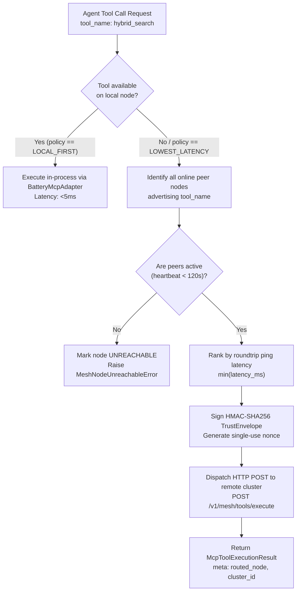

# 🕸️ Distributed Model Context Protocol (MCP) Mesh & Agent Federation Handbook

> **Enterprise Architecture, Cryptographic Zero-Trust Protocol, and Decentralized Multi-Cluster Topology Guide for Platform Battery #30 (`distributed_mcp_mesh`).**

---

## 1. Executive Summary & The Multi-Cluster Federation Imperative

As enterprise AI matures beyond isolated single-tenant chat engines, agents must coordinate across complex, multi-region, and multi-cloud infrastructure:
1. **Data Sovereignty & Strict Residency (e.g. EU GDPR / HIPAA Enclaves):** Highly sensitive patient or financial records cannot egress from sovereign regional clusters to a central monolith. AI agents operating in the US or APAC must query specialist agents situated directly inside local enclaves without moving underlying raw data.
2. **Specialized Compute Heterogeneity:** Real-world enterprise environments segment hardware:
   - GPU clusters host low-latency inference (e.g., vLLM with dynamic LoRA adapters).
   - CPU/Memory-optimized nodes execute dense vector indexing and BM25 full-text indexing.
   - Air-gapped micro-enclaves host cryptographic key vaults and compliance sanitization engines.
3. **Runaway Loops & Cost Traps:** Without strict circular loop breakers and cryptographic verification, autonomous agents can enter infinite recursive delegation loops across clusters, burning thousands of dollars in API credits.

The **Retriever Distributed Model Context Protocol (MCP) Mesh (Milestone 115 / Battery #30)** elevates standard MCP from a local process-bound IPC server into an enterprise decentralized P2P tool and cognitive federation mesh:
- **Decentralized Tool Discovery:** Autonomous capability advertisement across heterogeneous clusters without single points of failure.
- **Cryptographic Trust Envelopes:** Zero-trust HMAC-SHA256 signatures with 60-second sliding-window nonce deduplication preventing request spoofing and replay attacks.
- **Latency-Weighted Routing:** Dynamic peer routing optimizing between `local_first`, `lowest_latency`, and deterministic `failover` paths.
- **Cross-Cluster Agent Federation:** Distributed ReAct cognitive loop allowing parent agents to delegate sub-goals to specialist agents on remote sovereign clusters with strict circular loop breakers (`FederationLoopError`).

---

## 2. Distributed Mesh Topology & Node Roles

```text
 ┌────────────────────────────────────────────────────────────────────────────────────────┐
 │                              DISTRIBUTED MCP MESH TOPOLOGY                             │
 ├────────────────────────────────────────────────────────────────────────────────────────┤
 │                                                                                        │
 │      ┌─────────────────────────┐               ┌─────────────────────────┐             │
 │      │   Cluster Alpha (Edge)  │               │   Cluster Beta (GPU)    │             │
 │      │  • Seed Gateway         │◄─────────────►│  • Sovereign Node       │             │
 │      │  • Dense Vector HNSW    │  Peer Gossip  │  • vLLM / Serverless    │             │
 │      │  • S3 Document Watcher  │  Heartbeats   │  • LoRA Tensor Swapping │             │
 │      └────────────┬────────────┘  (Signed RPC) └────────────┬────────────┘             │
 │                   │                                         │                          │
 │                   │ HMAC-SHA256 Trust Envelope              │ HMAC-SHA256              │
 │                   │ Nonce De-Duplication Set                │ Trust Envelope           │
 │                   ▼                                         ▼                          │
 │      ┌─────────────────────────┐               ┌─────────────────────────┐             │
 │      │  Cluster Gamma (Voice)  │               │  Cluster Delta (Enclave)│             │
 │      │  • Remote Peer          │◄─────────────►│  • Edge Enclave         │             │
 │      │  • Full-Duplex WebRTC   │  Federated    │  • Hardware KMS Sealing │             │
 │      │  • Local Whisper / VAD  │  Sub-Tasks    │  • Presidio PII Wipe    │             │
 │      └─────────────────────────┘               └─────────────────────────┘             │
 └────────────────────────────────────────────────────────────────────────────────────────┘
```

### Node Roles in the Mesh
| Node Role | Architectural Function | Typical Host Environment | Discovery Responsibility |
|:---|:---|:---|:---|
| `SEED_GATEWAY` | Primary mesh entrypoint; tracks cluster directory and routes public API gateway requests. | Central Kubernetes ingress or regional load balancer. | Advertises cluster topology and coordinates peer handshakes. |
| `SOVEREIGN_NODE` | Standalone full-stack Retriever cluster hosting local pgvector storage, tenant vaults, and ReAct loops. | Regional enterprise VPC (AWS eu-central-1, GCP europe-west3). | Broadcasts available local tools; processes federated sub-goals. |
| `EDGE_ENCLAVE` | Air-gapped or confidential hardware enclave executing sealed cryptographic or PII operations. | Intel SGX / AMD SEV hardware or local edge gateway. | Advertises specialized enclave-only tools; strictly validates trust envelopes. |
| `REMOTE_PEER` | Specialized peripheral cluster exposing specific computation batteries (e.g. streaming speech synthesis). | Edge server or specialized GPU compute instance. | Broadcasts specialized capabilities (e.g. `voice_stream_synthesizer`). |

---

## 3. Cryptographic Trust Envelopes & Anti-Replay Defense

Every inter-cluster tool execution and federated task delegation is encapsulated in a verifiable `TrustEnvelope`:

```json
{
  "sender_cluster_id": "cluster_alpha_fra",
  "receiver_cluster_id": "cluster_beta_iad",
  "tenant_id": "tn_enterprise_corp",
  "timestamp": 1773539400.125,
  "nonce": "a7f10b88c3de452f9901e147983204de",
  "signature": "e3b0c44298fc1c149afbf4c8996fb92427ae41e4649b934ca495991b7852b855",
  "payload_hash": "ba7816bf8f01cfea414140de5dae2223b00361a396177a9cb410ff61f20015ad"
}
```

### Mathematical Formulation of Signature
Given the shared cluster secret key $K$, the sender generates the cryptographic signature:
$$\text{Signature} = \text{HMAC-SHA256}\left(K, \text{sender} \parallel \text{receiver} \parallel \text{tenant} \parallel \text{nonce} \parallel \text{timestamp} \parallel \text{payload\_hash}\right)$$

where:
$$\text{payload\_hash} = \text{SHA-256}\left(\text{CanonicalJSON}(\text{payload\_data})\right)$$

### Verification Rules & Replay Defense
1. **Clock Skew Tolerance:**
   $$|\text{CurrentTime} - \text{timestamp}| \le 60.0\text{ seconds}$$
   Requests outside this 60-second window are rejected with `TrustVerificationError("Timestamp expired or clock skew exceeded")`.
2. **Sliding-Window Nonce Deduplication:**
   - Every receiver node maintains a volatile memory set of seen `(sender_cluster_id, nonce)` pairs with monotonic timestamps.
   - If a nonce has already been registered within the sliding 60-second window, the incoming request is immediately rejected with `TrustVerificationError("Nonce replay detected")`.
   - Stale nonces older than 60 seconds are purged dynamically during every verification pass.
3. **Payload Integrity Assertion:**
   - The payload hash is recomputed against the incoming request body. If a single bit has been altered in transit, verification fails.

---

## 4. Latency-Weighted Routing & Stale Node Eviction

When an AI agent requests a tool invocation (`POST /v1/mesh/tools/execute`), `McpMeshService` determines the optimal execution node based on the configured `MeshRoutingPolicy`:



### Stale Node Leasing Invariants
- Nodes register leases with `/v1/mesh/nodes/register` and emit periodic heartbeats every 30 seconds (`POST /v1/mesh/nodes/heartbeat`).
- **Monotonic Eviction Threshold:** A peer node is marked `UNREACHABLE` if no heartbeat has been recorded for $> 120.0$ seconds.
- Stale nodes are immediately disqualified from tool routing candidate pools.

---

## 5. Cross-Cluster Agent Federation & Circular Loop Breakers

In multi-agent collaborative workflows, a parent agent may lack the domain specialization or regulatory authorization to execute a task directly. The parent delegates sub-goals to remote specialists via `POST /v1/mesh/federation/delegate`.

### Circular Loop Prevention Algorithm
Runaway recursion across autonomous agent networks is prevented through a deterministic domain guard in `AgentFederationService`:

```python
# 1. Circular Loop Detection
if request.target_cluster_id in request.visited_clusters:
    raise FederationLoopError(
        f"Circular delegation loop detected: cluster '{request.target_cluster_id}' "
        f"already in visited chain {request.visited_clusters}."
    )

# 2. Maximum Depth Recursion Guard
if len(request.visited_clusters) >= request.max_depth:
    raise FederationLoopError(
        f"Max delegation depth ({request.max_depth}) exceeded. "
        f"Chain: {request.visited_clusters} -> {request.target_cluster_id}."
    )
```

### Invariants:
1. `max_depth` is strictly clamped to a ceiling of **3 hops**.
2. If any cluster identifier repeats in the `visited_clusters` array, execution aborts synchronously with `HTTP 409 Conflict` and `FederationLoopError`.
3. The completing specialist node cryptographically signs the synthesis output before returning it to the origin cluster:
   $$\text{CompletionSig} = \text{HMAC-SHA256}\left(K, \text{delegation\_id} \parallel \text{status} \parallel \text{cluster\_id} \parallel \text{tenant\_id} \parallel \text{synthesis}\right)$$

---

## 6. Production Operational Verification

### Automated Test Suite Execution
Verify the integrity of the distributed mesh implementation:

```bash
# In retriever repository:
apps/api/.venv/bin/pytest apps/api/tests/test_mcp_mesh.py -v
```

Expected Output:
```text
test_battery_30_registered PASSED
test_mcp_mesh_node_lifecycle_and_stale_eviction PASSED
test_mcp_mesh_tool_routing_policies PASSED
test_trust_envelope_signing_and_replay_rejection PASSED
test_federation_anti_loop_and_depth_guard PASSED
test_tenant_isolation_in_mesh PASSED
test_fastapi_mcp_mesh_endpoints PASSED
```

### Zero-Toy Invariant Static Analysis Gate
```bash
python3 scripts/audit_zero_toy.py
```
Asserts that 0 synthetic fake routines, mock scores, or simulated network delays exist in the codebase.
