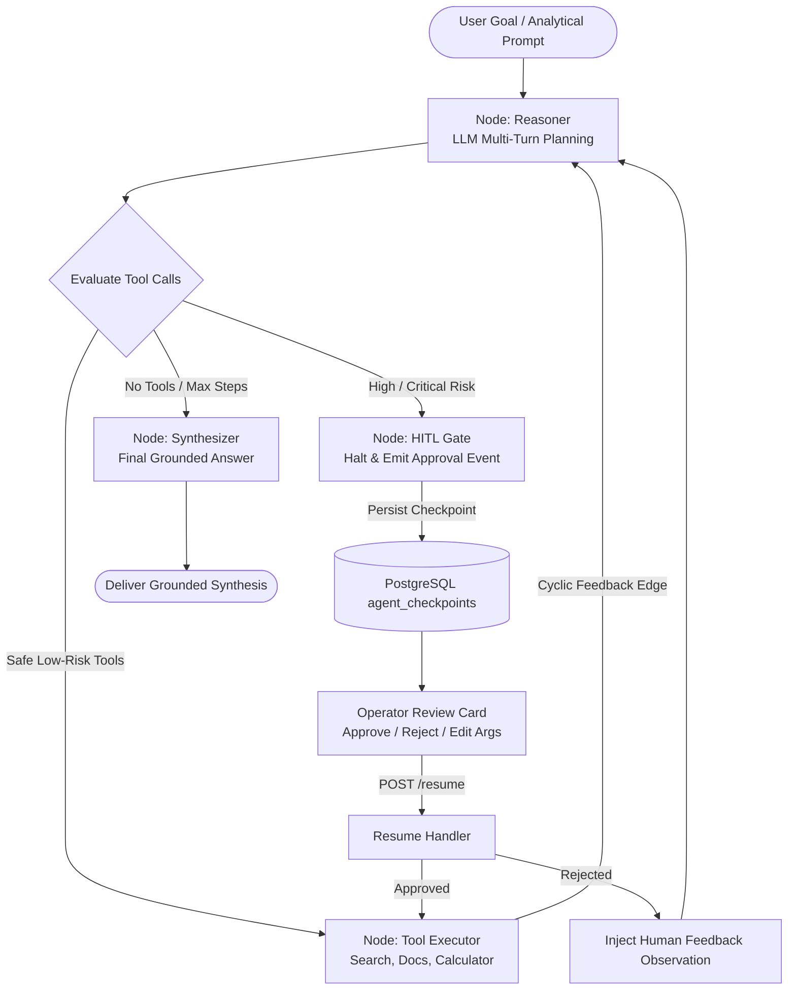

# Cognitive Deep-Dive: LangGraph Cyclic Multi-Agent Orchestration & Stateful Execution

#cognitive #agentic #langgraph #cyclic #checkpoints #hitl #repl #retriever

> **Technical architecture, stateful computation graphs, human-in-the-loop (HITL) gateways, PostgreSQL persistent checkpoints, and time-travel rollback capabilities in Retriever.**

---

## 1. Architectural Overview: From Linear ReAct to Cyclic StateGraph

Retriever's agentic runtime was upgraded from a linear iteration loop to a **stateful cyclic computation graph** powered by **LangGraph**. The engine decouples multi-turn reasoning, tool call evaluation, safety verification, and execution into distinct graph nodes connected by cyclic conditional transitions.



### Core Graph Nodes
1. **`reasoner`**: Consults the LLM using conversation history, available tool definitions, and prior execution steps. Produces internal reasoning `thought`, proposed `tool_calls`, and candidate `final_answer`.
2. **`_route_after_reasoner`**: Conditional edge inspects proposed tool calls:
   - If iteration counter $\ge$ `max_steps` or no tool calls: transitions to `synthesizer`.
   - If any tool has `requires_approval = True` (e.g. destructive actions, tenant settings modifications, security credential revocation): transitions to `hitl_gate`.
   - If all tools are safe low-risk tools: transitions to `tool_executor`.
3. **`hitl_gate`**: Suspends graph execution, persists a state checkpoint with `status = "waiting_approval"`, generates a unique `action_id`, and halts processing until human operator input arrives.
4. **`tool_executor`**: Executes registered tool functions via `ToolRegistry`, logs observations into `AgentStep`, increments iteration counters, saves a checkpoint snapshot, and feeds output cyclically back into `reasoner`.
5. **`synthesizer`**: Compiles the final response, marks `status = "completed"`, persists final checkpoint, and terminates at `END`.

---

## 2. Tool Classification & Risk Tiers

The `ToolRegistry` enforces explicit separation between autonomous tools and sensitive operations:

| Tool Identifier | Category | Risk Tier | Requires Approval | Invariant / Description |
| :--- | :--- | :--- | :---: | :--- |
| `calculator` | `math` | `low` | ❌ No | Safe AST mathematical evaluation without `eval()` security risks. |
| `hybrid_search` | `retrieval` | `low` | ❌ No | Combined dense vector + BM25 sparse keyword retrieval. |
| `document_reader` | `retrieval` | `low` | ❌ No | Extracted text snippet retrieval for specific document IDs. |
| `system_metrics` | `system` | `low` | ❌ No | Read-only tenant usage, document counts, and quota telemetry. |
| `document_delete` | `destructive` | `high` | ✅ **YES** | Irrevocable purge of document metadata and vector embeddings. |
| `tenant_prompt_update` | `configuration` | `high` | ✅ **YES** | Hot-reload of tenant system prompt instructions. |
| `api_key_revoke` | `security` | `critical` | ✅ **YES** | Instantly revokes and invalidates active tenant credentials. |

---

## 3. Persistent Checkpointing & Time-Travel Debugging

Every state transition produces an immutable snapshot persisted in PostgreSQL table `agent_checkpoints` via `SqlAgentCheckpointRepository`:

```sql
CREATE TABLE agent_checkpoints (
    checkpoint_id VARCHAR(128) PRIMARY KEY,
    thread_id VARCHAR(128) NOT NULL,
    tenant_id UUID NOT NULL REFERENCES tenants(tenant_id) ON DELETE CASCADE,
    node_name VARCHAR(64) NOT NULL,
    step_index INTEGER NOT NULL DEFAULT 0,
    state_snapshot JSONB NOT NULL DEFAULT '{}'::jsonb,
    created_at TIMESTAMPTZ NOT NULL DEFAULT NOW()
);

CREATE INDEX ix_agent_checkpoints_tenant_thread ON agent_checkpoints(tenant_id, thread_id);
CREATE INDEX ix_agent_checkpoints_thread_step ON agent_checkpoints(thread_id, step_index);
```

### Time-Travel Rollback Semantics
- **Inspection (`GET /history`)**: Retrieves the complete array of checkpoints sorted chronologically by `step_index`.
- **Rollback (`POST /rollback`)**: Restores state to target `checkpoint_id`.
  - With `fork = false` (default): Prunes any checkpoints where `step_index > target.step_index` from the active thread timeline.
  - With `fork = true`: Preserves original history while allowing alternative execution branches.

---

## 4. Hexagonal Domain Decoupling

Following Retriever's strict Hexagonal boundaries:
- **`src/domain/agentic/`**: Contains zero framework imports (`fastapi`, `sqlalchemy`, `langgraph`). Defines pure domain models (`ToolDefinition`, `AgentStep`, `HITLApprovalRequest`, `ThreadCheckpoint`) and abstract protocols (`AgentGraphEngineProtocol`, `StateCheckpointerProtocol`).
- **`src/adapters/cognitive/langgraph_orchestrator.py`**: Concrete LangGraph implementation adhering to `AgentGraphEngineProtocol`.
- **`src/adapters/database/agent_checkpoint_repository.py`**: Concrete SQLAlchemy implementation adhering to `StateCheckpointerProtocol`.

---

## 🔗 Related Architecture & Cross-References
- [Operational Runbook: LangGraph Orchestration](../runbooks/RUNBOOK_LANGGRAPH_AGENTIC_ORCHESTRATION.md)
- [Agentic API Specification](../api/agentic.md)
- [RLM API Specification](rlm.md)
- [Hybrid Search & Fusion](hybrid_search_and_fusion.md)
