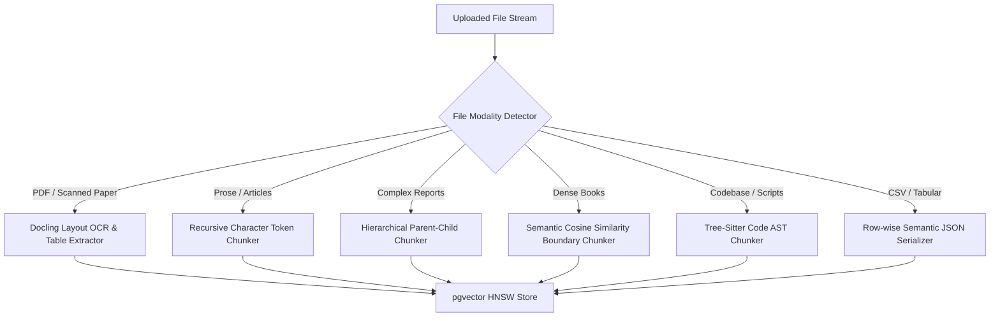
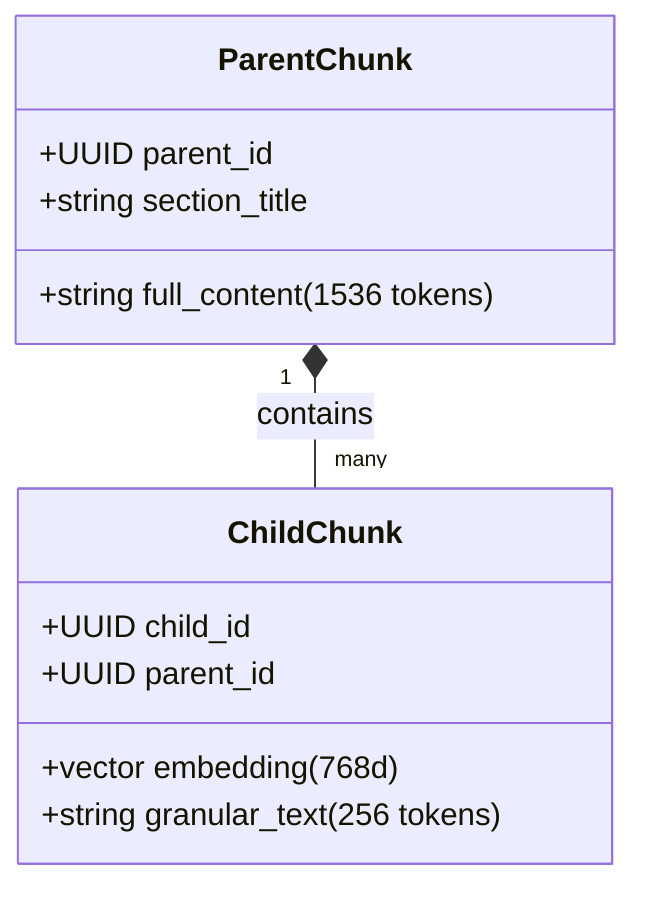

# Cognitive Deep-Dive: Hierarchical Chunking, Vision OCR & Docling Ingestion

#cognitive #chunking #docling #ocr #parentchild #ast #retriever

> **Technical architecture, layout parsing strategies, and hierarchical chunking algorithms in Retriever.**

---

## 1. Chunking Strategy Taxonomy

Retriever provides 6 specialized chunking engines tailored to different document modalities:

---

## 2. Chunking Engines Deep-Dive

### 2.1 Hierarchical Parent-Child Chunking
- **Parent Chunk (1536 tokens):** Contains complete section or article context.
- **Child Chunks (256 tokens):** Granular sub-passages embedded into pgvector for high-precision search.
- **Retrieval Mechanism:** When a child chunk matches a query, Retriever injects the **Parent Chunk** into the LLM prompt, providing broad contextual grounding without token bloat.

---

### 2.2 Semantic Similarity Boundary Chunking
Computes sentence-level embeddings using a lightweight local model. When the cosine distance between sentence \(s_i\) and sentence \(s_{i+1}\) exceeds a threshold \(\theta_{\text{split}} = 0.35\), a new chunk boundary is placed dynamically at the topical shift.

---

### 2.3 Docling Vision OCR & Layout Extraction
Uses IBM Docling to reconstruct multi-column academic papers, extract complex financial tables into Markdown/JSON format, and retain visual bounding boxes for UI rendering.

---

## 🔗 Related Architecture & Cross-References
- [Document API Specification](../api/document.md)
- [Hybrid Search & Fusion](hybrid_search_and_fusion.md)
- [Storage & Zero-Trust Encryption](../infrastructure/storage_and_encryption.md)
