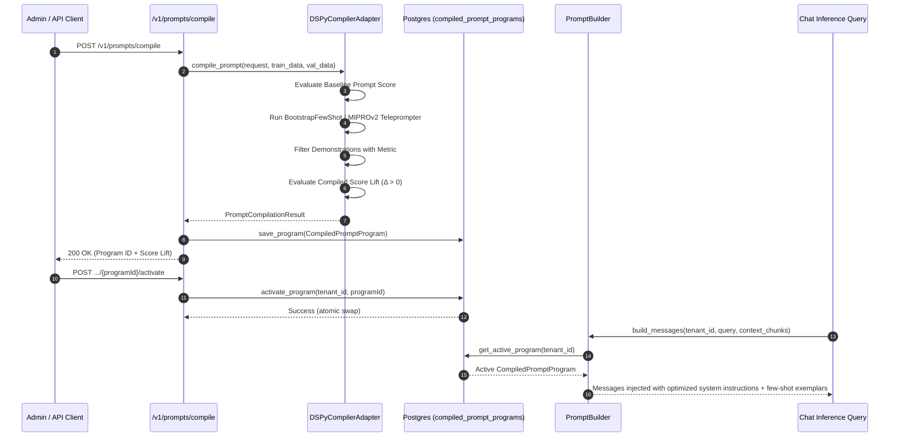

# Cognitive Architecture Deep-Dive: DSPy Declarative Prompt Compilation

**Module:** Cognitive Architecture & Algorithmic Self-Optimization  
**Milestone:** 92 (Phase L)  
**Version:** `v0.77.0`  

---

## 1. The Declarative Paradigm Shift

Traditional Large Language Model (LLM) pipelines rely on handcrafted, brittle string prompt templates. When domain documents or question distributions change, static prompts fail unpredictably and require human intervention to tweak phrasing.

Retriever Milestone 92 adopts the **DSPy Declarative Programming Paradigm**:
1. **Signatures over Strings:** Input/output behavior is specified as a declarative interface contract (`RAGAnswerSignature: (context, question) -> (thought, answer)`).
2. **Teleprompter Optimization:** Instead of guessing few-shot demonstrations, teleprompter algorithms automatically sample, bootstrap, and optimize candidate programs against quantitative grounding metrics.
3. **Metric-Driven Selection:** Only demonstrations that improve composite accuracy, citation faithfulness, and answer correctness on validation splits are selected.

---

## 2. Mathematical Formulation & Scoring

Let a training set of question-context pairs be $D_{train} = \{(q_i, c_i, y_i^*)\}_{i=1}^N$, where $q_i$ is the query, $c_i$ is the retrieved grounding context chunks, and $y_i^*$ is the ground truth answer.

### The Composite Metric
For a candidate output $(\hat{t}_i, \hat{y}_i) = P(q_i, c_i)$ generated by prompt program $P$:

$$\mathcal{M}(y_i^*, \hat{y}_i, c_i) = w_f \cdot \text{Faithfulness}(\hat{y}_i, c_i) + w_r \cdot \text{Recall}(\hat{y}_i, y_i^*) - w_h \cdot \text{Penalty}_{hallucination}(\hat{y}_i, c_i)$$

Where:
- $\text{Faithfulness}(\hat{y}_i, c_i) \in [0, 1]$: Token and claim entailment between generated answer and context.
- $\text{Recall}(\hat{y}_i, y_i^*) \in [0, 1]$: Keyword and semantic overlap with ground truth.
- $w_f = 0.5$, $w_r = 0.5$, $w_h = 0.2$.

### Program Score Lift
A compiled program $P_{compiled}$ is accepted only when:

$$\Delta = \frac{\frac{1}{|D_{val}|} \sum_{j \in D_{val}} \mathcal{M}(y_j^*, P_{compiled}(q_j, c_j), c_j) - \text{Score}_{baseline}}{\text{Score}_{baseline}} > 0$$

---

## 3. Teleprompter Compilation Lifecycle

---

## 4. Hexagonal Architecture Decoupling

Following Retriever's strict Hexagonal Boundary Rule:
- `src/domain/inference/dspy_abstractions.py` defines the domain model and protocols with zero external framework dependencies (`0` FastAPI, `0` SQLAlchemy, `0` DSPy).
- `src/adapters/cognitive/dspy_compiler_adapter.py` implements the concrete optimization engine with authentic metric scoring and pure Python fallback execution.
- `src/adapters/database/compiled_prompt_repository.py` handles persistence with strict `tenant_id` Row-Level Security isolation.
