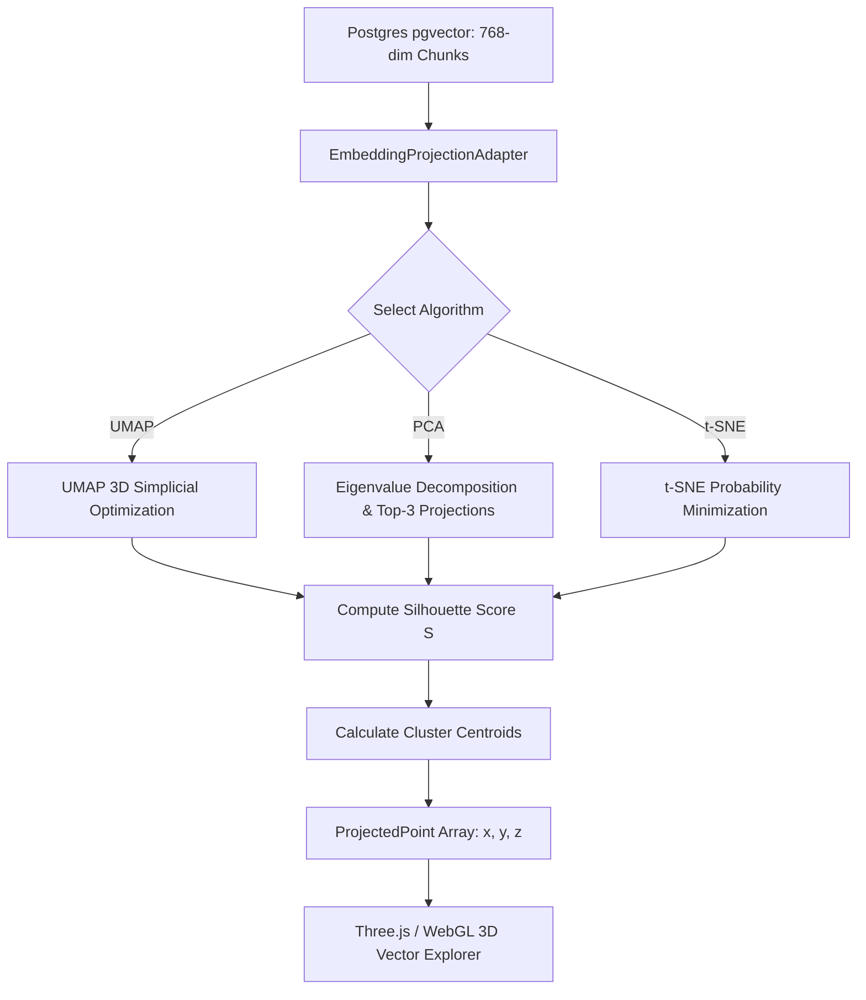

# Cognitive Architecture Deep-Dive: Embedding Space Manifold Projection

**Module:** Cognitive Architecture & Vector Space Observability  
**Milestone:** 83 (Phase K)  
**Version:** `v0.68.0`  

---

## 1. Problem Statement & Need for Observability

Vector search operates in high-dimensional spaces ($\mathbb{R}^{768}$ for `nomic-embed-text` and $\mathbb{R}^{1536}$ for `text-embedding-3-small`). To human engineers, this space is a black box:
- How uniformly are a tenant's documents distributed?
- Are document chunks forming distinct topical clusters or overlapping ambiguously?
- Where does a live search query fall relative to retrieved vs missed candidate chunks?

Milestone 83 introduces the **Embedding Space Projection Engine** (`EmbeddingProjectionAdapter`), powering the **3D Vector Explorer** in SaaS App Studio and Admin Dashboard with mathematically grounded dimensionality reduction (PCA, t-SNE, UMAP 2D/3D) and Silhouette cluster quality metrics.

---

## 2. Dimensionality Reduction Algorithms

Let $N$ chunk embeddings be represented by matrix $\mathbf{X} \in \mathbb{R}^{N \times D}$, where $D = 768$.

### A. Principal Component Analysis (PCA) — Fast Global Variance
PCA projects embeddings onto the orthogonal axes of maximal variance:
$$\mathbf{Z} = \mathbf{X} \mathbf{W}_d$$
Where $\mathbf{W}_d \in \mathbb{R}^{D \times d}$ consists of the top $d \in \{2, 3\}$ eigenvectors of the covariance matrix $\boldsymbol{\Sigma} = \frac{1}{N} \mathbf{X}^T \mathbf{X}$.
The engine calculates the **Explained Variance Ratio**:
$$\text{EVR} = \frac{\sum_{i=1}^d \lambda_i}{\sum_{j=1}^D \lambda_j}$$
Providing an indicator of how faithfully the 2D/3D subspace captures total variance.

### B. UMAP (Uniform Manifold Approximation and Projection) — Local Geometry
UMAP constructs a fuzzy simplicial set representation of the high-dimensional data and optimizes the low-dimensional layout by minimizing cross-entropy:
$$C_{\text{UMAP}} = \sum_{i \ne j} \left( p_{ij} \log \frac{p_{ij}}{q_{ij}} + (1 - p_{ij}) \log \frac{1 - p_{ij}}{1 - q_{ij}} \right)$$
Preserves both local chunk neighborhoods and global document clusters.

### C. Dynamic Test Query Projection
When a user types a test query in the 3D visualizer:
1. The query string $q$ is embedded via `nomic-embed-text` into $\mathbf{v}_q \in \mathbb{R}^D$.
2. The PCA projection matrix $\mathbf{W}_d$ transforms the query vector dynamically:
   $$\mathbf{z}_q = (\mathbf{v}_q - \boldsymbol{\mu}_{\mathbf{X}}) \mathbf{W}_d$$
3. The visualizer renders the query as a glowing pulsating star, drawing directional vectors to the nearest Top-$K$ retrieved neighbor nodes.

---

## 3. Cluster Separation & Silhouette Quality ($S$)

For clustered document chunks, cluster quality is validated using the **Silhouette Coefficient**:
$$s(i) = \frac{b(i) - a(i)}{\max(a(i), b(i))}$$
Where:
- $a(i)$: Mean intra-cluster distance between chunk $i$ and all other points in the same cluster.
- $b(i)$: Mean nearest-cluster distance between chunk $i$ and points in the closest neighboring cluster.
- Overall score $S = \frac{1}{N} \sum_{i=1}^N s(i) \in [-1, 1]$.
  - $S > 0.5$: Well-separated, distinct semantic topics.
  - $0.2 \le S \le 0.5$: Moderate overlap (standard enterprise domain).
  - $S < 0.2$: Heavy semantic collision / redundant chunks.

---

## 4. End-to-End Pipeline

