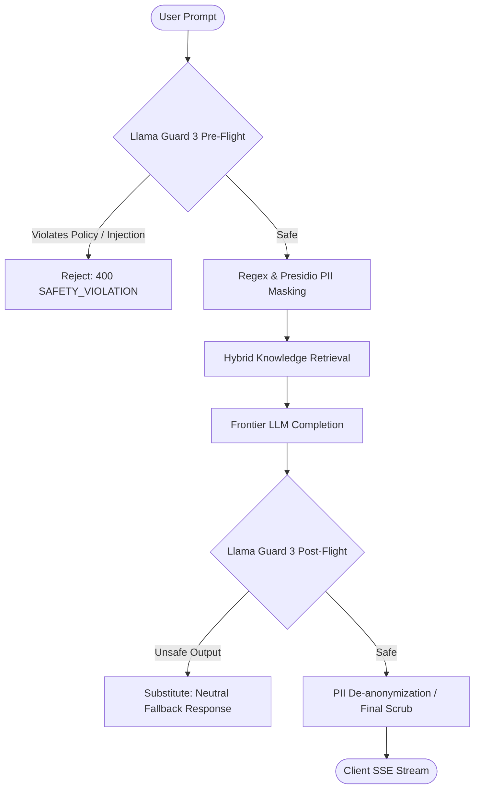

# Cognitive Deep-Dive: Enterprise Guardrails, Llama Guard 3 & Zero-Footprint PII Redaction

#cognitive #guardrails #llamaguard #pii #security #safety #retriever

> **Technical architecture, prompt injection defenses, content moderation classifiers, and zero-footprint PII redaction.**

---

## 1. Zero-Trust Guardrails Architecture

Retriever wraps every inbound user prompt and outbound LLM generation with a dual-stage safety perimeter:

---

## 2. Protected Hazard Categories

| Hazard Code | Category Description | Detection Engine |
|:---|:---|:---|
| `S1` | Violent Crimes & Physical Harm | Llama Guard 3 |
| `S2` | Non-Violent Illegal Acts | Llama Guard 3 |
| `S3` | Sexually Explicit Content | Llama Guard 3 |
| `S4` | Child Sexual Exploitation | Llama Guard 3 |
| `S5` | Defamation & Hate Speech | Llama Guard 3 |
| `S6` | Specialized Advice (Financial / Medical) | Domain Boundary Classifier |
| `S7` | System Prompt Extraction & Jailbreaks | Regex + Heuristic AST Filter |
| `PII` | Email, Phone, Credit Card, SSN, API Keys | Microsoft Presidio / Regex Engine |

---

## 🔗 Related Architecture & Cross-References
- [Chat API Specification](../api/chat.md)
- [Zero-Trust Storage & Encryption](../infrastructure/storage_and_encryption.md)
