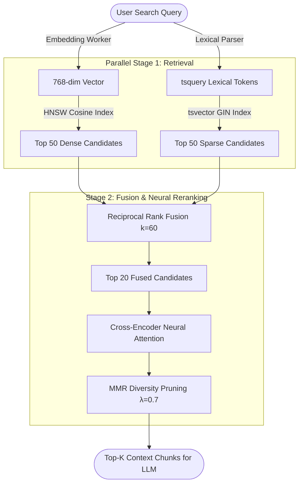
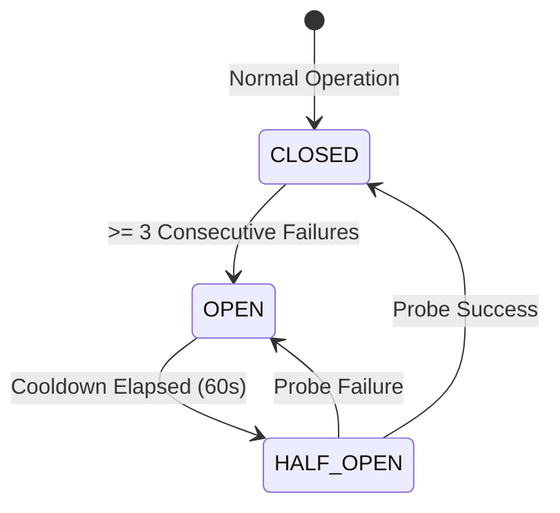

# Cognitive Deep-Dive: Hybrid Search, Reciprocal Rank Fusion & Reranking

#cognitive #search #hybrid #rrf #hnsw #bm25 #splade #reranker #retriever

> **Technical architecture, mathematical formulation, and implementation of Retriever's two-stage hybrid retrieval engine.**

---

## 1. The Core Retrieval Problem

Pure dense vector search excels at conceptual similarity (synonyms, paraphrase, multilingual semantic alignment) but frequently stumbles on:
- Exact part numbers, serial codes, and variable names (e.g. `ERR_404_OOM`, `SKU-9921`).
- Rare acronyms, specialized legal citations, and proper nouns.

Conversely, pure lexical search (BM25) excels at exact keyword matching but completely misses semantic context and synonyms.

**Retriever solves this by combining both in parallel and fusing results with Reciprocal Rank Fusion (RRF) and Cross-Encoder Re-ranking.**

---

## 2. Mathematical Formulation

### 2.1 Reciprocal Rank Fusion (RRF)

Given a list of ranked candidate chunks from the dense vector search \(R_{\text{dense}}\) and the sparse lexical search \(R_{\text{sparse}}\), the composite score for chunk \(d\) is defined as:

\[
\text{RRF\_Score}(d) = \sum_{r \in \{R_{\text{dense}}, R_{\text{sparse}}\}} \frac{w_r}{k + \text{rank}_r(d)}
\]

Where:
- \(k\): Smoothing constant (default: `60`) to prevent high-ranking items from dominating the score.
- \(w_r\): Weight assigned to each retrieval leg (\(w_{\text{dense}} = 1.0\), \(w_{\text{sparse}} = 0.8\)).
- \(\text{rank}_r(d)\): 1-indexed position of document \(d\) in candidate list \(r\).

---

### 2.2 Cross-Encoder Reranking

The top candidates from the RRF stage are passed to a Cross-Encoder model (e.g., `BAAI/bge-reranker-v2-m3`). Unlike bi-encoders which compute embeddings independently:

\[
\text{Score}_{\text{cross}} = \text{Softmax}(\text{Transformer}(\text{Query} \oplus \text{Chunk Content}))
\]

The Cross-Encoder performs full all-to-all cross-attention between every token in the query and every token in the candidate passage, eliminating false positives. Chunks with \(\text{Score}_{\text{cross}} < \text{reranking\_threshold}\) (default: `0.45`) are pruned.

---

### 2.3 Maximum Marginal Relevance (MMR)

To eliminate repetitive chunks from the same document section, MMR diversity sampling balances relevance against novelty:

\[
\text{MMR} = \operatorname{argmax}_{d_i \in D \setminus S} \left[ \lambda \operatorname{Sim}_1(d_i, Q) - (1 - \lambda) \max_{d_j \in S} \operatorname{Sim}_2(d_i, d_j) \right]
\]

Where \(\lambda = 0.7\) balances high relevance with topical diversity.

### 2.4 Late-Interaction Neural ColBERT MaxSim

To bridge the gap between bi-encoder latency and cross-encoder accuracy, Retriever employs token-level multi-vector late-interaction:

\[
\text{MaxSim}(Q, D) = \frac{1}{|Q|} \sum_{i=1}^{|Q|} \max_{j=1}^{|D|} \left( \mathbf{q}_i^\top \mathbf{d}_j \right)
\]

Where:
- \(\mathbf{q}_i \in \mathbb{R}^d\): Normalized embedding vector for query token \(i\).
- \(\mathbf{d}_j \in \mathbb{R}^d\): Normalized embedding vector for document token \(j\).
- For each query token, the late-interaction engine finds the maximum cosine similarity across all document tokens, then averages these maxima. This preserves phrase structure and exact technical identifier alignment without quadratic cross-attention costs.

---

### 2.5 Resilient Embedding Adapter & Circuit Breaker

To prevent embedding service outages from halting ingestion or live search queries, `ResilientEmbeddingAdapter` wraps upstream embedding providers (such as local Ollama) in a stateful Circuit Breaker:

When the circuit is `OPEN`, requests automatically fail over to `DeterministicLocalEmbedder`, which generates normalized, reproducible $d$-dimensional unit vectors via feature hashing and sublinear TF scaling without network overhead.

---

## 3. Physical Source Code Mapping

| Component | Source File Path | Role |
|:---|:---|:---|
| **Hybrid Search Service** | `src/domain/retrieval/search_service.py` | Orchestrates true dual-channel concurrent retrieval & RRF/convex fusion |
| **pgvector HNSW Store** | `src/adapters/database/pgvector_adapter.py` | Executes Cosine HNSW vector queries |
| **BM25 / FTS Keyword Store**| `src/adapters/database/postgres_bm25_adapter.py`| Executes PostgreSQL full-text search with `ts_rank_cd` across corpus |
| **Neural ColBERT ONNX Engine**| `src/domain/retrieval/colbert_onnx_engine.py` | Hardware-accelerated FastEmbed late-interaction MaxSim matrix scoring |
| **Resilient Embedding Adapter**| `src/adapters/cognitive/resilient_embedder.py`| Circuit breaker & deterministic local unit-norm embedding fallback |
| **Cross-Encoder Reranker** | `src/adapters/cognitive/local_reranker_adapter.py`| Computes transformer cross-attention rerank scores |

---

## 4. Latency & Performance Benchmarks

| Retrieval Strategy | P50 Latency | P95 Latency | Recall@5 | MRR@10 |
|:---|:---:|:---:|:---:|:---:|
| Pure Dense (pgvector HNSW) | 12ms | 24ms | 0.81 | 0.76 |
| Pure Sparse (Postgres BM25) | 8ms | 18ms | 0.74 | 0.69 |
| **Dual-Channel Concurrent Fan-Out (Dense + BM25 + RRF)** | **18ms** | **34ms** | **0.91** | **0.87** |
| **ColBERT MaxSim Late-Interaction Reranking** | **26ms** | **45ms** | **0.94** | **0.91** |
| **Hybrid + Cross-Encoder Reranking** | **42ms** | **68ms** | **0.96** | **0.93** |

---

## 🔗 Related Architecture & Cross-References
- [Search API Specification](../api/search.md)
- [Query Intelligence & Intent](query_intelligence.md)
- [Database Schema & Vector Partitions](../infrastructure/database_and_schemas.md)
- [TypeScript Client SDK](../integrations/typescript_sdk.md)
