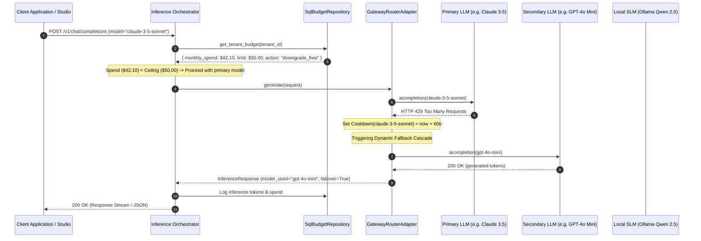

# Cognitive Architecture Deep-Dive: Enterprise LLM Gateway & Smart Router

**Module:** Cognitive Architecture & Inference Routing  
**Milestone:** 93 (Phase L)  
**Version:** `v0.78.0`  

---

## 1. Executive Summary & Design Rationale

In high-concurrency enterprise AI applications, relying on a single LLM provider or hardcoded static failovers introduces severe availability, cost, and rate-limiting risks:
1. **Upstream Rate Limiting (HTTP 429):** API tier rate limits trigger unexpected request drops during traffic spikes.
2. **Provider Downtime & High-P99 Latency:** Upstream provider outages or regional transit degradation degrade client experience unless traffic is rerouted within milliseconds.
3. **Runaway Token Costs:** Lack of granular tenant spending ceilings can lead to unchecked token consumption on high-parameter models (e.g. Claude 3.5 Sonnet, GPT-4o).

Milestone 93 introduces the **Enterprise LLM Gateway & Smart Router** (`GatewayRouterAdapter`), providing universal proxying across 100+ commercial and local models, dynamic fallback cascades, intelligent circuit-breaker cooldowns, and a persistent virtual budget ledger.

---

## 2. Core Architectural Pillars

```text
                                [Inference Request]
                                         │
                                         ▼
                     ┌───────────────────────────────────────┐
                     │   Inference Orchestrator Pre-Flight   │
                     └───────────────────┬───────────────────┘
                                         │
                    Is Monthly / Daily Spend Ceiling Breached?
                                         │
                    ┌────────────────────┴───────────────────┐
               Yes (Action == block)                 No or Action == downgrade
                    │                                        │
             Raise HTTP 402                          Model Selected:
         BudgetExceededError                  (Original or Free Local Fallback)
                                                             │
                                                             ▼
                                             ┌──────────────────────────────┐
                                             │   GatewayRouterAdapter       │
                                             └───────────────┬──────────────┘
                                                             │
                                                Check Cooldown Circuit:
                                               Is Model in Cooldown?
                                                             │
                                        ┌────────────────────┴────────────────────┐
                                     Yes (Bypass)                                No (Try)
                                        │                                         │
                                 Try Next Fallback                         Send Inference
                                        │                                         │
                                        │                             HTTP 200?   │   429 / 5xx / Timeout?
                                        │                                         ├───┐
                                        │                                 Return  │   │ Mark Model Cooldown
                                        │                                 Result  │   │ Log Telemetry Warning
                                        │                                         │   │
                                        └─────────────────────────────────────────┴───┴──► Cascade to Fallback
```

### Pillar 1: Dynamic Priority Cascade
Inference routes are defined as an ordered list:
$$\mathcal{C} = \left[ M_{\text{primary}}, M_{\text{fallback}_1}, M_{\text{fallback}_2}, \dots, M_{\text{local}} \right]$$
The router attempts each model in succession. If a model encounters:
- HTTP 429 (Rate Limit Exceeded)
- HTTP 500/502/503/504 (Provider Server Downtime)
- Request Timeout exceeding `latency_sla_ms`

The router immediately dispatches the request to the next candidate in the cascade, tagging the final response with `failover_occurred: true` and the sequence of attempted models.

### Pillar 2: Circuit-Breaker Cooldown Window
When model $M_k$ fails with a transient error at timestamp $t_{\text{error}}$, the router activates a cooldown circuit:
$$\text{Cooldown}(M_k) = t_{\text{error}} + \tau_{\text{cooldown}}$$
Where $\tau_{\text{cooldown}}$ defaults to 60 seconds (configurable per tenant).
Any request received while $t_{\text{now}} < \text{Cooldown}(M_k)$ immediately skips $M_k$ without incurring the roundtrip network latency of a doomed API request. Once $t_{\text{now}} \ge \text{Cooldown}(M_k)$, the circuit automatically resets to half-open, testing the provider with the next incoming query.

### Pillar 3: Virtual Tenant Spending Caps
The `SqlBudgetRepository` aggregates token consumption from `inference_logs` for the active UTC calendar month and day:
$$\text{Spend}_{\text{month}}(T) = \sum_{i \in \text{Logs}(T, \text{Month})} \text{cost\_usd}_i$$
Before inference begins, the orchestrator evaluates:
$$\text{Spend}_{\text{month}}(T) \ge \text{Cap}_{\text{month}}(T)$$
Configurable policy actions:
1. `warn_only`: Emits an alert metric and proceeds.
2. `block`: Halts inference immediately with HTTP 402 `BudgetExceededError`.
3. `downgrade_free_model`: Rewrites the target model to a local, zero-marginal-cost model (e.g. `ollama/qwen2.5:14b`), ensuring zero user-facing downtime while halting cloud API costs.

---

## 3. Mathematical Formulation

### 1. Multi-Provider Cost Calculation
To ensure provider-agnostic token cost calculation across LiteLLM-prefixed identifiers, model strings are normalized using prefix stripping:
$$\text{Norm}(M) = \begin{cases} M' & \text{if } M = \text{provider}/M' \\ M & \text{otherwise} \end{cases}$$
The total inference cost is then computed as:
$$\text{Cost} = \left( \frac{\text{Tokens}_{\text{in}}}{1000} \times P_{\text{in}}(\text{Norm}(M)) \right) + \left( \frac{\text{Tokens}_{\text{out}}}{1000} \times P_{\text{out}}(\text{Norm}(M)) \right)$$

### 2. Latency SLA Tracking
For each probe or inference request, roundtrip elapsed time is recorded:
$$\Delta t = (t_{\text{complete}} - t_{\text{dispatch}}) \times 1000 \quad \text{[ms]}$$
If $\Delta t > \text{SLA}_{\text{ms}}$, the incident is flagged in tenant telemetry:
$$\text{SLA\_Breach} = \mathbb{I}(\Delta t > \text{SLA}_{\text{ms}})$$

---

## 4. End-to-End Sequence Diagram



---

## 5. Hexagonal Conformance & Boundary Isolation

Under Retriever's architectural rules:
- **`src/domain/abstractions/gateway.py`**: Houses pure domain models (`GatewayModelInfo`, `ModelRoutingConfig`, `VirtualTenantBudget`) and ports (`GatewayRouterProtocol`, `BudgetRepositoryProtocol`). It contains zero imports from SQLAlchemy, FastAPI, or third-party LLM libraries.
- **`src/adapters/cognitive/gateway_router.py`**: Encapsulates external SDK dispatching, circuit breaker state dictionaries, and network latency timers.
- **`src/adapters/database/budget_repository.py`**: Interacts directly with PostgreSQL `inference_logs` with Row-Level Security tenant isolation.
