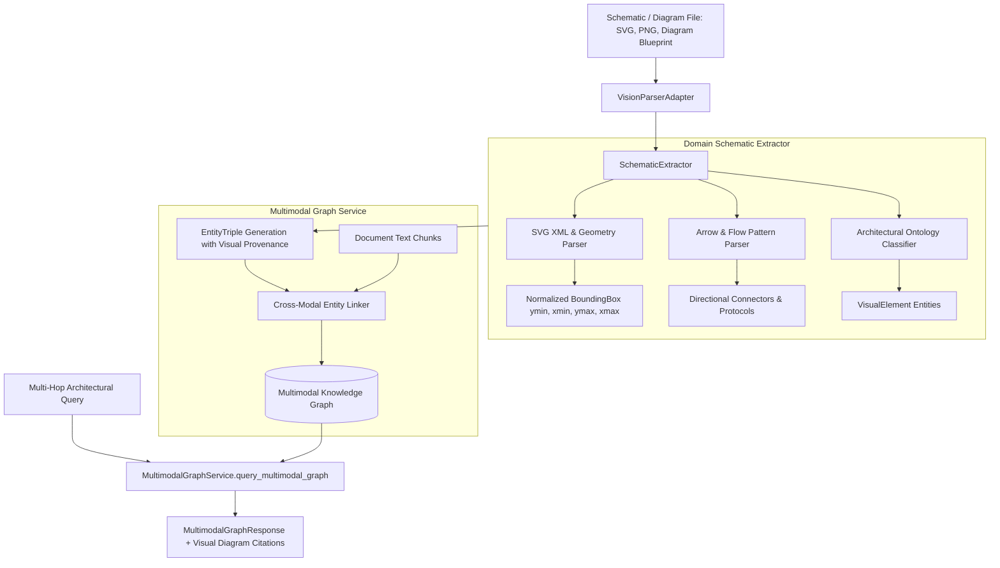

# Cognitive Deep-Dive: Multimodal Vision GraphRAG & Architectural Schematic Ingestion

#cognitive #vision #graphrag #schematics #multimodal #triples #retriever #battery29

> **Technical architecture, visual bounding-box coordinates, architectural ontology classification, connector topology extraction, and cross-modal GraphRAG linking in Retriever Battery #29.**

---

## 1. Executive Summary & Problem Statement

Standard RAG engines are blind to architectural schematics, system flowcharts, circuit diagrams, and cloud infrastructure visual topologies. When system diagrams (e.g. AWS architectures, Kubernetes deployments, microservice communication topologies) are ingested as plain text or flattened OCR, spatial relationships, protocols, and dataflow directionality are completely lost.

**Retriever Battery #29 (`multimodal_vision_graphrag`)** under `BatteryCategory.COMPUTATION_GRAPH` introduces a native multimodal perception and knowledge-graph engine that parses technical diagrams into:
1. **Geometric Visual Elements:** Components classified under strict architectural ontologies (e.g., `api_gateway`, `database`, `microservice`, `queue`, `client_app`) with normalized `[ymin, xmin, ymax, xmax]` bounding boxes ($0.0 \le \text{coord} \le 1.0$).
2. **Directional Visual Connectors:** Explicit arrows and flowlines annotated with protocols (`HTTPS POST`, `gRPC`, `AMQP`, `SQL`) and directionality (`unidirectional`, `bidirectional`).
3. **Cross-Modal Graph Entities:** Ingested diagram elements are grounded into the tenant's global knowledge graph, bridging textual documentation and visual layout.

---

## 2. Multimodal Architecture Overview



---

## 3. Core Geometric & Graph Primitives

### 3.1 Normalized Bounding Box (`BoundingBox`)
All bounding boxes adhere to standard normalized coordinate spaces:
$$\text{coords} = [y_{\min}, x_{\min}, y_{\max}, x_{\max}]$$
with invariants:
- $0.0 \le y_{\min} < y_{\max} \le 1.0$
- $0.0 \le x_{\min} < x_{\max} \le 1.0$

Intersection over Union (IoU) calculation:
$$\text{IoU}(A, B) = \frac{\text{Area}(A \cap B)}{\text{Area}(A \cup B)}$$

### 3.2 Architectural Ontology Classes (`VisualElementType`)
Components are classified into first-class system types:
- `api_gateway`: API routers, reverse proxies, ingress controllers.
- `database`: PostgreSQL, Redis, DynamoDB, MongoDB, vector stores.
- `microservice`: Backend workers, domain services, containerized apps.
- `queue`: Kafka, RabbitMQ, SQS, pub/sub streams.
- `client_app`: Web frontends, mobile clients, external callers.
- `cache`: Redis, Memcached, semantic caches.
- `storage`: S3, GCS, Blob storage, static file buckets.
- `auth_service`: OAuth servers, Cognito, Auth0, Supabase Auth.

---

## 4. Visual Diagram Citations & Lightbox

Retriever outputs visual diagram citations alongside text citations in LLM completions:
```text
[Schematic: Architecture.svg | Box: 0.15,0.20,0.35,0.40 | "API Gateway"]
```
When parsed by the Control Plane (`ChatPanel.tsx`), users can click the badge to open an interactive lightbox rendered through `<Portal>`, displaying:
- Schematic canvas viewport with pulsing bounding-box overlays.
- Exact coordinates and confidence score.
- Verified cross-modal links back to the underlying specification text.

---

## 5. API Endpoints

- `GET /v1/graph/multimodal/status`: Battery registration and capability status.
- `POST /v1/tenants/{tenantId}/vision/schematic/extract`: Multipart upload for binary images and SVGs.
- `POST /v1/tenants/{tenantId}/vision/schematic/extract-text`: Text/SVG string extraction.
- `POST /v1/tenants/{tenantId}/vision/graph/query`: Multi-hop entity query spanning visual elements and text chunks.
- `GET /v1/tenants/{tenantId}/vision/schematics/{documentId}`: Retrieve all visual triples linked to a document.

---

## 🔗 Related Architecture & Cross-References
- [GraphRAG Knowledge Graph](graphrag.md)
- [Hybrid Search & Fusion](hybrid_search_and_fusion.md)
- [DSPy Prompt Compilation](dspy_prompt_compilation.md)
