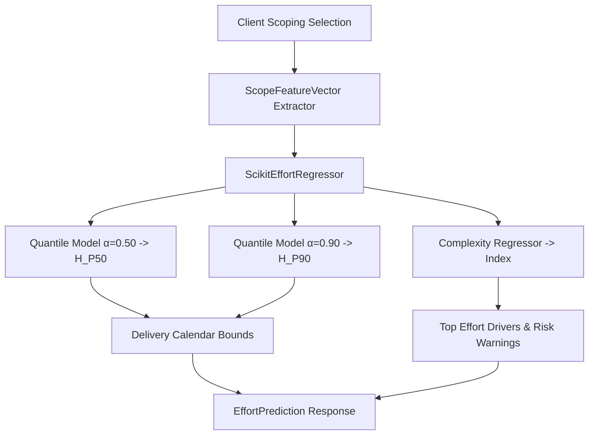

# Cognitive Architecture Deep-Dive: Quantile Effort Regression & Sprint Delivery Bounds

**Module:** Machine Learning & CPQ Scoping Intelligence  
**Milestone:** 84 (Phase K)  
**Version:** `v0.69.0`  

---

## 1. Problem Statement & Motivation

Traditional software estimation relies on ad-hoc gut feeling, resulting in either under-quoted engagements (eroding developer margin) or inflated timelines (deterring clients).

Milestone 84 replaces manual quoting heuristics with a statistical machine-learned regression engine: **`ScikitEffortRegressor`**.
The engine translates architectural specifications (DAG topological depth, module categories, engine archetype, and design tier) into empirical **Quantile Effort Bounds (P50/P90)** and calendar delivery windows.

---

## 2. Mathematical Modeling: Quantile Gradient Boosting

Let a project scope feature vector be $\mathbf{x} \in \mathbb{R}^{11}$:
$$\mathbf{x} = \begin{bmatrix} e_{\text{engine}} & N_{\text{features}} & N_{\text{auth}} & N_{\text{db}} & N_{\text{ai}} & N_{\text{voice}} & N_{\text{billing}} & N_{\text{admin}} & d_{\text{DAG}} & w_{\text{brand}} & w_{\text{care}} \end{bmatrix}^T$$

To capture asymmetry and project delivery risk, the engine trains two independent **Quantile Gradient Boosted Trees** optimizing the pinball loss function:

$$L_\alpha(y, \hat{y}) = \begin{cases} \alpha (y - \hat{y}) & \text{if } y \ge \hat{y} \\ (1 - \alpha)(\hat{y} - y) & \text{if } y < \hat{y} \end{cases}$$

### Quantiles:
1. **Median Effort ($H_{\text{P50}}$):** $\alpha = 0.50$ (Expected engineering effort under standard velocity).
2. **Risk-Buffered Upper Bound ($H_{\text{P90}}$):** $\alpha = 0.90$ (Covers 90% of delivery contingencies including third-party API delays, webhook debugging, and schema revisions).

### 3. Calendar Delivery Turnaround
Given developer focused sprint capacity (nominally $C = 6.0$ productive engineering hours/day):

$$\text{Days}_{\text{min}} = \max\left(3, \left\lceil \frac{H_{\text{P50}}}{6.0} \right\rceil\right)$$
$$\text{Days}_{\text{max}} = \max\left(\text{Days}_{\text{min}} + 2, \left\lceil \frac{H_{\text{P90}}}{4.0} \right\rceil\right)$$

Where the denominator for the upper bound is reduced to $4.0\text{h/day}$ to account for client feedback cycles, QA testing, and DNS propagation.

### 4. Architectural Complexity Index
Complexity $C_{\text{arch}} \in [1.0, 5.0]$ is regressed using mean squared error over graph topology:

$$C_{\text{arch}} = 1.0 + 0.4 \cdot d_{\text{DAG}} + 0.3 \cdot \mathbb{I}(\text{AI} > 0) + 0.5 \cdot \mathbb{I}(\text{Voice} > 0) + 0.2 \cdot \log(1 + N_{\text{features}})$$

---

## 3. End-to-End Estimation Flow

---

## 4. Architectural Hexagonal Conformance
- **Domain:** Pure interface `EffortEstimatorInterface` and models `ScopeFeatureVector`, `EffortPrediction` in `src/domain/abstractions/effort_estimation.py`.
- **Adapter:** `ScikitEffortRegressor` in `src/adapters/ml/scikit_effort_regressor.py` encapsulates `sklearn.ensemble.GradientBoostingRegressor`.
- **Router:** `src/routers/estimation.py` exposes `POST /v1/scoping/estimate-timeline` without direct ML library coupling.
