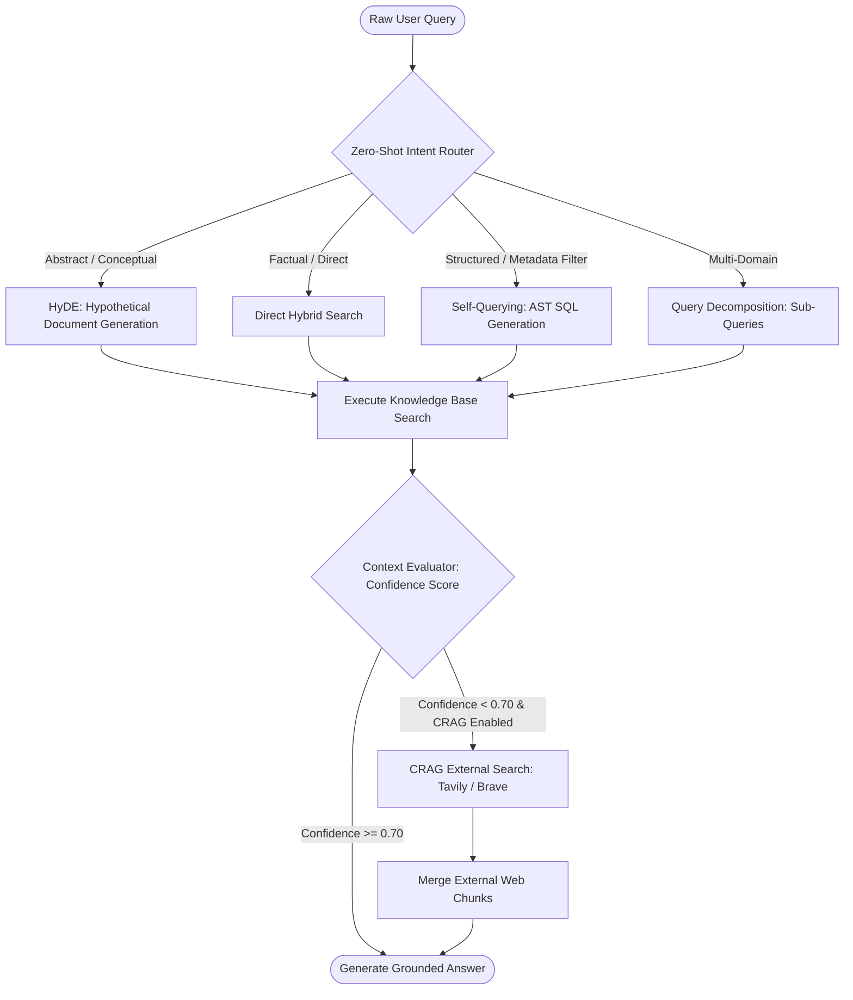

# Cognitive Deep-Dive: Query Intelligence, HyDE, Self-Querying & Corrective RAG (CRAG)

#cognitive #query #hyde #crag #selfquery #routing #retriever

> **Technical architecture, routing heuristics, and fallback mechanisms for intent-aware dynamic query transformation.**

---

## 1. Multi-Stage Query Intelligence Pipeline

Raw user queries are often ambiguous, underspecified, or mix analytical criteria with semantic intent. Retriever runs a 4-stage query enhancement engine:



---

## 2. Query Transformation Techniques

### 2.1 Hypothetical Document Embeddings (HyDE)
For questions with few keyword overlaps with source texts, Retriever prompts a fast LLM to generate a plausible hypothetical response \(D_{\text{hypo}}\). We then embed \(D_{\text{hypo}}\) instead of the raw query \(Q\):

\[
\vec{v}_{\text{search}} = \operatorname{Embed}(D_{\text{hypo}})
\]

This bridges the vocabulary gap between questions and encyclopedic documentation.

---

### 2.2 Self-Querying (Natural Language to AST Filter)
Extracts structured filters automatically from natural language:
- **User Prompt:** *"Show me 2026 security whitepapers with high severity ratings."*
- **Generated AST Filter:**
```json
{
  "and": [
    {"field": "year", "operator": "eq", "value": 2026},
    {"field": "category", "operator": "eq", "value": "security"},
    {"field": "severity", "operator": "eq", "value": "high"}
  ]
}
```

---

### 2.3 Corrective RAG (CRAG) External Fallback
If the internal vector store cannot find relevant chunks (\(\text{max\_score} < 0.65\)), the CRAG engine triggers an external search query via Tavily or Brave Search API, ingesting and ranking real-time web results on the fly.

---

## 🔗 Related Architecture & Cross-References
- [Search API Specification](../api/search.md)
- [Chat & Streaming API](../api/chat.md)
- [Hybrid Search & Fusion](hybrid_search_and_fusion.md)
