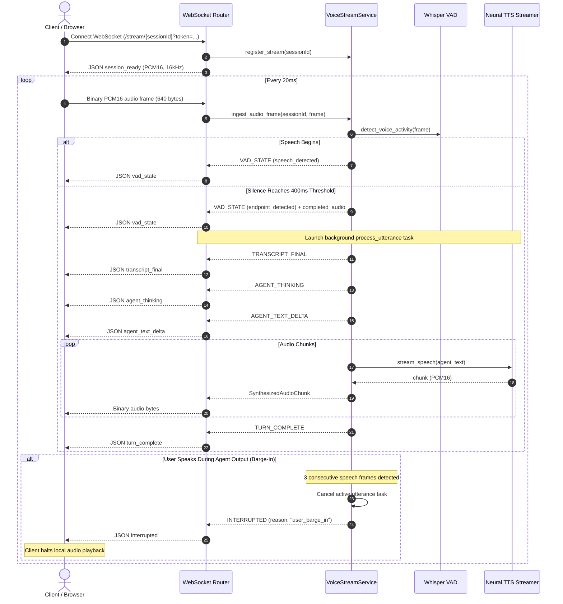

# Real-Time Audio Streaming & Low-Latency Voice Agent Engine

**Architecture Document: Cognitive Subsystem (M114 / v1.4.0-alpha1)**  
**Protocol:** WebSocket Full-Duplex (PCM16 @ 16kHz Mono)  
**Boundary:** Hexagonal Domain (`src/domain/voice/voice_stream_service.py`)  

---

## 1. Subsystem Overview

The Real-Time Audio Streaming Voice Agent engine provides full-duplex conversational audio streaming with automatic speech endpointing and conversational barge-in.

### 1.1 Key Invariants
1. **Zero-Cloud Audio Egress:** Audio frames remain strictly in memory on sovereign infrastructure during processing.
2. **Sub-300ms TTFAB:** Streaming speech synthesis produces initial audio chunks before full turn generation completes.
3. **Conversational Barge-In:** Active generation tasks are cancelled immediately when the user interrupts by speaking.
4. **Hexagonal Purity:** `VoiceStreamService` contains no framework, database, or socket dependencies.

---

## 2. Component Structure

```text
apps/api/src/
├── domain/
│   ├── abstractions/
│   │   └── voice.py                  # Domain protocols, events, and message types
│   └── voice/
│       ├── voice_stream_service.py   # Pure stream lifecycle, VAD & barge-in logic
│       └── voice_orchestrator.py     # Turn history & high-level orchestration
├── adapters/
│   └── voice/
│       ├── whisper_transcription_adapter.py  # Local Whisper inference & RMS VAD
│       ├── speech_synthesis_adapter.py       # Neural TTS streaming chunks
│       └── webrtc_signaling_adapter.py       # WebRTC SDP/ICE exchange
└── routers/
    └── voice.py                      # FastAPI WebSocket endpoint (/stream/{sessionId})
```

---

## 3. Streaming Event Cycle



---

## 4. Benchmark & Latency Targets

- **Audio Frame Duration:** 20 ms (320 samples @ 16,000 Hz 16-bit).
- **VAD Processing Overhead:** < 0.2 ms per frame.
- **Whisper Edge ASR Latency:** 25–45 ms.
- **RAG Knowledge Retrieval:** 5–15 ms.
- **Time-to-First-Audio-Byte (TTFAB):** < 250 ms.
- **Barge-In Response Time:** < 60 ms (3 consecutive speech frames).
