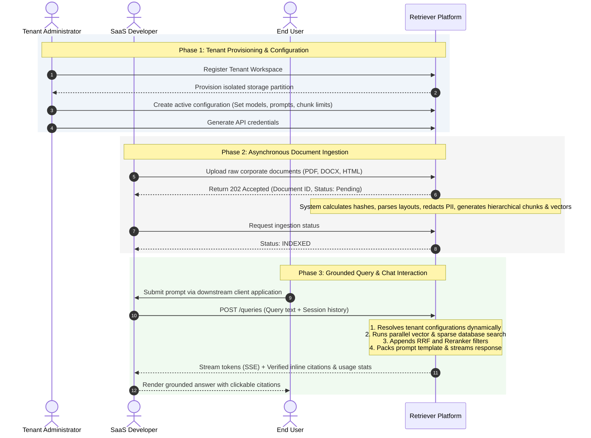
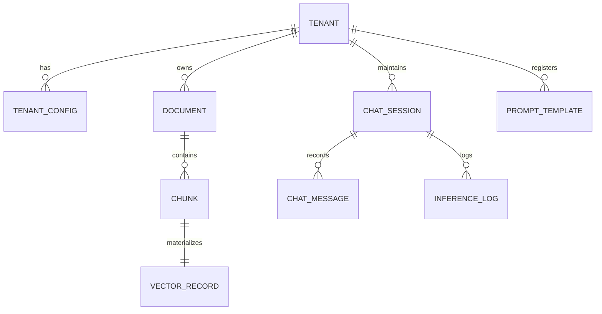

# Feature Specification: Retriever Core Platform

---

## 1. Product Overview

Retriever is a headless, multi-tenant AI Knowledge Platform designed to serve as the permanent, secure memory layer for enterprise AI applications. The platform decouples corporate knowledge from cognitive engines (Large Language Models), enabling downstream systems to query, search, and synthesize proprietary data across multiple modalities without being tied to specific LLMs, vector stores, or cloud vendors. 

At its core, Retriever provides standard APIs and SDKs to ingest unstructured documentation, decompose it into semantic chunks, construct hierarchical relationships, execute high-performance hybrid queries, and orchestrate grounded generative answers with strict citation enforcement and security boundaries.

### 1.1 Out of Scope (What Retriever is NOT)
To maintain architectural focus and prevent scope creep, Retriever explicitly excludes:
*   **Default User Interface:** No static chatbot interface or document dashboard is provided in the core platform; Retriever is API-driven (reference implementations exist separately).
*   **Workflow Automation:** Retriever does not orchestrate business logic flows, conditional system integrations, or multi-app actions.
*   **Business Intelligence (BI):** Retriever does not generate reporting charts, metrics dashboards, or data aggregation analytics.
*   **Model Training or Hosting:** Retriever does not train, fine-tune, or host base LLMs or embedding models; it connects to external endpoints via abstraction adapters.

---

## 2. Primary User Personas

The platform serves three primary distinct user personas.

| Persona | Role | Primary Objective | Key Requirements |
|---|---|---|---|
| **SaaS Developer (Consumer)** | Integrates Retriever APIs into downstream corporate apps (e.g., custom Slack bots, internal search, CRM side panels). | Retrieve highly relevant contexts and generated answers for end users. | - Stable, well-documented REST APIs - Client SDKs (Python/TypeScript) - Low-latency query pathways - Consistent JSON schemas |
| **Tenant Administrator (Admin)** | Manages a specific workspace/tenant's data boundaries, configurations, and permissions. | Configure business-specific knowledge bases, prompt guidelines, and models. | - Runtime configuration API - Document status dashboards - Secret/API key management - Prompt registry control |
| **Platform Engineer (Operator)** | Deploys, monitors, and operates the global Retriever installation. | Ensure high availability, strict tenant isolation, scalability, and operational security. | - Detailed telemetry (OpenTelemetry) - Multi-tenant resource caps - Row-level isolation validation - Asynchronous queue monitoring |

---

## 3. End-to-End User Journey

The diagram below details the operational sequence from tenant initialization to grounded document search and chat:

---

## 4. Core Features

Retriever's capabilities are divided into five logical feature groups:

1.  **Multi-Tenant Identity & Config Registry (`identity`):** Authentication of requests, enforcement of security boundaries, and dynamic lookup of runtime configuration schemas.
2.  **Asynchronous Document Ingestion (`ingestion`):** Parallel document upload parsing, sandboxed layouts extraction, duplicate file detection, and PII sanitization.
3.  **Knowledge Indexing & Hierarchical Chunking (`knowledge`):** Text segmentation strategies, parent-child context trees, and automatic vector synchronization.
4.  **Hybrid Retrieval & Fusion (`retrieval`):** Merged vector-semantic and relational-keyword queries, metadata classification filters, and relevance reranking.
5.  **Grounded Generative Inference (`inference`):** Session history retention, context compilation, citation-first generation, safety guardrails, structured JSON generation, tool orchestration, and human-in-the-loop approvals.

---

## 5. Functional Requirements

### 5.1 Multi-Tenant Identity & Config Registry
*   **FR-1.1: Multi-Tenant Data Separation:** The platform MUST enforce strict data isolation between tenants. Under no circumstance may queries or documents belonging to Tenant A be exposed to Tenant B.
*   **FR-1.2: API Key Authentication:** The platform MUST authenticate every API request using unique credentials associated with a tenant ID.
*   **FR-1.3: Dynamic Configuration (CAD):** The platform MUST resolve prompt templates, cognitive model choices, temperature, chunk sizes, and retrieval weights dynamically at runtime based on the authenticated tenant context.
*   **FR-1.4: Isolation Level Configurations:** The system MUST support configurable database multi-tenancy mappings, allowing logical separation (Row-Level Security), logical database schemas separation, or physical server database separation per tenant.

### 5.2 Asynchronous Document Ingestion Pipeline
*   **FR-2.1: Multi-Format Upload:** The system MUST support uploading document formats including PDF, HTML, DOCX, and raw Text.
*   **FR-2.2: Asynchronous Parsing Sandbox:** The system MUST process document parsing asynchronously in a restricted container sandbox environment.
*   **FR-2.3: Structural Extraction:** The parsing process MUST preserve document metadata and structural elements, such as tables, headers, and bulleted lists.
*   **FR-2.4: Duplicate Detection:** The system MUST compute a content hash for every uploaded file. If the hash matches an existing document in the tenant's registry, the system MUST skip parsing and link to the existing asset.
*   **FR-2.5: PII Redaction:** The ingestion system MUST scan extracted text for Personally Identifiable Information (PII) and redact it based on tenant security policies prior to chunk indexing.
*   **FR-2.6: Status Monitoring:** The system MUST provide status tracking endpoints (`PENDING`, `PARSING`, `INDEXING`, `INDEXED`, `FAILED`) for document ingestion processes.

### 5.3 Knowledge Indexing & Chunk Management
*   **FR-3.1: Chunking Strategies:** The system MUST decompose documents into chunks based on tenant-configured parameters (e.g., token limits, overlap sizes, or semantic paragraph boundaries).
*   **FR-3.2: Parent-Child Hierarchies:** The system MUST record parent-child relationships between small semantic chunks (children, e.g., 200 tokens) and their surrounding context blocks (parents, e.g., 1000 tokens) to allow precise matches to retrieve broader context.
*   **FR-3.3: Automatic Vectorization:** The system MUST generate mathematical vectors (embeddings) for chunks automatically when a document is indexed.
*   **FR-3.4: Dynamic Vector Synchronization:** The system MUST update the vector database and relational chunk registries in a single transactional state to prevent orphan vectors.

### 5.4 Hybrid Retrieval & Fusion Engine
*   **FR-4.1: Parallel Search Execution:** The retrieval system MUST run a vector search query and a sparse-text keyword query in parallel.
*   **FR-4.2: Reciprocal Rank Fusion (RRF):** The retrieval system MUST merge parallel search results into a single ranked list using a Reciprocal Rank Fusion (RRF) algorithm.
*   **FR-4.3: Metadata Filtering:** The system MUST filter search candidate lists using metadata tags (e.g., source file date, custom categories, document type) before applying ranking algorithms.
*   **FR-4.4: Context Reranking:** The system MUST route the top fused candidates to a cross-encoder model to compute relevance scores and prune chunks below a tenant-configured similarity threshold.

### 5.5 Grounded Generative Inference
*   **FR-5.1: Chat Session Tracking:** The system MUST manage conversation histories, saving user inputs and system responses in session logs.
*   **FR-5.2: Prompt Construction:** The system MUST construct prompts dynamically by combining system guidelines, tenant persona configurations, retrieved context chunks, and user inputs.
*   **FR-5.3: Context Window Management:** The system MUST check the token counts of compiled prompts. If the prompt exceeds the target model's limits, it MUST automatically apply compression policies (e.g., summarizing older history or selecting only highest-scoring chunks).
*   **FR-5.4: Citation Enforcement:** Generated responses MUST include inline citations referring to specific source chunk IDs. The system MUST validate citations; responses containing unresolvable citations MUST trigger correction logic or throw a validation error.
*   **FR-5.5: Structured Output Generation:** The system MUST enforce structured JSON formats for models when requested and validate outputs against target JSON schemas.
*   **FR-5.6: Input/Output Guardrails:** The system MUST check input queries for prompt injection attempts and check output tokens for safety violations.
*   **FR-5.7: Tool Execution Scope:** If the cognitive model requests tool execution, the system MUST validate the tool schemas against the tenant's allowed scopes.
*   **FR-5.8: Human-in-the-Loop Hooks:** The platform MUST support pausing tool executions or high-risk generations to register token hooks in the database, waiting for external user approval before completing the operation.

---

## 6. Non-Functional Requirements (NFRs)

### 6.1 Performance
*   **Search Latency:** The system MUST execute hybrid searches, fusion, and reranking in under 150ms.
*   **Inference Startup:** The Generative Inference pipeline MUST achieve a Time-To-First-Token (TTFT) of under 500ms (excluding model endpoint response time).
*   **Ingestion Processing:** Standard documents (under 50 pages) MUST be processed, chunked, vectorized, and queryable in under 10 seconds.

### 6.2 Scalability
*   **Stateless Serving Nodes:** The API and serving layers MUST remain completely stateless to support horizontal scaling.
*   **Asynchronous Queuing:** Document processing tasks MUST run out-of-process via event messaging queues to protect API gateway threads.
*   **Dynamic Cache System:** The system MUST use L1 in-memory caches for active configurations and L2 semantic similarity caches for search queries to reduce database workloads.

### 6.3 Security
*   **Tenancy Breach Kill-Switch:** If the database adapter detects a tenant ID mismatch between the request context and retrieved records, it MUST terminate the database connection pool, revoke the caller's credentials, and flag a Severity-1 security incident.
*   **Egress Sandbox Security:** Parsing workers MUST run inside sandboxed environments with no internet egress traffic permitted to prevent PII leakage.
*   **PII Sanitization:** The system MUST support dynamic encryption or redaction of text sequences classified as PII (e.g., social security numbers, credit card details).

### 6.4 Accessibility (Playground Reference UI)
*   **WCAG 2.1 Compliance:** Reference interfaces provided alongside the platform MUST comply with WCAG 2.1 Level AA guidelines.
*   **Keyboard Navigation:** All interactive controls in reference dashboards MUST support full keyboard accessibility.
*   **ARIA Labels:** Semantic markup and ARIA tags MUST be defined on all reactive components.

---

## 7. Permissions and User Roles

Retriever enforces access controls across four defined roles.

| Role | Scope | Permissions | Constraints |
|---|---|---|---|
| **Global Administrator** | System-wide | - Provision new tenants - Suspend or terminate tenants - Adjust global billing tiers - View system-wide telemetry | Cannot read raw document chunks or query text within individual tenant databases. |
| **Tenant Administrator** | Tenant-specific | - Generate and revoke API keys - Edit prompt templates in the registry - Configure active models and parameters - View tenant billing and usage data | Cannot access data or configurations of other tenants. |
| **Application Integrator** | API Access | - Upload and delete documents - Trigger document chunking - Query the search engine - Open inference chat sessions | Restricted to calling authenticated endpoints; cannot modify tenant configurations or security rules. |
| **End User** | Client-level | - Submit queries to a downstream application - View generated responses and citations | Access is mediated by downstream apps; direct Retriever API access is prohibited. |

---

## 8. Data Entities Involved

Below are the logical entities tracked by Retriever:

*   **Tenant:** Represents isolated enterprise workspace bounds.
    *   *Fields:* `tenantId` (UUID), `status` (`Active`, `Suspended`, `Terminated`), `tier` (`Standard`, `Enterprise`), `allowedModels` (List), `createdAt` (Timestamp).
*   **TenantConfig:** Runtime behavior settings for each tenant.
    *   *Fields:* `tenantId` (UUID), `activeModel` (String), `temperature` (Float), `chunkSize` (Integer), `chunkOverlap` (Integer), `rrfWeights` (JSON), `rerankingThreshold` (Float), `systemPromptTemplateId` (UUID).
*   **Document:** Raw document tracking metadata.
    *   *Fields:* `documentId` (UUID), `tenantId` (UUID), `fileName` (String), `fileHash` (String), `storagePath` (String), `mimeType` (String), `status` (`Pending`, `Parsing`, `Indexing`, `Indexed`, `Failed`), `createdAt` (Timestamp).
*   **Chunk:** Text snippets extracted from documents.
    *   *Fields:* `chunkId` (UUID), `documentId` (UUID), `tenantId` (UUID), `content` (Text), `tokenCount` (Integer), `sequenceOrder` (Integer), `metadata` (JSON), `parentChunkId` (UUID).
*   **VectorRecord:** Mathematical embeddings for chunks.
    *   *Fields:* `chunkId` (UUID), `tenantId` (UUID), `embedding` (Array of Floats), `payload` (JSON).
*   **PromptTemplate:** Dynamic instructions stored in the database.
    *   *Fields:* `promptId` (UUID), `tenantId` (UUID), `name` (String), `content` (Text), `isSystemPrompt` (Boolean), `createdAt` (Timestamp).
*   **ChatSession:** Chat tracking record.
    *   *Fields:* `sessionId` (UUID), `tenantId` (UUID), `createdAt` (Timestamp).
*   **ChatMessage:** Conversational text steps.
    *   *Fields:* `messageId` (UUID), `sessionId` (UUID), `role` (`System`, `User`, `Assistant`, `Tool`), `content` (Text), `toolCalls` (JSON), `createdAt` (Timestamp).
*   **InferenceLog:** Operational log for cost and audit tracing.
    *   *Fields:* `logId` (UUID), `tenantId` (UUID), `sessionId` (UUID), `modelUsed` (String), `inputTokens` (Integer), `outputTokens` (Integer), `latencyMs` (Integer), `createdAt` (Timestamp).

---

## 9. Error States and Edge Cases

The table below defines how the system handles critical error states:

| Scenario | System Detection Mechanism | Action/Response | Fallback Strategy | User-Visible Notification |
|---|---|---|---|---|
| **Mismatched Tenant Data Access** | Database adapters verify requested tenant ID against execution context. | **Tenancy Breach Kill-Switch:** Immediately sever DB connection pool, flag Severity-1 alert. | Revoke credentials of the calling key. | HTTP `403 Forbidden` response. |
| **Duplicate Document Upload** | Hash check matches `fileHash` of an uploaded document. | Skip processing pipeline. | Return reference link to existing document schema. | HTTP `200 OK` showing file already indexed. |
| **Corrupt or Unreadable Document** | Ingestion parser throws processing exception. | Set document status to `FAILED`. | Log details to audit database. | Document list shows status `Failed` with diagnostic message. |
| **Vector DB Outage** | Vector store queries return connection timeouts or errors. | Open circuit breaker. | Fall back to text keyword search in relational database. | API returns query successfully (reduced semantic quality mode). |
| **Context Window Overflow** | Prompt builder counts tokens and detects limit breach. | Apply context compression. | Compress conversation history and prune low-scoring chunks. | Warning header in response details token trimming. |
| **Citation Validation Failure** | Verification engine flags inline citations that do not exist in source chunks. | Reject output. | Trigger dynamic auto-correct generation pass using LLM. | HTTP `500 Server Error` (if auto-correct fails). |
| **Guardrail Safety Breach** | Content scanner flags input prompt or output text. | Terminate processing. | Return safety rejection message. | API returns error detailing policy block. |

---

## 10. Acceptance Criteria

### 10.1 Multi-Tenant Config Registry
*   [ ] **AC 1.1:** Any API request missing an authorization header or using an invalid API key MUST be rejected with HTTP `401 Unauthorized`.
*   [ ] **AC 1.2:** Database queries MUST automatically apply filters restricting results to the caller's tenant ID context.
*   [ ] **AC 1.3:** Changes to a tenant's config registry (e.g., switching model names) MUST apply to subsequent API calls within 60 seconds without server restarts.

### 10.2 Asynchronous Document Ingestion Pipeline
*   [ ] **AC 2.1:** Uploading a document MUST write a database record with status `PENDING` and return an HTTP `202 Accepted` response with the document ID.
*   [ ] **AC 2.2:** Uploading a duplicate file MUST skip parsing and return HTTP `200 OK` with the existing document's ID.
*   [ ] **AC 2.3:** Document parsing failures MUST transition the document status to `FAILED` and log error details to the database.

### 10.3 Knowledge Indexing & Chunk Management
*   [ ] **AC 3.1:** Document text MUST be segmented into chunks matching the tenant's configuration limits.
*   [ ] **AC 3.2:** Sub-chunks (children) MUST be saved with `parentChunkId` referencing their parent context block.
*   [ ] **AC 3.3:** Indexed chunks MUST have corresponding mathematical vectors generated and saved in the vector database.

### 10.4 Hybrid Retrieval & Fusion Engine
*   [ ] **AC 4.1:** Search queries MUST run semantic similarity match and keyword match in parallel.
*   [ ] **AC 4.2:** Search result listings MUST contain only chunk entities associated with the requesting tenant.
*   [ ] **AC 4.3:** Merged search results MUST be ordered according to RRF and filtered by metadata constraints.

### 10.5 Grounded Generative Inference
*   [ ] **AC 5.1:** Generative responses MUST include inline citation tags (e.g., `[Source ID]`) that resolve to active chunks.
*   [ ] **AC 5.2:** Generated responses containing unresolvable citations MUST be rejected.
*   [ ] **AC 5.3:** Outputs violating target JSON schemas or safety guardrails MUST be blocked.
*   [ ] **AC 5.4:** The system MUST compress prompt inputs when total tokens exceed 95% of target model context limits.

---

## 11. Future Expansion Ideas (Out of Scope)

*   **No-Code Visual Workflow Builder:** Provide a drag-and-drop dashboard to build custom multi-model processing chains.
*   **Auto-Tuning Chunking Engine:** Automate optimization pipelines that adjust chunk boundaries and overlap sizes based on user search feedback.
*   **Multimodal Embedding & Parsing:** Extend the ingestion pipeline to parse, index, and retrieve video files, voice clips, and images directly.
*   **Federated Data Sovereignty:** Allow enterprise tenants to host vector databases in their own cloud accounts while using Retriever's central orchestration engine.

---

## 12. Open Questions and Assumptions

*   **Q-1: Reranking Config Routing:** Do we support tenant-configured reranking models (e.g., Tenant A uses Cohere, Tenant B uses local Cross-Encoder), or does the platform run a single shared reranker service?
    *   *Assumption:* The platform utilizes a shared reranker instance in Phase 1, with tenant-configured model routing added in later releases.
*   **Q-2: Chunk Deletion Synchronization:** When a document is deleted, should the chunk deletion in relational and vector databases run synchronously or eventually?
    *   *Assumption:* Deleting a document removes metadata synchronously, and background workers clean up chunk databases and vector stores asynchronously.
*   **Q-3: Human-in-the-Loop Expiry:** How long should a paused, human-in-the-loop inference session wait for approval before timing out?
    *   *Assumption:* Approval tokens remain valid for 24 hours. If no approval is received, the session transitions to an expired error state.
