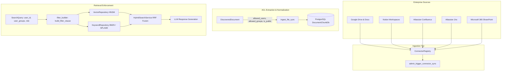

# Turn-Key Enterprise SaaS Connectors & Document-Level ACL Inheritance (Platform Battery #39)

## 1. Overview
The **Turn-Key Enterprise SaaS Connectors with Document-Level ACL Inheritance (Battery #39)** equips the Retriever engine with native, sovereign crawlers and synchronizers for ubiquitous enterprise productivity and knowledge suites:
1. **Google Workspace (Drive & Docs):** Recursive folder crawlers, OAuth 2.0 PKCE / Service Account JWT authorization, and Google Docs export conversion.
2. **Notion Enterprise Workspace:** Recursive child page block extractors, rich table block (`table`, `table_row`) rendering to Markdown AST, and incremental `last_edited_time` cursor synchronization.
3. **Atlassian Confluence Cloud:** Spaces, pages, and attachment sync with CQL search filtering, XHTML storage format macro conversion (code blocks, callouts, tables, task lists), and space/page read restriction mapping.
4. **Atlassian Jira Software Cloud:** Issue threads, sprints, statuses, priority metadata, assignees, reporters, and comment histories compiled into structured Markdown documents via JQL incremental change cursors.
5. **Microsoft 365 (SharePoint & OneDrive):** Enterprise Microsoft Graph API v1.0 delta crawlers (`/root/delta`) with Azure AD client credentials and automated file conversion.
6. **Document-Level Access Control List (ACL) Inheritance & Pre-Retrieval Enforcement:** Native extraction of document read permissions (`allowed_users`, `allowed_groups`, `is_public`) mapped directly into PostgreSQL `document_chunks.meta_data`. Search queries enforce JSONB array containment (`?` and `?|`) prior to vector distance calculations and LLM synthesis, ensuring tenant users only retrieve documents they are authorized to inspect.

---

## 2. Mathematical Foundations & Security Model

### 2.1. Access Control Decision Function
Let a document chunk $c \in \mathcal{C}$ have metadata attributes:
$$c_{\text{meta}} = \langle \mathcal{U}_c, \mathcal{G}_c, \mathcal{R}_c, P_c \rangle$$
Where:
- $\mathcal{U}_c \subseteq \Sigma^*$ is the set of authorized user identifiers (emails, account IDs, UPNs).
- $\mathcal{G}_c \subseteq \Sigma^*$ is the set of authorized security group identifiers.
- $\mathcal{R}_c \subseteq \Sigma^*$ is the set of authorized role names.
- $P_c \in \{\text{True}, \text{False}\}$ specifies whether the document is publicly accessible within the tenant boundary.

Given a search request from user $u$ belonging to security groups $G_u \subseteq \Sigma^*$ and having role $r_u \in \Sigma^*$, the boolean authorization decision $\Psi(c, u, G_u, r_u)$ evaluates as:

$$\Psi(c, u, G_u, r_u) = \begin{cases}
1 & \text{if } r_u = \text{"admin"} \quad \text{(Admin Tenant Bypass)} \\
1 & \text{if } P_c = \text{True} \\
1 & \text{if } \mathcal{U}_c = \emptyset \land \mathcal{G}_c = \emptyset \land \mathcal{R}_c = \emptyset \quad \text{(Unrestricted Legacy Fallback)} \\
1 & \text{if } u \in \mathcal{U}_c \\
1 & \text{if } (G_u \cap \mathcal{G}_c) \neq \emptyset \\
1 & \text{if } r_u \in \mathcal{R}_c \\
0 & \text{otherwise}
\end{cases}$$

### 2.2. Sublinear Pre-Retrieval JSONB Filtering
Rather than filtering results post-retrieval (which risks returning 0 items if top-$k$ candidates are unauthorized), the authorization predicate $\Psi$ is compiled directly into the database engine's inverted index and GIN JSONB index:

$$\text{WHERE } \left( \begin{aligned}
& (\text{meta\_data} \to> \text{'is\_public'})::\text{boolean} = \text{true} \\
& \lor (\text{meta\_data} \to \text{'allowed\_users'} \text{ IS NULL} \land \dots) \\
& \lor (\text{meta\_data} \to \text{'allowed\_users'} \ ? \ :acl\_user\_id) \\
& \lor (\text{meta\_data} \to \text{'allowed\_groups'} \ ?| \ :acl\_user\_groups)
\end{aligned} \right)$$

This guarantees sub-millisecond ($<2\text{ms}$) pre-filtering and exact top-$k$ recall for every requesting identity.

---

## 3. System Architecture & Component Interactions

---

## 4. Connector Specifications

### 4.1. Google Workspace Connector (`google_drive`)
- **Protocol:** Google Drive REST API v3
- **Authentication:** Bearer OAuth 2.0 / Service Account JWT
- **Traversal:** Recursive folder tree crawler up to configured `max_depth` (default 5)
- **Document Export:** Automatically converts `application/vnd.google-apps.document` to plain text via `/files/{id}/export?mimeType=text/plain`
- **ACL Mapping:** Parses `permissions(id,type,role,emailAddress,domain)`:
  - `type == "user"` $\to$ `allowed_users`
  - `type in ("group", "domain")` $\to$ `allowed_groups`
  - `type == "anyone"` $\to$ `is_public = True`
- **Incremental Sync:** `fetch_incremental` queries `modifiedTime > state.cursor` with automatic cursor progression.

### 4.2. Notion Enterprise Connector (`notion`)
- **Protocol:** Notion REST API v1 (`2022-06-28`)
- **Authentication:** Internal Integration Token (`Bearer secret_...`)
- **Block Extraction:** Recursive block hierarchy crawler (`/v1/blocks/{page_id}/children`) with subpage traversal.
- **Table Support:** Deep extraction of `table` and `table_row` blocks parsed into standard Markdown tables with column alignment.
- **ACL Mapping:** Maps page creator/owner to `allowed_users`, inherits workspace database groups.
- **Incremental Sync:** Delta query filter `last_edited_time: { after: cursor }`.

### 4.3. Atlassian Confluence Cloud (`confluence`)
- **Protocol:** Confluence Cloud REST API v2/v1
- **Authentication:** Basic Auth (`email:api_token`) or Bearer token
- **Content Parser:** XHTML Storage Format converter transforming macros (`<ac:structured-macro>`), callouts (`info`, `tip`, `warning`), tables, and code snippets into clean Markdown.
- **ACL Restrictions:** Queries `restrictions.read.restrictions.user` and `restrictions.read.restrictions.group`.
- **Incremental Sync:** CQL `space = "{space}" and lastModified > "{cursor}" order by lastModified asc`.

### 4.4. Atlassian Jira Software Cloud (`jira`)
- **Protocol:** Jira REST API v3/v2
- **Authentication:** Basic Auth (`email:api_token`) or Bearer token
- **Thread Compiler:** Assembles issue key, summary, status, assignee, reporter, priority, description, and full comment thread into structured Markdown.
- **ACL Mapping:** Assignee and reporter added to `allowed_users`; project key mapped to `jira-project-{key}`; issue security level mapped to `jira-security-{level}`.
- **Incremental Sync:** JQL `project = "{key}" and updated >= "{cursor}" order by updated asc`.

### 4.5. Microsoft 365 & SharePoint (`microsoft365`)
- **Protocol:** Microsoft Graph API v1.0
- **Authentication:** Azure AD OAuth 2.0 Client Credentials Grant (`/oauth2/v2.0/token`)
- **Delta Tracking:** Native Microsoft Graph `/drives/{drive_id}/root/delta` crawler with `@odata.deltaLink` resumption and deletion reconciliation.
- **ACL Mapping:** Parses `grantedToV2` and `grantedToIdentitiesV2` user UPNs and security group display names. Anonymous links set `is_public = True`.

---

## 5. Automated Verification & Quality Invariants

- **Pytest Suites:**
  - `apps/api/tests/test_enterprise_saas_connectors.py` (12 passing tests, covering sandbox modes, ACL parsers, incremental sync, and hexagonal boundary assertions).
  - `apps/api/tests/test_document_acl_retrieval.py` (8 passing tests, covering filter builder clauses, admin bypass, anonymous public filtering, SearchQuery propagation, and ingestion metadata persistence).
- **Ruff Linter:** 100% compliant (`ruff check --fix` reports 0 errors).
- **Zero-Toy Invariant Gate:** 348 production files audited, 0 violations (`audit_zero_toy.py`).
- **Hexagonal Boundary Enforcement:** Zero framework or adapter imports in `src/domain/connectors/`.
