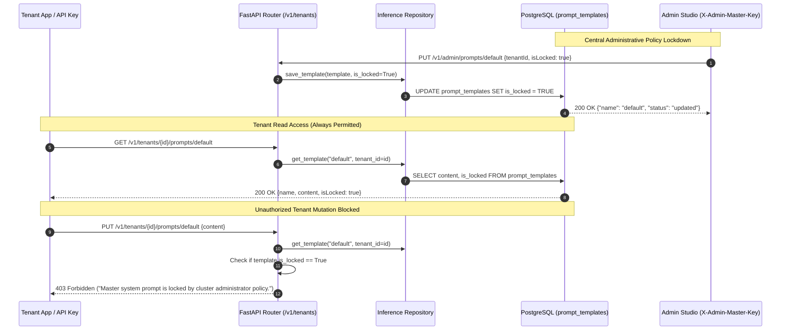

# Tenant Master Prompt Engine & Central Governance Policy Lock

## Overview

Retriever empowers tenants to define their workspace's foundational AI Persona and Master System Prompt via self-serve REST APIs (`GET/PUT /v1/tenants/{tenantId}/prompts/default`). This prompt anchors all RAG reasoning and context synthesis before retrieved context is injected into LLM inference.

To support high-compliance enterprise deployments, Retriever features a **Central Governance Policy Lock** (`is_locked: bool`). Cluster administrators can lock a tenant's prompt via the Admin Studio or Admin API. When locked, any modification attempt by tenant API keys is rejected with `HTTP 403 Forbidden`, safeguarding brand guidelines, legal disclaimers, and regulatory guardrails.

---

## 1. Architectural Topology



---

## 2. Core Components & Invariants

### 2.1 Hexagonal Domain Model (`src/domain/abstractions/inference.py`)
```python
@dataclass
class PromptTemplate:
    name: str
    content: str
    tenant_id: str | None = None
    is_system_prompt: bool = True
    is_locked: bool = False
    created_at: datetime = field(default_factory=datetime.utcnow)
```
- **Invariant:** Domain models remain 100% pure standard Python dataclasses with zero framework dependencies.

### 2.2 Database Persistence (`src/adapters/database/`)
- **SQLAlchemy Model:** `PromptTemplateDb.is_locked = Column(Boolean, nullable=False, default=False)`.
- **Alembic Migration:** `p1q2r3s4t5u6_add_is_locked_to_prompt_templates.py` (`ALTER TABLE prompt_templates ADD COLUMN is_locked BOOLEAN NOT NULL DEFAULT FALSE`).
- **Repository Implementation:** `SqlPromptTemplateRegistry` faithfully reads, maps, and persists `is_locked` across `get_template`, `save_template`, and `list_templates`.

### 2.3 Router Enforcement (`src/routers/tenant.py` & `src/routers/admin.py`)
- `GET /v1/tenants/{tenantId}/prompts/default`:
  - Requires tenant isolation verification (`verify_tenant_isolation`).
  - Returns fallback default instructions if no custom template has been saved yet.
- `PUT /v1/tenants/{tenantId}/prompts/default`:
  - Rejects with `HTTP 403 Forbidden` if `existing.is_locked == True`.
  - Atomically saves updated content if unlocked.
- `GET /v1/admin/prompts`: Exposes `isLocked` in template schemas for admin inspection.
- `PUT /v1/admin/prompts/{name}`: Allows cluster administrators to override prompt content and toggle `is_locked` at any time.

---

## 3. Automated Test Coverage

The governance policy lock is validated by an automated test suite in `apps/api/tests/test_tenant_prompt_governance.py`:
1. `test_get_tenant_default_prompt_fallback`: Verifies default system instructions on fresh tenant onboarding.
2. `test_get_tenant_existing_prompt`: Verifies retrieval of customized prompt with lock state.
3. `test_update_tenant_prompt_success`: Validates successful update when `is_locked == False`.
4. `test_update_tenant_prompt_forbidden_when_locked`: Verifies `HTTP 403 Forbidden` when `is_locked == True`.
5. `test_admin_can_override_and_unlock_prompt`: Verifies administrator's ability to lock, update, and unlock templates via master keys.
