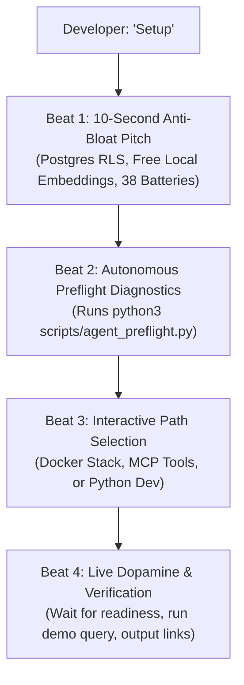

# AI-Native Developer Onboarding (`Setup`)

> **"Don't read the README. Just open in your AI editor and type `Setup`."**

In 2026, software developers no longer read 20-page manuals or 5,000-line README files to get an open-source project running. Instead, they clone the repository, open their AI coding assistant (**Cursor**, **Windsurf**, **Claude Code**, **Antigravity**, **GitHub Copilot**), and start building.

Retriever features an **Agent-Native Onboarding Architecture** that transforms any modern AI coding assistant into an autonomous Setup Concierge.

---

## 🎯 How It Works

When a developer opens Retriever and sends `Setup` (or `setup`, `init`, `start`, `Help me get started`), the AI agent automatically intercepts the prompt and triggers a standardized **4-Beat Concierge Protocol**:



---

## 📁 System Configuration Files

To guarantee consistent behavior regardless of which IDE or AI tool the developer prefers, the onboarding protocol is registered across all major agent specification standards:

| Assistant / Environment | Manifest File | Role |
|---|---|---|
| **Antigravity / Windsurf / OpenCode** | [`AGENTS.md`](file:///Users/prateeksharma/Developer/retriever/AGENTS.md) & [`.agents/AGENTS.md`](file:///Users/prateeksharma/Developer/retriever/.agents/AGENTS.md) | Universal agent behavior specification and 4-beat concierge instructions. |
| **Cursor IDE** | [`.cursorrules`](file:///Users/prateeksharma/Developer/retriever/.cursorrules) & [`.cursor/rules/setup.mdc`](file:///Users/prateeksharma/Developer/retriever/.cursor/rules/setup.mdc) | Composer & Chat rules intercepting `Setup` and enforcing Hexagonal guidelines. |
| **Anthropic Claude Code** | [`CLAUDE.md`](file:///Users/prateeksharma/Developer/retriever/CLAUDE.md) | CLI agent instructions with setup protocol and verification loops. |
| **GitHub Copilot Workspace** | [`.github/copilot-instructions.md`](file:///Users/prateeksharma/Developer/retriever/.github/copilot-instructions.md) | Chat instructions for Copilot workspace initialization. |

---

## 🛠️ The Preflight Diagnostic Tool

AI agents execute [`scripts/agent_preflight.py`](file:///Users/prateeksharma/Developer/retriever/scripts/agent_preflight.py) to assess system readiness:

```bash
# Formatted ANSI report (for humans & terminal viewers)
python3 scripts/agent_preflight.py

# Clean JSON output (for programmatic ingestion by AI agents)
python3 scripts/agent_preflight.py --json
```

### Diagnostic Checks:
1. **Hardware & Acceleration:** Detects Apple Silicon Metal (MPS / Neural Engine), NVIDIA CUDA, or CPU fallbacks.
2. **Container Runtime:** Confirms Docker engine status and Docker Compose V2 availability.
3. **Local Embedding Engine:** Checks if Ollama is running on port 11434 with `nomic-embed-text` downloaded.
4. **Port Availability:** Validates ports 8000 (API), 3000 (Web), 5432 (Postgres), 6379 (Redis).
5. **Environment Readiness:** Checks `.env` configuration or provisions from `.env.docker.example`.

---

## 🚀 The 3 Launch Paths

The agent guides the developer into one of three distinct tracks based on their immediate goal:

### 1. 🚀 Option 1: 1-Click Local Full Stack (Docker)
Spins up the complete sovereign RAG engine locally with zero external API dependencies:
- PostgreSQL 16 with `pgvector`
- Redis 7 cache & event broker
- Local Ollama with `nomic-embed-text`
- FastAPI Cognitive Backend (port 8000)
- Next.js Admin Web Studio (port 3000)

### 2. 🤖 Option 2: Connect AI Tools via MCP (`retriever-mcp`)
If the developer already has a running instance (or connects to `https://rag.prateeq.in`), the agent configures the Model Context Protocol server. This equips their AI assistant with native tools:
- `retriever_create_tenant`
- `retriever_upload_file`
- `retriever_hybrid_search`
- `retriever_got_plan`

### 3. 🛠️ Option 3: Core Python Developer Mode
For engineers contributing directly to Retriever's cognitive algorithms:
- Creates a Python 3.11/3.12 virtualenv
- Installs dependencies: `pip install -r requirements.txt`
- Runs database migrations: `alembic upgrade head`
- Executes tests: `pytest apps/api/tests`
