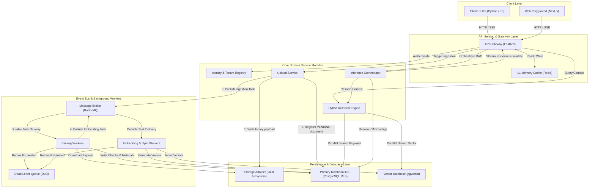
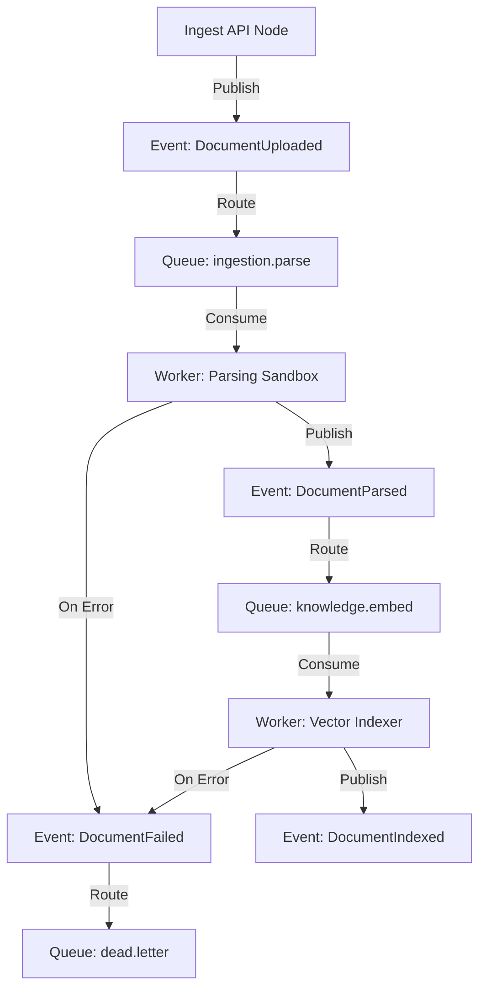

# System Design & Implementation Blueprint: Retriever Platform

This blueprint serves as the canonical implementation reference for the Retriever platform. It bridges the gap between logical architectural guidelines and physical code, detailing modules, database tables, API schemas, background worker states, and operational profiles. 

Refer to the foundational documents for contextual guidelines:
- [The Engineering Constitution (master-vision.md)](file:///Users/prateeksharma/Developer/retriever/docs/constitution/master-vision.md)
- [System Architecture Design Blueprint (architecture.md)](file:///Users/prateeksharma/Developer/retriever/docs/architecture.md)
- [Feature Specification (core-platform.md)](file:///Users/prateeksharma/Developer/retriever/docs/features/core-platform.md)

---

## 1. High-Level System Design

The Retriever platform implements a decoupled, event-driven architecture using the Hexagonal (Ports and Adapters) pattern. It separates read pipelines (optimized for low-latency search and streaming generation) from write pipelines (optimized for durable ingestion, parsing sandboxing, and background embedding generation).

### 1.1 Complete Service Map



### 1.2 Request Lifecycle

#### 1.2.1 Synchronous Grounded Query Path (`POST /v1/tenants/{tenantId}/chat/sessions/{sessionId}/messages`)
1. **Ingress:** Client initiates an HTTP POST request targeting the SSE stream message route.
2. **Context Resolution Middleware:** Gateway intercepts request, extracts the `Authorization` header, computes a SHA-256 hash of the API key, and queries the L1 Cache (Redis). If cache misses, the registry queries the PostgreSQL database. Mismatches or expired keys terminate requests with an HTTP `401 Unauthorized` or `403 Forbidden` response.
3. **Trace Propagation:** The Gateway generates a unique `Trace ID` (W3C Trace Context standard) and binds it to the asynchronous execution thread context.
4. **Session Authentication Check:** The Gateway verifies that `sessionId` belongs to the authenticated `tenantId`.
5. **Dynamic CAD Resolution:** The gateway fetches the active `TenantConfig` and prompt template parameters from Redis (L1).
6. **Parallel Context Retrieval:**
    * The query text is dispatched to the embedding provider to generate a query vector.
    * The `Retrieval Engine` launches parallel retrieval threads:
        * **Thread A:** Queries the Vector DB with query vector, filtering candidates by `tenantId` and metadata constraints.
        * **Thread B:** Queries the PostgreSQL DB using BM25 keyword indices, filtering by `tenantId` and metadata.
7. **Fusion and Reranking:** The `Retrieval Engine` receives results from both threads, applies Reciprocal Rank Fusion (RRF), routes the top candidates to the `Reranker` cross-encoder module, and filters out chunks below the configuration threshold.
8. **Prompt Compiling:** The `Inference Orchestrator` fetches the session chat history, checks token budgets, executes summarization/pruning strategies if close to limits, compiles the final prompt, and applies the dynamic guardrail filters.
9. **Cognitive Generation & SSE Stream:** The `Inference Orchestrator` invokes the external `LlmProvider` stream adapter. Deltas are received, routed through the validation rules (citation checking, JSON schema syntax validation, and output guardrails), and flushed to the client socket as Server-Sent Events.
10. **Finalize & Record:** The Gateway registers final token counts, computes total latency, and writes an `InferenceLog` record to PostgreSQL.

#### 1.2.2 Asynchronous Document Ingestion Path (`POST /v1/tenants/{tenantId}/documents`)
1. **Ingress:** Multipart form-data containing the document binary and metadata parameters arrives at the Gateway.
2. **Verification & Idempotency Check:** The system verifies the authentication scope. An MD5/SHA-256 hash of the binary file is calculated and compared against database indices. If duplicate detected, processing is bypassed and references are linked.
3. **Durable File Upload:** The gateway routes the raw binary stream to the active storage adapter (e.g., S3/MinIO bucket partition isolated by `tenantId`).
4. **Pending Registration:** The database records a `Document` record in PostgreSQL with status `PENDING` within a database transaction.
5. **Task Publishing:** The `Upload Service` writes a `DocumentUploadedEvent` task to RabbitMQ. The message payload contains the `documentId`, `tenantId`, and `storagePath`.
6. **Client Response:** The Gateway returns HTTP `202 Accepted` with the `documentId` and status query routes.
7. **Async Ingestion Execution:** (Described in worker sections).

### 1.3 Event Flow

The platform relies on RabbitMQ exchanges to orchestrate decoupling across states. The following diagram illustrates the event flow:



#### Event Schemas (JSON Payloads)

##### 1. `DocumentUploadedEvent` (Routing Key: `document.event.uploaded`)
```json
{
  "eventId": "evt_889f02a3-2c1b-4b5c-a6d8-e9f01a2b3c4d",
  "eventType": "DOCUMENT_UPLOADED",
  "timestamp": "2026-07-12T07:34:37Z",
  "traceId": "tr_11223344556677889900aabbccddeeff",
  "payload": {
    "documentId": "doc_a01b02c0-3d04-5e06-7f08-9a0b0c0d0e0f",
    "tenantId": "tnt_800f72a0-0a20-475f-b2e2-f1eaeffc2a58",
    "fileName": "q2_financial_report.pdf",
    "storagePath": "tnt_800f72a0/documents/doc_a01b02c0.pdf",
    "mimeType": "application/pdf"
  }
}
```

##### 2. `DocumentParsedEvent` (Routing Key: `document.event.parsed`)
```json
{
  "eventId": "evt_990a03b4-3d2c-5b6c-b7e9-f0a12b3c4d5e",
  "eventType": "DOCUMENT_PARSED",
  "timestamp": "2026-07-12T07:34:42Z",
  "traceId": "tr_11223344556677889900aabbccddeeff",
  "payload": {
    "documentId": "doc_a01b02c0-3d04-5e06-7f08-9a0b0c0d0e0f",
    "tenantId": "tnt_800f72a0-0a20-475f-b2e2-f1eaeffc2a58",
    "chunkIds": [
      "chk_001a1234-5678-90ab-cdef-1234567890ab",
      "chk_002b1234-5678-90ab-cdef-1234567890ab"
    ]
  }
}
```

##### 3. `DocumentIndexedEvent` (Routing Key: `document.event.indexed`)
```json
{
  "eventId": "evt_001b04c5-4d3e-6c7d-c8f0-a1b23c4d5e6f",
  "eventType": "DOCUMENT_INDEXED",
  "timestamp": "2026-07-12T07:34:45Z",
  "traceId": "tr_11223344556677889900aabbccddeeff",
  "payload": {
    "documentId": "doc_a01b02c0-3d04-5e06-7f08-9a0b0c0d0e0f",
    "tenantId": "tnt_800f72a0-0a20-475f-b2e2-f1eaeffc2a58",
    "chunksVectorized": 2,
    "vectorCollection": "tenant_embeddings_v1"
  }
}
```

##### 4. `DocumentFailedEvent` (Routing Key: `document.event.failed`)
```json
{
  "eventId": "evt_e77a15d6-5e4f-7c8d-d9f0-b2c34d5e6f7a",
  "eventType": "DOCUMENT_FAILED",
  "timestamp": "2026-07-12T07:34:40Z",
  "traceId": "tr_11223344556677889900aabbccddeeff",
  "payload": {
    "documentId": "doc_a01b02c0-3d04-5e06-7f08-9a0b0c0d0e0f",
    "tenantId": "tnt_800f72a0-0a20-475f-b2e2-f1eaeffc2a58",
    "failurePhase": "PARSING",
    "errorMessage": "Sandbox parsing resource limit exceeded (Timeout)"
  }
}
```

---

## 2. Repository Structure

Retriever uses a monorepo structure to isolate execution contexts while sharing standard type contracts.

```
/Users/prateeksharma/Developer/retriever/
├── apps/
│   ├── api/                     # Backend REST API Serving Node (FastAPI Application)
│   │   ├── src/
│   │   │   ├── domain/          # Hexagonal Application Core (Isolated logical layers)
│   │   │   │   ├── abstractions/ # Port interfaces (contracts between layers)
│   │   │   │   ├── config/       # Configuration-as-Data service
│   │   │   │   ├── identity/     # Tenant isolation, auth, and credential validation
│   │   │   │   ├── ingestion/    # Files validation & mapping to sandbox jobs
│   │   │   │   ├── knowledge/    # Hierarchical chunking & text indexing logic
│   │   │   │   ├── retrieval/    # Hybrid search & cross-encoder ranking algorithms
│   │   │   │   └── inference/    # Token compression, prompt templating, and SSE pipelines
│   │   │   ├── adapters/        # Concrete infrastructure implementations (Physical)
│   │   │   │   ├── database/    # PostgreSQL client interface (SQLAlchemy & RLS rules)
│   │   │   │   ├── vector/      # pgvector query abstraction adapters
│   │   │   │   ├── storage/     # Local filesystem and external storage drivers
│   │   │   │   ├── cognitive/   # OpenAI, Cohere, and embedding connectors
│   │   │   │   ├── broker/      # RabbitMQ task publishers and consumers
│   │   │   │   ├── cache/       # Redis configuration cache and semantic caches
│   │   │   │   └── telemetry/   # OpenTelemetry span exporters and metrics registers
│   │   │   ├── main.py          # FastAPI application initialization & routing mappings
│   │   │   └── config.py        # System startup environment variable maps
│   │   ├── pyproject.toml       # API dependencies configuration (uv toolchain)
│   │   └── uv.lock              # Explicit API build lockfile
│   │
│   └── web/                     # Client Web UI Reference Playground (Next.js Application)
│       ├── src/
│       │   └── app/             # Next.js App Router endpoints and page layouts
│       ├── package.json         # UI dependencies configuration
│       └── tsconfig.json        # TypeScript configuration
│
├── workers/                     # Asynchronous background workers (Celery — ADR-004)
│   ├── src/
│   │   ├── tasks/               # Celery task definitions (parsing, embedding, periodic)
│   │   ├── celery_app.py        # Celery application configuration
│   │   └── event_consumer.py    # Legacy pika consumer (deprecated)
│   ├── Dockerfile.worker        # Docker configuration for Worker daemon
│   ├── pyproject.toml
│   └── uv.lock
│
├── docs/                        # Project documentation
│   ├── constitution/            # Immutable manifesto and core developer laws
│   ├── decisions/               # Architectural Decision Records
│   └── implementation/          # System design documents & integration specifications
│       └── system-design.md     # This document
```

---

## 3. Backend Modules

### 3.1 Identity
* **Responsibility:** Authenticate incoming HTTP API operations. Match hashed keys against database records, populate thread-local contexts, and restrict access boundaries.
* **Inputs:** Raw Authorization header bearer token string.
* **Outputs:** `UserContext` payload mapping `userId`, `tenantId`, `roles`, and `scopes`.
* **Dependencies:** L1 Redis Cache, Relational DB (Fallback).
* **Failure Modes:** 
  * *DB/Cache Outage:* Reject incoming requests with HTTP `503 Service Unavailable`.
  * *Key Hashing Mismatch:* Fail fast and return HTTP `401 Unauthorized`.

### 3.2 Tenant Registry
* **Responsibility:** Provision isolated tenant storage bounds and maintain administrative records.
* **Inputs:** Tenant creation metadata parameters (`name`, `tier`, `isolationLevel`).
* **Outputs:** Created `Tenant` entity status payload (UUID validation, status).
* **Dependencies:** Relational DB.
* **Failure Modes:** 
  * *Duplicate Tenant Registration:* Raise transaction unique index constraint exception, return HTTP `409 Conflict`.

### 3.3 Configuration Registry
* **Responsibility:** Maintain Configuration-as-Data (CAD) schemas. Manage active model routing records, temperatures, chunk boundary dimensions, and dynamic prompt identifiers.
* **Inputs:** Tenant UUID query lookup parameter.
* **Outputs:** Structured `TenantConfig` mapping.
* **Dependencies:** Relational DB, L1 Cache.
* **Failure Modes:**
  * *Config Corruption:* If invalid JSON is loaded, fall back to global platform default settings and dispatch a Severity-2 warning log.

### 3.4 API Gateway
* **Responsibility:** Expose REST/SSE routes. Manage trace generation, rate limiting, and route mapping to core domain ports.
* **Inputs:** HTTP payloads, client IP values, trace headers.
* **Outputs:** API response payloads (JSON, Server-Sent Events stream).
* **Dependencies:** Identity, L1 Cache (Rate limiter state).
* **Failure Modes:**
  * *Connection Saturation:* Returns HTTP `429 Too Many Requests` or drops connections gracefully to protect system resources.

### 3.5 Upload Service
* **Responsibility:** Receive binary file payloads, verify tenant storage bounds, persist raw assets to storage, and publish event tasks.
* **Inputs:** Multipart form data (file bytes, tags).
* **Outputs:** HTTP `202 Accepted` response with `documentId`.
* **Dependencies:** Storage Provider, Relational DB, Message Broker, Identity.
* **Failure Modes:**
  * *Storage Unreachable:* Fail immediately, transaction is rolled back, return HTTP `507 Insufficient Storage`.

### 3.6 Parsing Service
* **Responsibility:** Execute document parsing inside isolated sandbox containers. Extract raw text structure layouts and metadata tags.
* **Inputs:** Document storage path, MIME type.
* **Outputs:** Standardized JSON struct containing raw text elements, coordinate hierarchies, and tables.
* **Dependencies:** Storage Provider, Sandbox Container Engine, Telemetry.
* **Failure Modes:**
  * *Parsing Core Dump:* If processing crashes, mark document status as `FAILED`, write log trace, and dispatch to DLQ.

### 3.7 Chunking Engine
* **Responsibility:** Divide extracted document text blocks into small chunks, creating parent-child trees to maintain context.
* **Inputs:** Extracted text structure, `TenantConfig` dimensions (e.g. Size: 200, Overlap: 40).
* **Outputs:** Ordered list of `Chunk` entities with hierarchical tags (`parentChunkId`).
* **Dependencies:** Relational DB.
* **Failure Modes:**
  * *Size Limits Exceeded:* If a document contains a single contiguous block with no paragraph structure, apply hard sliding window limits.

### 3.8 Embedding Engine
* **Responsibility:** Generate numerical coordinate arrays for text chunks using the tenant's configured embedding model.
* **Inputs:** Text blocks list.
* **Outputs:** Array of coordinate values (e.g. 1536 float elements).
* **Dependencies:** External Cognitive Provider Adapter (OpenAI / local HuggingFace).
* **Failure Modes:**
  * *Provider Timeout:* Retry with exponential backoff. If exhaustion occurs, fail task and mark chunks as `UNINDEXED`.

### 3.9 Vector Service
* **Responsibility:** Write vector coordinates to isolated tenant indices and execute similarity queries.
* **Inputs:** List of `VectorEntity` objects, vector search queries.
* **Outputs:** Sorted candidate indices (`chunkId` list, similarity values).
* **Dependencies:** Vector Store Adapter (pgvector).
* **Failure Modes:**
  * *Vector DB Connection Failure:* Open circuit breaker, fall back to relational sparse search degraded mode.

### 3.10 Retrieval Engine
* **Responsibility:** Execute parallel searches across vector and sparse indices, merge them using RRF, and filter results based on metadata.
* **Inputs:** Query text, filter constraints, `TenantConfig`.
* **Outputs:** Sorted list of relevant `Chunk` entities.
* **Dependencies:** Vector Service, Relational DB (BM25 search), Reranker.
* **Failure Modes:**
  * *Component Failure:* If one search thread fails, log the exception and return results from the active thread (degraded search).

### 3.11 Reranker
* **Responsibility:** Re-evaluate retrieved candidate lists using cross-encoder models, filtering out chunks below similarity thresholds.
* **Inputs:** Chunk candidates list, target query text.
* **Outputs:** Ordered list of chunks matching score parameters.
* **Dependencies:** Reranker Adapter (local PyTorch thread or Cohere API).
* **Failure Modes:**
  * *Service Outage:* Bypass reranking and return raw RRF-fused results directly.

### 3.12 Prompt Builder
* **Responsibility:** Compile prompt parameters by resolving CAD templates, injecting history logs, and appending context chunks. Enforce token compression policies.
* **Inputs:** Base user prompt, system prompt, chat history list, retrieved chunks list.
* **Outputs:** Formatted prompt payload string.
* **Dependencies:** Configuration Registry, Telemetry.
* **Failure Modes:**
  * *Token Limit Breach:* Apply token trimming rules (pruning the oldest chat logs first, then lower-scoring chunks).

### 3.13 Inference Orchestrator
* **Responsibility:** Dispatch prompts to cognitive providers, manage SSE token output streams, and trigger formatting validation.
* **Inputs:** Compiled prompt payload, execution constraints.
* **Outputs:** Server-Sent Events text stream.
* **Dependencies:** Prompt Builder, Cognitive Provider, Citation Validator, Guardrails.
* **Failure Modes:**
  * *LLM Outage:* Route task request to configured fallback model provider.

### 3.14 Citation Validator
* **Responsibility:** Inspect token stream content, identify source ID patterns (e.g. `[doc_a1b2]`), and verify matching references.
* **Inputs:** Text stream deltas, retrieved chunk IDs.
* **Outputs:** Validation confirmation or exception flag.
* **Dependencies:** None.
* **Failure Modes:**
  * *Invalid Citation:* Intercept token delivery, discard hallucinated source tokens, and write warning trace.

### 3.15 Guardrails
* **Responsibility:** Check input query strings for injection risks and inspect output tokens for PII or safety violations.
* **Inputs:** Raw input text or output tokens.
* **Outputs:** Verification flag (Allowed / Blocked).
  * *Blocked:* Returns error details.
* **Dependencies:** Safety Service.
* **Failure Modes:**
  * *System Failure:* Fail closed: reject request to protect data boundaries.

### 3.16 Chat Sessions
* **Responsibility:** Manage chat session parameters, historical conversation logs, and thread lifetimes.
* **Inputs:** Message payloads, session IDs.
* **Outputs:** History listing payload.
* **Dependencies:** Relational DB.
* **Failure Modes:**
  * *DB Timeout:* Returns HTTP `503 Service Unavailable`.

### 3.17 Billing Hooks
* **Responsibility:** Track tenant token usage, API operations, and storage resource consumption.
* **Inputs:** Tenant ID context, operation cost metrics (tokens, bytes).
* **Outputs:** None (Asynchronous update).
* **Dependencies:** Relational DB (async ledger update) or Kafka/RabbitMQ.
* **Failure Modes:**
  * *Ledger Failure:* Write metric payload to local file logs for manual reconciliation to prevent system blocking.

### 3.18 Telemetry
* **Responsibility:** Record performance spans, token counts, query latency, and pipeline status.
* **Inputs:** System tracing events.
* **Outputs:** Exporter payloads (OpenTelemetry).
* **Dependencies:** OpenTelemetry SDK.
* **Failure Modes:**
  * *Collector Outage:* Discard metric metrics to protect system performance.

---

## 4. Database Design

Retriever enforces strict data isolation using PostgreSQL Row-Level Security (RLS). Global platform administrators configure infrastructure parameters, while customer information is partitioned by tenant ID contexts.

### 4.1 Table Schema Blueprint

```
+---------------------------------------------------------------------------------------------------+
|                                       DATABASE SCHEMA MAP                                         |
+---------------------------------------------------------------------------------------------------+
|                                                                                                   |
|  +--------------------+             +------------------------+             +-------------------+  |
|  |      tenants       |<-----------|     tenant_configs     |             |     api_keys      |  |
|  |--------------------|             |------------------------|             |-------------------|  |
|  | PK: tenant_id (UI) |             | PK: tenant_id (UI, FK) |             | PK: key_id (UI)   |  |
|  |    status          |             |    active_model        |             | FK: tenant_id     |  |
|  |    tier            |             |    temperature         |             |    key_hash (UI)  |  |
|  |    created_at      |             |    chunk_size          |             |    created_at     |  |
|  +--------------------+             +------------------------+             +-------------------+  |
|           ^                                                                          ^            |
|           |                                                                          |            |
|           +---------------------------------+----------------------------------------+            |
|           |                                 |                                                     |
|           v                                 v                                                     |
|  +--------------------+             +------------------------+             +-------------------+  |
|  |     documents      |             |     chat_sessions      |             |    audit_logs     |  |
|  |--------------------|             |------------------------|             |-------------------|  |
|  | PK: doc_id (UI)    |             | PK: session_id (UI)    |             | PK: log_id (UI)   |  |
|  | FK: tenant_id      |             | FK: tenant_id          |             | FK: tenant_id     |  |
|  |    file_hash       |             |    created_at          |             |    action         |  |
|  |    status          |             +------------------------+             |    created_at     |  |
|  +--------------------+                         ^                          +-------------------+  |
|           ^                                     |                                                 |
|           |                                     v                                                 |
|           v                                 +------------------------+                            |
|  +--------------------+                     |     chat_messages      |                            |
|  |  document_chunks   |                     |------------------------|                            |
|  |--------------------|                     | PK: msg_id (UI)        |                            |
|  | PK: chunk_id (UI)  |                     | FK: session_id         |                            |
|  | FK: doc_id         |                     |    role                |                            |
|  | FK: tenant_id      |                     |    content             |                            |
|  |    content         |                     +------------------------+                            |
|  | FK: parent_id      |                                                                           |
|  +--------------------+                                                                           |
|           ^                                                                                       |
|           |                                                                                       |
|           v                                                                                       |
|  +--------------------+                                                                           |
|  |   vector_records   |                                                                           |
|  |--------------------|                                                                           |
|  | PK: chunk_id (FK)  |                                                                           |
|  | FK: tenant_id      |                                                                           |
|  |    embedding (Vec) |                                                                           |
|  +--------------------+                                                                           |
+---------------------------------------------------------------------------------------------------+
```

#### 4.1.1 `tenants`
* **Primary Key:** `tenant_id` (UUIDv4)
* **Foreign Keys:** None
* **Important Indexes:**
  * Unique index on `tenant_id`
* **Relationships:** One-to-One with `tenant_configs`, One-to-Many with `documents`, `chat_sessions`, `api_keys`, `audit_logs`.
* **Retention Strategy:** Permanent record. Suspended/terminated accounts update status fields; records are purged after 90 days of decommissioning.

#### 4.1.2 `tenant_configs`
* **Primary Key:** `tenant_id` (UUIDv4, FK referencing `tenants.tenant_id` ON DELETE CASCADE)
* **Foreign Keys:** None
* **Important Indexes:**
  * Primary index on `tenant_id`
* **Relationships:** One-to-One with `tenants`.
* **Retention Strategy:** Permanent (updated in place).

#### 4.1.3 `api_keys`
* **Primary Key:** `key_id` (UUIDv4)
* **Foreign Keys:** `tenant_id` (UUIDv4, FK referencing `tenants.tenant_id` ON DELETE CASCADE)
* **Important Indexes:**
  * Unique index on `key_hash` (SHA-256 string)
  * Index on `tenant_id`
* **Relationships:** Many-to-One with `tenants`.
* **Retention Strategy:** Rotated/revoked keys are marked inactive immediately; expired keys are purged after 30 days.

#### 4.1.4 `documents`
* **Primary Key:** `document_id` (UUIDv4)
* **Foreign Keys:** `tenant_id` (UUIDv4, FK referencing `tenants.tenant_id` ON DELETE CASCADE)
* **Important Indexes:**
  * Index on `tenant_id`
  * Compound unique index on `(tenant_id, file_hash)`
* **Relationships:** Many-to-One with `tenants`, One-to-Many with `document_chunks` (ON DELETE CASCADE).
* **Retention Strategy:** Retained until manual deletion or tenant deletion occurs.

#### 4.1.5 `document_chunks`
* **Primary Key:** `chunk_id` (UUIDv4)
* **Foreign Keys:** 
  * `document_id` (UUIDv4, FK referencing `documents.document_id` ON DELETE CASCADE)
  * `tenant_id` (UUIDv4, FK referencing `tenants.tenant_id` ON DELETE CASCADE)
  * `parent_chunk_id` (UUIDv4, FK referencing `document_chunks.chunk_id` ON DELETE SET NULL)
* **Important Indexes:**
  * Index on `tenant_id`
  * Index on `document_id`
  * Compound index on `(tenant_id, document_id)`
  * GIN index on `content` (supporting Postgres BM25 keyword searches)
* **Relationships:** Many-to-One with `documents`, Many-to-One with `tenants`, Hierarchical self-reference (parent-child).
* **Retention Strategy:** Cascade deleted when their parent `document` is deleted.

#### 4.1.6 `vector_records`
* **Primary Key:** `chunk_id` (UUIDv4, FK referencing `document_chunks.chunk_id` ON DELETE CASCADE)
* **Foreign Keys:** 
  * `tenant_id` (UUIDv4, FK referencing `tenants.tenant_id` ON DELETE CASCADE)
* **Important Indexes:**
  * HNSW vector index on `embedding` (using cosine metric)
  * Index on `tenant_id`
* **Relationships:** One-to-One with `document_chunks`.
* **Retention Strategy:** Cascade deleted when matching chunks are removed.

#### 4.1.7 `prompt_templates`
* **Primary Key:** `prompt_id` (UUIDv4)
* **Foreign Keys:** `tenant_id` (UUIDv4, FK referencing `tenants.tenant_id` ON DELETE CASCADE)
* **Important Indexes:**
  * Index on `tenant_id`
  * Compound index on `(tenant_id, name)`
* **Relationships:** Many-to-One with `tenants`.
* **Retention Strategy:** Permanent version history; old prompt versions are flagged inactive.

#### 4.1.8 `users`
* **Primary Key:** `user_id` (UUIDv4)
* **Foreign Keys:** `tenant_id` (UUIDv4, FK referencing `tenants.tenant_id` ON DELETE CASCADE)
* **Important Indexes:**
  * Index on `tenant_id`
  * Index on `user_id`
* **Columns:** `display_name`, `is_active`, `created_at`
* **RLS:** Filtered by `tenant_id`. Users are owned by the client tenant, not managed by Retriever — the client frontend authenticates its own users and passes `X-User-ID` on every request.
* **Relationships:** Many-to-One with `tenants`, One-to-Many with `chat_sessions`.

#### 4.1.9 `chat_sessions`
* **Primary Key:** `session_id` (UUIDv4)
* **Foreign Keys:** 
  * `tenant_id` (UUIDv4, FK referencing `tenants.tenant_id` ON DELETE CASCADE)
  * `user_id` (UUIDv4, FK referencing `users.user_id` ON DELETE CASCADE)
* **Important Indexes:**
  * Index on `tenant_id`
  * Index on `user_id`
  * Index on `created_at`
* **RLS:** Filtered by `tenant_id` + `user_id`. Each user sees only their own sessions.
* **Relationships:** Many-to-One with `tenants`, Many-to-One with `users`, One-to-Many with `chat_messages` (ON DELETE CASCADE).
* **Retention Strategy:** Stored for 90 days by default, unless configured otherwise in tenant TTL settings.

#### 4.1.10 `chat_messages`
* **Primary Key:** `message_id` (UUIDv4)
* **Foreign Keys:** 
  * `session_id` (UUIDv4, FK referencing `chat_sessions.session_id` ON DELETE CASCADE)
  * `tenant_id` (UUIDv4, FK referencing `tenants.tenant_id` ON DELETE CASCADE)
  * `user_id` (UUIDv4, FK referencing `users.user_id` ON DELETE CASCADE)
* **Important Indexes:**
  * Index on `session_id`
  * Index on `tenant_id`
  * Index on `user_id`
  * Index on `created_at`
* **RLS:** Filtered by `tenant_id` + `user_id`. Cascade deleted when matching sessions are removed.
* **Relationships:** Many-to-One with `chat_sessions`, Many-to-One with `tenants`, Many-to-One with `users`.

#### 4.1.11 `inference_logs`
* **Primary Key:** `log_id` (UUIDv4)
* **Foreign Keys:** 
  * `tenant_id` (UUIDv4, FK referencing `tenants.tenant_id` ON DELETE CASCADE)
  * `session_id` (UUIDv4, FK referencing `chat_sessions.session_id` ON DELETE SET NULL)
  * `user_id` (UUIDv4, FK referencing `users.user_id` ON DELETE SET NULL)
* **Important Indexes:**
  * Index on `tenant_id`
  * Index on `user_id`
  * Index on `created_at`
* **RLS:** Filtered by `tenant_id` + `user_id`. Admin bypasses user filter.
* **Relationships:** Many-to-One with `tenants`, Many-to-One with `users`, Many-to-One with `chat_sessions`.
* **Retention Strategy:** Retained for 180 days for auditing and billing verification, then archived to cold storage.

#### 4.1.12 `audit_logs`
* **Primary Key:** `log_id` (UUIDv4)
* **Foreign Keys:** `tenant_id` (UUIDv4, FK referencing `tenants.tenant_id` ON DELETE CASCADE)
* **Important Indexes:**
  * Index on `tenant_id`
  * Index on `created_at`
  * Compound index on `(tenant_id, action)`
* **Relationships:** Many-to-One with `tenants`.
* **Retention Strategy:** Immutable ledger record; retained for 1 year in active DB, then archived to read-only cold storage.

---

## 5. API Surface

Every request MUST provide header trace variables and client authorization keys.

### 5.1 Endpoint Specifications

#### 5.1.1 Tenant Administration

##### `POST /v1/tenants` (System-wide Admin)
* **Method:** `POST`
* **Authentication:** Global admin master key (`X-Admin-Master-Key`)
* **Request Schema:**
```json
{
  "name": "Acme Corp",
  "tier": "enterprise",
  "isolationLevel": "logical"
}
```
* **Response Schema (201 Created):**
```json
{
  "tenantId": "tnt_800f72a0-0a20-475f-b2e2-f1eaeffc2a58",
  "status": "active",
  "tier": "enterprise",
  "createdAt": "2026-07-12T07:34:37Z"
}
```
* **Error Responses:** 
  * `401 Unauthorized` (Invalid admin key)
  * `400 Bad Request` (Invalid payload parameters)

##### `PUT /v1/tenants/{tenantId}/config`
* **Method:** `PUT`
* **Authentication:** Tenant API Key (Bearer Token)
* **Request Schema:**
```json
{
  "activeModel": "claude-3-5-sonnet",
  "temperature": 0.2,
  "chunkSize": 500,
  "chunkOverlap": 100,
  "systemPromptTemplate": "You are a helpful grounding assistant..."
}
```
* **Response Schema (200 OK):**
```json
{
  "tenantId": "tnt_800f72a0-0a20-475f-b2e2-f1eaeffc2a58",
  "updatedAt": "2026-07-12T07:34:37Z"
}
```
* **Error Responses:**
  * `403 Forbidden` (Tenant mismatch / RLS block)
  * `422 Unprocessable Entity` (Schema validation failure)

---

#### 5.1.2 Document Ingestion

##### `POST /v1/tenants/{tenantId}/documents`
* **Method:** `POST`
* **Authentication:** Tenant API Key (Bearer Token)
* **Request Headers:** `Content-Type: multipart/form-data`
* **Request Payload:** Form fields containing file binary payload (`file`), metadata attributes (`tags`).
* **Response Schema (202 Accepted):**
```json
{
  "documentId": "doc_a01b02c0-3d04-5e06-7f08-9a0b0c0d0e0f",
  "status": "pending",
  "fileHash": "5d41402abc4b2a76b9719d911017c592",
  "createdAt": "2026-07-12T07:34:37Z"
}
```
* **Error Responses:**
  * `409 Conflict` (Duplicate file hash already uploaded)
  * `413 Payload Too Large` (File size exceeds limits)

##### `GET /v1/tenants/{tenantId}/documents/{documentId}`
* **Method:** `GET`
* **Authentication:** Tenant API Key (Bearer Token)
* **Response Schema (200 OK):**
```json
{
  "documentId": "doc_a01b02c0-3d04-5e06-7f08-9a0b0c0d0e0f",
  "status": "indexed",
  "fileName": "annual_budget_2026.pdf",
  "chunksCount": 42,
  "updatedAt": "2026-07-12T07:34:45Z"
}
```
* **Error Responses:**
  * `404 Not Found` (Document not found / Tenant access violation)

##### `DELETE /v1/tenants/{tenantId}/documents/{documentId}`
* **Method:** `DELETE`
* **Authentication:** Tenant API Key (Bearer Token)
* **Response Schema (200 OK):**
```json
{
  "documentId": "doc_a01b02c0-3d04-5e06-7f08-9a0b0c0d0e0f",
  "status": "deleting"
}
```

---

#### 5.1.3 Search & Retrieval

##### `POST /v1/tenants/{tenantId}/search`
* **Method:** `POST`
* **Authentication:** Tenant API Key (Bearer Token)
* **Request Schema:**
```json
{
  "query": "What is the budget limit for the Q3 marketing campaign?",
  "limit": 5,
  "filters": {
    "tags": ["finance", "marketing"],
    "dateAfter": "2026-01-01T00:00:00Z"
  }
}
```
* **Response Schema (200 OK):**
```json
{
  "query": "What is the budget limit for the Q3 marketing campaign?",
  "results": [
    {
      "chunkId": "chk_001a1234-5678-90ab-cdef-1234567890ab",
      "documentId": "doc_a01b02c0-3d04-5e06-7f08-9a0b0c0d0e0f",
      "content": "The Q3 marketing budget limit is set at $450,000 for ad spend.",
      "similarityScore": 0.92,
      "metadata": {
        "pageNumber": 12,
        "tags": ["finance", "marketing"]
      }
    }
  ]
}
```

---

#### 5.1.4 Chat & Inference

##### `POST /v1/tenants/{tenantId}/chat/sessions`
* **Method:** `POST`
* **Authentication:** Tenant API Key (Bearer Token)
* **Request Schema:** None (or optional session metadata tags)
* **Response Schema (201 Created):**
```json
{
  "sessionId": "ses_778f10b2-3c4d-5e6f-7a8b-9c0d1e2f3a4b",
  "createdAt": "2026-07-12T07:34:37Z"
}
```

##### `POST /v1/tenants/{tenantId}/chat/sessions/{sessionId}/messages`
* **Method:** `POST`
* **Authentication:** Tenant API Key (Bearer Token)
* **Request Headers:** `Accept: text/event-stream`
* **Request Schema:**
```json
{
  "query": "How much spend is allowed for the Q3 marketing?",
  "stream": true
}
```
* **Response Stream (Server-Sent Events):**
*Format:* `data: { JSON delta payload }\n\n`
```json
// Event: chunk delta
data: {"event": "token", "delta": "The "}
data: {"event": "token", "delta": "Q3 "}
...
// Event: verified inline citations
data: {"event": "citations", "references": [{"citationId": "[doc_a01b02c0]", "chunkId": "chk_001a1234-5678-90ab-cdef-1234567890ab"}]}
// Event: finish
data: {"event": "done", "usage": {"inputTokens": 350, "outputTokens": 45, "latencyMs": 120}}
```
* **Error Responses:**
  * `403 Forbidden` (Session does not belong to tenant)
  * `429 Too Many Requests` (Rate limit breached)
  * `503 Service Unavailable` (LLM gateway connection failure)

##### `POST /v1/tenants/{tenantId}/chat/sessions/{sessionId}/approve`
* **Method:** `POST`
* **Authentication:** Tenant API Key (Bearer Token)
* **Request Schema:**
```json
{
  "approvalToken": "app_token_990a03b4",
  "decision": "approved",
  "overridePayload": null
}
```
* **Response Schema (200 OK):**
```json
{
  "sessionId": "ses_778f10b2-3c4d-5e6f-7a8b-9c0d1e2f3a4b",
  "status": "processing"
}
```

---

## 6. Background Workers

All resource-intensive ingestion and synchronization tasks run asynchronously using RabbitMQ as the message broker.

### 6.1 Task Directory

| Background Job | Trigger | Retry Policy | Idempotency Strategy |
|---|---|---|---|
| **Document Parsing** | `DocumentUploadedEvent` published to queue. | Max 3 attempts. Exponential backoff starting at 10s. Route to DLQ on failure. | Skip parsing if `file_hash` unique index check matches existing record. |
| **OCR Extraction** | Sub-task triggered by Parsing Worker if MIME type is an image or scanned PDF. | Max 3 attempts. Backoff 30s. | Relies on parent document task hash check. |
| **Embedding Generation** | `DocumentParsedEvent` containing list of chunk IDs and text. | Max 5 attempts. Exponential backoff (starting at 2s) with jitter. | Verify if chunk coordinates already exist in vector store. |
| **Vector DB Sync** | Embeddings generated successfully. | Max 5 attempts. Backoff 5s. | Use upsert (write-through) operations with matching `chunk_id` as primary keys. |
| **Ingestion Cleanup** | Document deleted (`DELETE /v1/documents/{documentId}`). | Max 3 attempts. Linear backoff 10s. | Check that references are removed before clearing vectors. |
| **Index Reconstruction** | Manual CLI trigger or Vector database loss recovery action. | Max 3 attempts. Linear backoff 30s. | Re-vectorize chunks, writing to vector store with matching IDs. |
| **Cache Warming** | Scheduled cron job (every 6 hours) or configuration update event. | Max 2 attempts. Backoff 15s. | Overwrite cached configs using write-through invalidation. |
| **Reconciler Daemon** | Scheduled cron job checking status anomalies (every 15 mins). | Runs until completion. | Inspects `PENDING` database states older than 15 minutes, re-publishing tasks. |

---

## 7. Caching Strategy

Retriever implements a two-tier caching architecture to optimize performance and reduce database workloads.

```
       [API GATEWAY INTERACTION FLOW]
                  |
                  v
       +-----------------------+
       |   L1 Cache (Redis)    | <-- Authenticates keys & loads configurations (TTL 1h)
       +-----------------------+
                  |
            (Cache Miss)
                  v
       +-----------------------+
       |   L2 Cache (Redis)    | <-- Evaluates semantic query similarity (TTL 24h)
       +-----------------------+
                  |
            (Cache Miss)
                  v
       +-----------------------+
       | Database / Vector DB  | <-- Performs raw query executions
       +-----------------------+
```

### 7.1 Cache Configurations

#### 7.1.1 L1: In-Memory Configuration Cache
* **Purpose:** Reduce database load by caching tenant configurations, active API keys, and prompt templates.
* **Storage Media:** Redis cache instance.
* **Cache Key Schema:**
  * *API Key:* `auth:api_key:{api_key_hash}`
  * *Tenant Config:* `tenant:config:{tenant_id}`
  * *Prompt Template:* `tenant:prompt:{tenant_id}:{prompt_name}`
* **TTL Policy:** 1 hour.
* **Invalidation Strategy:** Write-through invalidation. Configuration updates (`PUT /v1/tenants/{tenantId}/config`) invalidate corresponding keys immediately.

#### 7.1.2 L2: Semantic Query Cache
* **Purpose:** Cache search query vectors to avoid redundant database searches.
* **Storage Media:** Redis.
* **Methodology:** 
  1. Vectorize query.
  2. Perform cosine similarity search against cached queries.
  3. If similarity exceeds **0.99**, return cached retrieval results.
* **Cache Key Schema:** `cache:retrieval:{tenant_id}:{query_text_md5_hash}`
* **TTL Policy:** 24 hours.
* **Invalidation Strategy:** Clear all cached vectors for a tenant when documents are added or deleted.

---

## 8. Security Model

Security is Retriever's highest priority. The system enforces tenant isolation across all layers to prevent unauthorized data access.

### 8.1 Key Security Operations

#### 8.1.1 Authentication & Keys
* All requests MUST provide Bearer keys. The API gateway checks authorization context at ingress:
$$\text{SHA256}(\text{Bearer Key}) \equiv \text{Database Key Hash}$$
* Raw strings are never stored in databases or logs.

#### 8.1.2 Scopes-based RBAC
Every validated request is mapped to specific scopes:
* `Global Admin`: `tenant:write`, `tenant:read`, `system:telemetry`.
* `Tenant Admin`: `config:write`, `config:read`, `api_key:write`, `api_key:read`.
* `Application Integrator`: `document:write`, `document:read`, `query:execute`.
* `End User`: No direct access allowed; requests must route through downstream clients.

#### 8.1.3 Tenant Isolation & Row-Level Security
* **Logical Isolation (Shared DB):** The database connection pool uses a restricted role. All queries include RLS checks:
```sql
ALTER TABLE document_chunks ENABLE ROW LEVEL SECURITY;

CREATE POLICY tenant_isolation_policy ON document_chunks
  FOR ALL
  USING (tenant_id = NULLIF(current_setting('app.current_tenant_id', true), '')::uuid);
```
* Before running a query, the adapter sets the active session context:
```sql
SET LOCAL app.current_tenant_id = 'tnt_800f72a0-0a20-475f-b2e2-f1eaeffc2a58';
```
* **Breach Kill-Switch:** Mismatches between request context and returned database records trigger the isolation kill-switch. This aborts active transactions, terminates the connection pool, revokes caller API keys, and returns a generic `403 Forbidden` response.

#### 8.1.4 Secrets Management
* Database credentials, master keys, and LLM provider tokens are retrieved from cloud key managers at startup.
* Application logs intercept formatting logic to redact pattern matches for keys, tokens, or common PII structures.

---

## 9. Observability

Observability tracks latency budgets and isolates resource metrics per tenant.

### 9.1 OpenTelemetry Span Tree

```
[FastAPI Route Execution] (Span: api.request_ingress)
 ├── [Authentication check] (Span: auth.validate_identity)
 ├── [Retrieve dynamic CAD config] (Span: config.load_cache)
 ├── [Orchestrate RAG Query] (Span: retrieval.execute_search)
 │    ├── [Vector DB Search] (Span: vector.query_index)
 │    └── [Relational Sparse Search] (Span: postgres.query_bm25)
 ├── [Rank candidates lists] (Span: retrieval.apply_reranker)
 ├── [LLM Streaming Connection] (Span: cognitive.llm_completion)
 └── [Audit Log Registration] (Span: audit.write_ledger)
```

### 9.2 Prometheus Metrics Registry

```prometheus
# HELP http_request_latency_seconds HTTP Request latency distribution.
# TYPE http_request_latency_seconds histogram
http_request_latency_seconds_bucket{le="0.05",method="POST",route="/v1/queries"} 120
http_request_latency_seconds_bucket{le="0.15",method="POST",route="/v1/queries"} 450
http_request_latency_seconds_bucket{le="0.8",method="POST",route="/v1/queries"} 592

# HELP tenant_token_consumption_total Accumulator of consumed tokens per tenant.
# TYPE tenant_token_consumption_total counter
tenant_token_consumption_total{tenant_id="tnt_800f",model="claude-3-5",type="prompt"} 890422
tenant_token_consumption_total{tenant_id="tnt_800f",model="claude-3-5",type="completion"} 112040

# HELP worker_queue_backpressure Active items in worker message queues.
# TYPE worker_queue_backpressure gauge
worker_queue_backpressure{queue_name="ingestion.parse"} 12
```

### 9.3 Observability Rules & Alert Rules
* **RLS Mismatch Alert (Severity 1):** Triggered immediately if the security kill-switch detects a tenant ID mismatch. This page-alerts the security operations team on call.
* **Low Latency Target Breached (Severity 2):** Triggered if 95th percentile query latencies exceed the **150ms** target (excluding LLM generation time) for 5 consecutive minutes.
* **Ingestion Backpressure Alert (Severity 3):** Triggered if the parsing queue backlog exceeds **50 items** for over 15 minutes, prompting HPA worker auto-scaling adjustments.

---

## 10. Scaling Strategy

Each layer of the Retriever platform scales independently based on execution bottlenecks.

```
       [SCALING ARCHITECTURE TYPOLOGY]

       [Serving Layer] ----> Autoscales horizontally via Kubernetes HPA (Target CPU: 70%)
       
       [Worker Layer]  ----> Scales workers dynamically based on RabbitMQ queue backlog sizes
       
       [Database Layer] ---> Scaled using PgBouncer poolers, Read Replicas, and DB partitioning
```

### 10.1 Layer Scaling Configurations

#### 10.1.1 API Serving Nodes (FastAPI)
* **Bottleneck:** High concurrent SSE stream connections and TLS termination overhead.
* **Scaling Driver:** Stateless containers scale horizontally using Kubernetes HPAs based on CPU utilization (target: 70%) and concurrent request loads.
* **Optimization:** Offload SSE connections from blocking application thread pools using async event loops.

#### 10.1.2 Background Workers (Celery)
* **Bottleneck:** Parsing resource limits and embedding generation delays.
* **Scaling Driver:** Worker pools scale dynamically based on RabbitMQ queue depth.
* **Isolation:** Separate parsing workers from embedding workers to isolate memory-heavy PDF parsing tasks from vector synchronization jobs.

#### 10.1.3 Relational Database (PostgreSQL)
* **Bottleneck:** Write lock saturation during bulk ingestion and connection count exhaustion.
* **Scaling Driver:** Scale connections using PgBouncer. Route read queries to read replicas, and partition high-volume tables (e.g. `document_chunks`) using tenant ID hash ranges.

#### 10.1.4 Vector Database
* **Bottleneck:** Memory constraints during vector HNSW index building.
* **Scaling Driver:** Configure index building limits, route queries to read replicas, and allocate sufficient memory bounds to allow indexing operations to run entirely in RAM.

---

## 11. Failure Recovery

This section outlines recovery protocols for system outages and failure scenarios.

### 11.1 Disaster Recovery Scenarios

#### 11.1.1 Database Outage
* **Failure Condition:** PostgreSQL primary instance becomes unreachable.
* **Protocol:**
  1. Open database connection circuit breakers immediately.
  2. Route API serving traffic to read-only mode, serving cached results from Redis.
  3. Promote the hot standby database replica to primary.
  4. Perform data validation audits, and reopen the write path when connection health check is restored.

#### 11.1.2 Queue Broker Outage
* **Failure Condition:** RabbitMQ broker crashes, dropping worker tasks.
* **Protocol:**
  1. If connection recovery fails, route ingestion tasks to local file logs.
  2. Periodically read files to rebuild task queues.
  3. The reconciler daemon scans for documents remaining in `PENDING` or `INDEXING` status for more than 15 minutes, re-publishing tasks once the broker is back online.

#### 11.1.3 Vector DB Index Corruption
* **Failure Condition:** Vector database loss or index corruption.
* **Protocol:**
  1. Route retrieval queries to degraded mode, falling back to PostgreSQL BM25 text search to keep search services active.
   2. Execute the index reconstruction script (planned for M12):
```bash
# TODO — index reconstruction script not yet implemented (tracked in M12)
celery -A workers.src.celery_app call workers.src.tasks.rebuild_indexes
```
   3. The script reads raw chunk text from PostgreSQL, re-generates embeddings, and upserts them to the vector store.

#### 11.1.4 LLM API Outage
* **Failure Condition:** Provider endpoints return timeouts or HTTP `429` / `5xx` errors.
* **Protocol:**
  1. Catch connection exceptions, and increment the provider fail count.
  2. If errors persist, redirect traffic to fallback model routes configured in the tenant registry.
  3. Update health statuses, and restore default routing when the primary provider health check passes.

#### 11.1.5 Partial Ingestion Failures
* **Failure Condition:** Task failures occur mid-process (e.g. parser succeeds but embedding fails).
* **Protocol:**
  1. Ingestion tasks execute within database transactions.
  2. If failures occur during parsing or vector indexing, the transaction rolls back, cleaning up orphan database records.
  3. Mark the document status as `FAILED`, log error details, and route the task payload to the DLQ.

---

## 12. Client Integration Model

### 12.1 Frontend → Retriever Flow

```
Client Frontend (coaching portal, CA app, legal tool, custom app)
  │
  │  Every API call:
  │  ├── Header: X-API-Key = sk_client_abc123
  │  ├── Header: X-User-ID  = user_42  (optional for admin keys)
  │  └── Body: standard REST payload
  │
  ▼
Retriever Gateway
  ├── Resolves API key → tenant_id + scope (admin | client)
  ├── Sets RLS context: app.current_tenant_id, app.current_user_id
  └── Routes to domain logic
```

### 12.2 Key Design Decisions
- **User identity owned by frontend:** Retriever never manages login, passwords, or sessions. The frontend authenticates its own users and passes the resolved `user_id` as `X-User-ID`.
- **Client API key scoped to tenant:** A client key can only access data within its own tenant. Admin keys (for the dashboard) can access all tenants.
- **Per-tenant LLM key resolved server-side:** Configured via admin API, stored encrypted in DB. Frontends don't need to know about it.
- **Override header:** A frontend can pass `X-LLM-Key` to use its own provider without admin involvement.

### 12.3 Data Isolation Boundaries
| Data | Scoped By | Access |
|---|---|---|
| Documents, chunks, configs, prompts | `tenant_id` | All users within client + admin |
| Chat sessions, messages, logs | `tenant_id` + `user_id` | Only the owning user + admin |

---

## 13. Development Roadmap

Implementation is divided into five phases. Each phase establishes a functional layer, validating system components before proceeding.

### 13.1 Timeline

```
PHASE 1: Foundation (Core Setup & Identity)
├── Setup repo structures & DB schemas
└── Implement identity context & RLS policies
    [EXIT CRITERIA: Verified RLS security policies & auth checks]

PHASE 2: Ingestion & Sandbox parsing
├── Set up worker daemons & sandbox environment
└── Implement layout extraction & file hash tracking
    [EXIT CRITERIA: Processed documents in sandbox parser]

PHASE 3: Retrieval & Fusion
├── Build hybrid search & RRF merger
└── Implement metadata filters & reranker models
    [EXIT CRITERIA: Multi-tier search queries executed < 150ms]

PHASE 4: Generative Orchestration
├── Implement token compression & prompt builder
└── Set up SSE streaming & citation validators
    [EXIT CRITERIA: Verified RAG SSE streaming response]

PHASE 5: Operational Hardening
├── Implement Prometheus dashboards & logs
└── Build evaluation pipeline for quality benchmarks
    [EXIT CRITERIA: Production metrics logged & baseline met]
```

### 13.2 Phase Profiles

#### 13.2.1 Phase 1: Foundation (Core & Identity)
* **Goal:** Set up the monorepo workspace, database schemas, and multi-tenant authentication middleware.
* **Deliverables:**
  * Root configurations and dependency lockfiles.
  * PostgreSQL schema migrations with RLS configurations.
  * Identity context middleware and key hashing logic.
* **Dependencies:** None.
* **Exit Criteria:** Automated tests verify that requests using invalid keys are rejected, and RLS policies prevent queries from reading other tenants' database records.

#### 13.2.2 Phase 2: Ingestion Pipeline & Parsing Sandbox
* **Goal:** Implement secure document ingestion, worker queue management, and isolated file parsing.
* **Deliverables:**
  * Storage adapter interface and file upload service.
  * Celery worker daemons and RabbitMQ task queues.
  * Parsing logic and content hashing. Sandboxed container isolation is aspirational.
* **Dependencies:** Phase 1.
* **Exit Criteria:** Uploading a document uploads the file, inserts a `PENDING` record, and completes parsing, updating status fields to `PARSED`.

#### 13.2.3 Phase 3: Hybrid Retrieval & Fusion
* **Goal:** Implement the parallel search pipeline, fusion logic, and cross-encoder reranking models.
* **Deliverables:**
  * Embedding service adapter.
  * Parallel search pipeline (vector + BM25 keyword search) with RRF merger.
  * Metadata filters and cross-encoder reranker integration.
* **Dependencies:** Phase 2.
* **Exit Criteria:** Hybrid searches return sorted chunk candidates, filtering out records outside the target tenant's database partition within the 150ms latency budget.

#### 13.2.4 Phase 4: Generative Inference & Citations
* **Goal:** Build prompt compilation logic, SSE streaming interfaces, and citation validation systems.
* **Deliverables:**
  * Prompt template registry and token compression engine.
  * SSE stream controller and provider adapters.
  * Citation validation engine. Input/output guardrails are aspirational.
* **Dependencies:** Phase 3.
* **Exit Criteria:** Querying the chat endpoint returns Server-Sent Event token streams with validated inline citations.

#### 13.2.5 Phase 5: Production Hardening & Evaluation
* **Goal:** Set up telemetry monitoring, scaling configurations, and evaluation benchmarks.
* **Deliverables:**
  * OpenTelemetry span exporters and Prometheus metric dashboards.
  * Rate limiter, health checks, and architecture conformance tests.
  * Ragas-based evaluation test suite and golden test dataset (aspirational).
* **Dependencies:** Phase 4.
* **Exit Criteria:** Telemetry dashboards log performance metrics, tests pass in CI, architecture boundaries are enforced.
