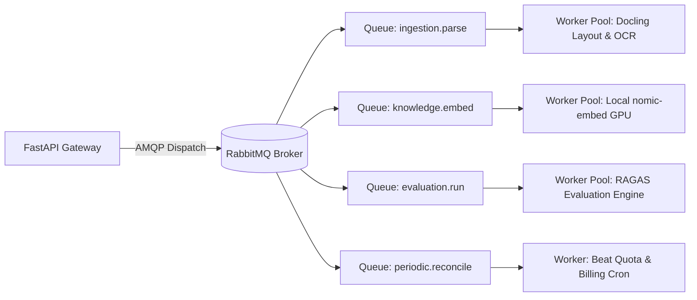

# Infrastructure Deep-Dive: Distributed Celery Workers, RabbitMQ Queues & Beat Scheduler

#infra #celery #rabbitmq #queues #workers #async #retriever

> **Technical architecture, task routing topologies, retry backoff policies, and Celery Beat periodic jobs.**

---

## 1. Task Queue Topology & Routing

---

## 2. Dedicated Queue Matrix

| Queue Name | Typical Payload | Prefetch Count | Concurrency Model | Max Retries |
|:---|:---|:---:|:---:|:---:|
| `ingestion.parse` | 50MB PDF/DOCX Binaries | 1 | Pre-fork (Processes) | 3 |
| `knowledge.embed` | 200 Text Chunks | 8 | Thread Pool / CUDA | 5 |
| `evaluation.run` | Chat Conversation Trace | 4 | Gevent / Asyncio | 2 |
| `periodic.reconcile` | Stripe / Razorpay Sync | 2 | Gevent | 3 |

---

## 🔗 Related Architecture & Cross-References
- [Document Ingestion API](../api/document.md)
- [Caching & Performance](caching_and_performance.md)
