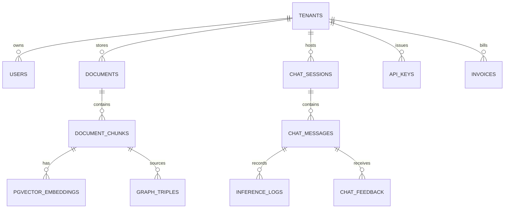

# Infrastructure Deep-Dive: PostgreSQL 16, pgvector HNSW Indexing & RLS Multi-Tenancy

#infra #database #postgres #pgvector #hnsw #rls #multitenancy #retriever

> **Authoritative specification for database architecture, 24 relational tables, pgvector HNSW partitioning, Row-Level Security (RLS), and Alembic migrations.**

---

## 1. Relational Entity-Relationship Diagram



---

## 2. Multi-Dimension pgvector HNSW Table Schema

Retriever provides dimension-isolated tables so tenants can utilize different embedding models concurrently without dimensional collision:

```sql
-- 1. Standard 768-Dimension (Nomic, Snowflake Arctic M, Google text-embedding-004)
CREATE TABLE IF NOT EXISTS vector_records (
    chunk_id UUID PRIMARY KEY REFERENCES document_chunks(chunk_id) ON DELETE CASCADE,
    tenant_id UUID NOT NULL REFERENCES tenants(tenant_id) ON DELETE CASCADE,
    collection_id UUID,
    embedding vector(768) NOT NULL,
    created_at TIMESTAMPTZ NOT NULL DEFAULT NOW()
);
CREATE INDEX IF NOT EXISTS idx_vector_records_embedding ON vector_records USING hnsw (embedding vector_cosine_ops) WITH (m = 16, ef_construction = 200);

-- 2. Heavyweight 1024-Dimension (BGE-M3, Snowflake Arctic Large, Mixedbread AI)
CREATE TABLE IF NOT EXISTS vector_records_1024 (
    chunk_id UUID PRIMARY KEY REFERENCES document_chunks(chunk_id) ON DELETE CASCADE,
    tenant_id UUID NOT NULL REFERENCES tenants(tenant_id) ON DELETE CASCADE,
    collection_id UUID,
    embedding vector(1024) NOT NULL,
    created_at TIMESTAMPTZ NOT NULL DEFAULT NOW()
);
CREATE INDEX IF NOT EXISTS idx_vector_records_1024_embedding ON vector_records_1024 USING hnsw (embedding vector_cosine_ops) WITH (m = 16, ef_construction = 200);

-- 3. Commercial 1536-Dimension (OpenAI text-embedding-3-small)
CREATE TABLE IF NOT EXISTS vector_records_1536 (
    chunk_id UUID PRIMARY KEY REFERENCES document_chunks(chunk_id) ON DELETE CASCADE,
    tenant_id UUID NOT NULL REFERENCES tenants(tenant_id) ON DELETE CASCADE,
    collection_id UUID,
    embedding vector(1536) NOT NULL,
    created_at TIMESTAMPTZ NOT NULL DEFAULT NOW()
);
CREATE INDEX IF NOT EXISTS idx_vector_records_1536_embedding ON vector_records_1536 USING hnsw (embedding vector_cosine_ops) WITH (m = 16, ef_construction = 200);

-- 4. High-Precision 3072-Dimension (OpenAI text-embedding-3-large)
CREATE TABLE IF NOT EXISTS vector_records_3072 (
    chunk_id UUID PRIMARY KEY REFERENCES document_chunks(chunk_id) ON DELETE CASCADE,
    tenant_id UUID NOT NULL REFERENCES tenants(tenant_id) ON DELETE CASCADE,
    collection_id UUID,
    embedding vector(3072) NOT NULL,
    created_at TIMESTAMPTZ NOT NULL DEFAULT NOW()
);
CREATE INDEX IF NOT EXISTS idx_vector_records_3072_embedding ON vector_records_3072 USING hnsw (embedding vector_cosine_ops) WITH (m = 16, ef_construction = 200);
```

---

## 🔗 Related Architecture & Cross-References
- [Caching & Performance](caching_and_performance.md)
- [Storage & Zero-Trust Envelope Encryption](storage_and_encryption.md)
