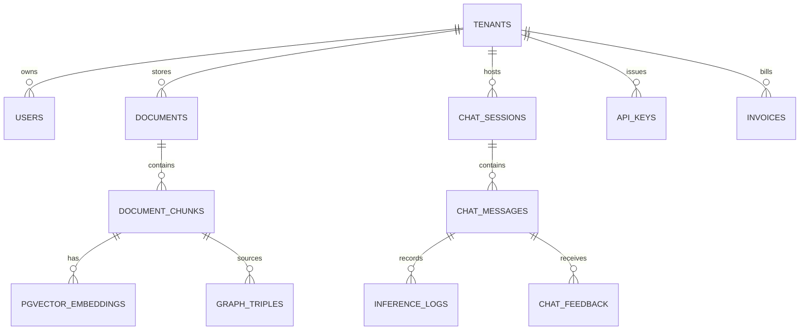

# Infrastructure Deep-Dive: PostgreSQL 16, pgvector HNSW Indexing & RLS Multi-Tenancy

#infra #database #postgres #pgvector #hnsw #rls #multitenancy #retriever

> **Authoritative specification for database architecture, 24 relational tables, pgvector HNSW partitioning, Row-Level Security (RLS), and Alembic migrations.**

---

## 1. Relational Entity-Relationship Diagram



---

## 2. pgvector HNSW Index Configuration

```sql
-- Partitioned Vector Embeddings Table
CREATE TABLE IF NOT EXISTS pgvector_embeddings (
    id UUID PRIMARY KEY DEFAULT gen_random_uuid(),
    tenant_id UUID NOT NULL REFERENCES tenants(id) ON DELETE CASCADE,
    document_id UUID NOT NULL REFERENCES documents(id) ON DELETE CASCADE,
    chunk_id UUID NOT NULL REFERENCES document_chunks(id) ON DELETE CASCADE,
    dimensions INT NOT NULL DEFAULT 768,
    embedding vector(768) NOT NULL,
    created_at TIMESTAMPTZ DEFAULT now()
);

-- High-Performance HNSW Cosine Distance Index
CREATE INDEX IF NOT EXISTS idx_pgvector_hnsw_cosine 
ON pgvector_embeddings 
USING hnsw (embedding vector_cosine_ops) 
WITH (m = 16, ef_construction = 64);
```

---

## 🔗 Related Architecture & Cross-References
- [Caching & Performance](caching_and_performance.md)
- [Storage & Zero-Trust Envelope Encryption](storage_and_encryption.md)
