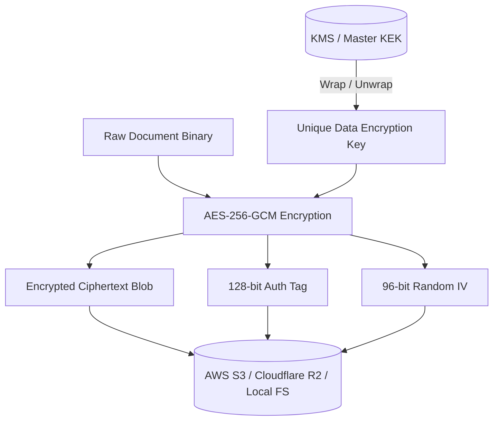

# Infrastructure Deep-Dive: S3 Object Storage, HMAC URLs & Zero-Trust Envelope Encryption

#infra #storage #s3 #encryption #aes256 #envelope #security #retriever

> **Technical architecture, envelope encryption key lifecycle, S3/R2 storage adapters, and HMAC-signed presigned download URLs.**

---

## 1. Envelope Encryption Lifecycle

Retriever implements standard 2-tier Zero-Trust Envelope Encryption for all confidential document storage:

---

## 2. Presigned Download URL Signature Formula

Download URLs are secured via HMAC-SHA256 signatures with deterministic timestamp expiration:

\[
\text{Signature} = \operatorname{HMAC-SHA256}\left(K_{\text{tenant}}, \text{DocID} \oplus \text{ExpiresTimestamp}\right)
\]

---

## 🔗 Related Architecture & Cross-References
- [Document API Specification](../api/document.md)
- [Security & Compression Specification](../api/security_compression.md)
