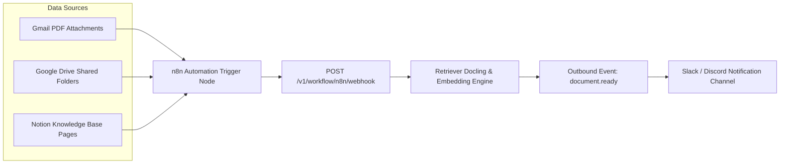

# Client Integration Guide: n8n Workflow Automation & Multi-Source Auto-Ingestion

#integrations #n8n #automation #gmail #googledrive #notion #webhooks #retriever

> **Step-by-step setup guide, webhook configuration, and prebuilt JSON workflows for automating document ingestion via n8n.**

---

## 1. n8n Integration Architecture

---

## 2. Inbound Webhook Configuration

1. In n8n, create an **HTTP Request** node.
2. Set Method to `POST`.
3. Set URL to `https://rag.prateeq.in/v1/workflow/n8n/webhook`.
4. Add Header: `X-Tenant-Key: ret_live_...`.
5. Send binary file body or JSON payload with download URL.

---

## 🔗 Related Architecture & Cross-References
- [Workflow API Specification](../api/workflow.md)
- [Document Ingestion API](../api/document.md)
