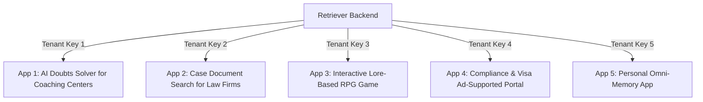

# Retriever Engine: Market Opportunities & Revenue Blueprint

This report analyzes the earning potential, creative business models, and geographic strategies for the **Retriever Core Platform** across global and Indian markets. 

By leveraging Retriever’s current architectural strengths—**hexagonal architecture** (flexibility), **multi-tenancy** (run multiple apps on one database), and **cost optimization** (free-tier/local model friendly)—you can build a highly profitable portfolio of products with virtually zero incremental infrastructure overhead.

---

## 1. Monetization Models & Financial Projections

Since you do not have a fixed target audience, you can deploy Retriever across multiple monetization channels. Here is an analysis of five distinct business models:

### Model A: White-Labeled Micro-SaaS for SMBs (CAs, Legal, Coaching)
Instead of building a consumer product, you sell web-based software templates directly to small-and-medium businesses (SMBs) who want to offer AI features to their own clients or students.

*   **How it works:** You build a reusable Next.js frontend (e.g., a "Client Portal"). Each business gets their own Tenant API Key from Retriever. They upload their documents, brand the portal with their logo, and give it to their clients or students.
*   **Target Pricing:** 
    *   **India:** ₹3,000 to ₹10,000/month ($35 – $120/month) per firm.
    *   **Global (US/EU):** $99 to $299/month per firm.
*   **Profit Margins:** **> 90%**. Since Retriever utilizes cost-optimization strategies and can route to free-tier/low-cost LLMs, your active cost per tenant is under $2/month.
*   **Earning Potential:** 10 US-based boutique legal or CA firms paying $150/month = **$1,500/month recurring (MRR)**.

### Model B: Ad-Supported Niche Information Search Engines
You upload highly sought-after public domain PDFs/documents to a public-facing search directory and monetize the traffic with display ads.

*   **How it works:** Create directories like *"Global Immigration Requirements Guide"* or *"Indian Entrance Exam (JEE/NEET) Syllabus & Past Papers Chat"*. Users search and chat for free. Ads are placed around the search interface (e.g., Google AdSense, Mediavine, or native course sponsorships).
*   **Ad RPMs (Revenue per 1,000 views):**
    *   **India:** $0.50 – $3.50 RPM.
    *   **Global (US/UK):** $12.00 – $40.00+ RPM (highly dependent on the niche; legal and financial niches command the highest RPMs).
*   **Earning Potential:** A US-targeted immigration info portal getting 50,000 pageviews/month at a $20 RPM = **$1,000/month in passive ad revenue**.

### Model C: Gamified & Interactive Storytelling Apps (Freemium + Ads)
Retriever’s hybrid search and context window management can be used to query game states, lore databases, and NPC instructions.

*   **How it works:** A text-based detective or fantasy RPG web app. A massive universe lore document is uploaded to Retriever. When a player talks to an NPC or inspects a room, Retriever searches the database for relevant lore and guides the LLM to write the response.
*   **Monetization:** 
    *   *Rewarded Video Ads:* Watch an ad to get a "hint," restore energy, or unlock a new mystery case.
    *   *Premium Tier:* $2.99 one-time payment to remove ads and unlock infinite gameplay.
*   **Earning Potential:** High-volume viral consumer play. A game with 100,000 monthly active users (MAUs) running rewarded ads can generate **$1,500 – $3,000/month**.

### Model D: Lifetime Deal (LTD) on Developer Marketplaces (Gumroad / AppSumo)
Sell Retriever as a self-hostable, production-ready developer tool for indie hackers who want multi-tenant RAG but don't want to build it.

*   **How it works:** Package the backend as a single-click Docker Compose template. Sell lifetime access to updates.
*   **Target Pricing:** $49 – $99 one-time payment.
*   **Platform Fees:** Gumroad takes 10%; AppSumo takes 70% (but drives massive traffic).
*   **Earning Potential:** A launch on AppSumo Select can bring in **$10,000 – $50,000 in cash** within 30 days, serving as non-dilutive capital to fund your other apps.

### Model E: API-as-a-Service for Indie Hackers (B2B SaaS)
Provide Retriever as a hosted developer API, competing with services like Pinecone + LangChain but offering a simpler, pre-built, multi-tenant wrapper.
*   **How it works:** Developers sign up, get an API key, and use your endpoints to ingest documents and chat.
*   **Target Pricing:** Pay-as-you-go based on database storage (e.g., $0.10/MB) and retrieval volume.
*   **Earning Potential:** Moderate scaling, requires marketing to developers.

---

## 2. Creative Domain Applications (Brainstorming)

Here are five specific application concepts you can launch by plugging different frontends into your single Retriever backend:

### 1. EdTech: The "Infinite Tutors" Portal (For Indian Coaching Centers)
*   **Concept:** A white-labeled doubt-solving web app. Coaching institutes upload their textbook PDFs, reference materials, and question banks.
*   **User Value:** Students scan a QR code, type a question, and get a step-by-step explanation backed by their specific textbook pages.
*   **Why it works:** The Indian coaching institute market is worth **$7.2 Billion** and is rapidly digitizing. Institutes use this to advertise "24/7 AI tutor support" to attract students.

### 2. LegalTech: The "Case File Auditor" (Global Market Focus)
*   **Concept:** A secure repository for legal files or tax documents. CAs or Lawyers upload historical litigation filings, contract templates, and tax codes.
*   **User Value:** Quick cross-referencing. The lawyer can ask: *"Have we ever drafted a non-compete clause for a remote software engineer in California? Find the exact document."* Retriever's pgvector hybrid search excels at finding exact phrases across thousands of legal PDFs.
*   **Why it works:** Global legal firms are highly profitable and happily pay $100+/month for software that saves billing hours.

### 3. Gaming: The "Crime Scene Investigator" RPG (Consumer Focus)
*   **Concept:** An interactive web game where players play a detective. You upload case files, witness statements, and autopsy reports as "documents."
*   **User Value:** Players interrogate suspects (powered by Retriever feeding clue retrieval into free LLMs). If they ask the wrong question, the NPC lies; if they cite a document retrieved by the engine, the suspect confesses.
*   **Why it works:** Text-based mysteries have a dedicated fan base. It is cheap to host, virally shareable, and easy to monetize with rewarded ads.

### 4. InfoPortal: The "Immigration & Visa Guide" (Ad-Supported)
*   **Concept:** An interactive visa advisor. You ingest official embassy guidelines, application forms, and immigration laws for major countries (US, Canada, EU, UK).
*   **User Value:** Users get plain-English answers on visa eligibility, required documents, and wait times, with direct citations to official PDFs.
*   **Why it works:** Visa processes are notoriously confusing. The site will attract high-intent traffic from people looking to travel or relocate, allowing you to charge high premium rates for ads from migration agents and flight aggregators.

### 5. B2C: "Omni-Memory" Personal Assistant (Subscription Focus)
*   **Concept:** A personal knowledge base. Users connect their diaries, book highlights, voice notes, and research bookmarks.
*   **User Value:** A conversational "second brain" that remembers everything you've read or written.
*   **Why it works:** High conversion rates in the global productivity market (e.g., fans of Obsidian, Notion, or Roam Research).

---

## 3. Global vs. Indian Market Realities

| Metric / Dimension | Global Market (US / Western Europe) | Indian Market |
| :--- | :--- | :--- |
| **Buying Power** | **High** ($99 - $300/mo is standard for business software) | **Price-Sensitive** (preference for free or under ₹2,000/mo) |
| **Monetization Fit** | B2B SaaS, AppSumo LTDs, Premium Consumer Apps | High-volume Ad-Supported, Enterprise White-Label |
| **Traffic Ad RPM** | **$12.00 – $40.00+** (highly profitable for free tools) | **$0.50 – $3.50** (requires massive scale to monetize) |
| **Compliance Needs** | Strict (GDPR, SOC 2, HIPAA, CCPA) | Medium-High (compliance with India's DPDP Act) |
| **Sales Cycle** | Short (self-serve credit card checkouts) | Long (often requires high-touch sales/demos) |

### Key Strategic Takeaway:
*   **If targeting India:** Target high-volume, lower-price solutions or ad-supported public directories. Alternatively, target premium corporate CA firms and enterprise-level educational coaching centers (e.g., FIITJEE, Allen, or regional leaders) with high-ticket customized setups.
*   **If targeting Global:** Launch self-serve micro-SaaS templates or interactive tools. A small global customer base will pay significantly more than a large Indian customer base for the same utility.

---

## 4. Compliance Blueprint for Global Market Entry

To enter the global market without high upfront compliance costs, use these strategies:

1.  **The Self-Hosted Strategy (Zero Compliance Cost):** Sell the product as a self-hosted Docker container (Gumroad/AppSumo). Because the customer runs Retriever on their own AWS/GCP servers, you are not storing or transferring their data. This bypasses GDPR, HIPAA, and SOC 2 requirements entirely.
2.  **SaaS Database Isolation (GDPR / DPDP Compliance):** Since you use PostgreSQL RLS, you can prove to customers that their data is logically segregated and cannot leak to other tenants. You can host instances in different regions (e.g., AWS Frankfurt for EU customers, AWS Mumbai for Indian customers) to comply with local data residency laws.
3.  **No PII Policy:** Instruct users not to upload Personally Identifiable Information (PII) to the documents. Provide simple client-side text scrubbing in your frontend app before sending content to the Retriever API.

---

## 5. Technical Action Plan: Running 5 Apps on 1 Backend

Your current database setup and code can run multiple distinct applications right now. Here is how you do it:

1.  **API Key Tenant Isolation:** Create 5 different tenants in your `tenants` table. Assign `Key_Tenant_1` to your game, `Key_Tenant_2` to your CA client portal, and so on.
2.  **Front-End Client Routing:** Create lightweight front-ends (or a single monorepo) that use the `RetrieverClient` SDK and inject the respective tenant API key.
3.  **Free-Tier Routing:** In your configuration management, configure your LLM provider to point to free/low-cost endpoints (e.g., OpenRouter free models, local Ollama running on a cheap cloud VPS, or Gemini free-tier keys) to keep server overhead near zero.
4.  **Local Embeddings:** Follow your workspace rule to utilize local embeddings (e.g., `nomic-embed-text` on a local or self-hosted Ollama server) to ensure zero third-party API costs for document indexing.
