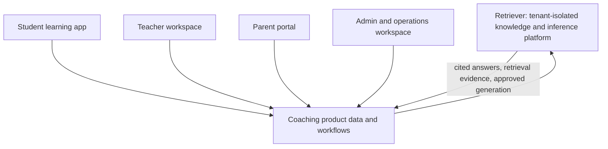

# Product Vision: AI-First Coaching Operating System

## Opportunity and framing

**Product hypothesis:** coaching institutes need more than a generic chatbot or standard ERP. The valuable loop is: institute material and classroom activity → evidence-backed help → assessment → teacher-reviewed intervention → measurable learning progress.

| Role | Job to be done | Better outcome |
|---|---|---|
| Student | Learn, practise, clear doubts, know next action. | Cited explanation and adaptive next step—not an answer dump. |
| Teacher | Teach consistently, prepare faster, intervene intelligently. | Reviewable AI drafts plus a clear, evidence-backed intervention list. |
| Parent/guardian | Understand progress and logistics. | Plain-language, consent-respecting updates rather than opaque charts. |
| Admin/owner | Operate, retain, and grow. | Reliable workflows and cohort signals, not AI-made business decisions. |

### Problem clusters

1. Content is fragmented across PDFs, notes, recordings, question banks, and solutions.
2. Scores/ranks arrive without explanation of misconceptions, speed, prerequisites, or remediation.
3. Doubts, material preparation, assessment review, and parent updates do not scale with faculty capacity.
4. Admissions, batches, fees, attendance, notices, and basic testing are essential but increasingly table stakes.
5. Minors, copyrighted material, anxious parents, and high-stakes exams make trust, provenance, and controls essential.

## Market context (external research)

Classplus markets the table-stakes stack—batches, live classes, materials, online tests, parent communication, and fees—and says it has enabled more than 100,000 coaching institutes. [Classplus Lite](https://classplusapp.com/lp/my-classroom) and [company overview](https://classplusapp.com/aboutus)

Teachmint markets institute management and connected classrooms plus AI-generated quizzes, summaries, homework, multilingual input, and NCERT-aligned materials. [Teachmint AI brochure](https://www.teachmint.com/en-ae/tmx-brochure)

CoachPlus markets CRM, fees, tests, parent communication, WhatsApp, branded apps, plus AI doubts, quiz generation, and at-risk flags. [CoachPlus coaching solution](https://coachplusapp.com/solutions/coaching)

The broader direction is toward AI-supported material creation, tutoring, and data-informed teaching rather than a replacement for instructors. An EY-Parthenon/FICCI update reported that 53% of surveyed Indian higher-education institutions used GenAI for learning materials and 40% for tutoring/chatbots; this is adjacent evidence rather than a direct coaching-market estimate. [EY India](https://www.ey.com/en_in/newsroom/2025/10/over-half-of-indian-heis-adopt-ai-policies-as-gen-ai-transforms-teaching-and-learning) An EY/ASSOCHAM report similarly frames AI as a path to more adaptive and inclusive learning, contingent on thoughtful deployment. [ASSOCHAM](https://www.assocham.org/publication-details.php?id=ai-as-a-catalyst-for-education-delivery)

**Implication:** “ERP + chatbot + quiz generator” is not a defensible position. The possible moat is an institute-grounded learning loop: provenance-aware tutoring, fine-grained mastery evidence, teacher-controlled intervention, and accumulated institutional learning data.

## Product thesis and principles

> Every interaction should turn institute material and learner evidence into a verifiable next learning action, with teachers retaining authority.

- **Grounded before fluent:** cite approved module pages, solutions, or lecture timestamps; abstain on inadequate evidence.
- **Pedagogy over answer delivery:** hints, worked steps, misconception diagnosis, and prerequisite repair precede answers.
- **Teacher-in-the-loop:** published content, generated tests, interventions, and consequential parent communication receive review.
- **Role-appropriate transparency:** students receive help, teachers see evidence/confidence, parents get concise non-diagnostic summaries.
- **Institute knowledge before open web:** if web grounding is used, it is visibly separated from approved institute content.
- **Learning over vanity metrics:** measure mastery, completion, retention, and intervention effectiveness—not only chats.

## Product shape

**Repository-derived fit:** Retriever already identifies coaching portals as a client product and provides tenant-scoped ingestion, hybrid retrieval, runtime prompts, citations, GraphRAG, evaluation, guardrails, ACLs, queues, and provider abstraction. Its constitution also says it is not the frontend, identity service, BI platform, or ERP/workflow product. See [master vision](../../constitution/master-vision.md) and [core platform spec](../../features/core-platform.md).

## Differentiation candidates

| Candidate | Why it matters | Proof required |
|---|---|---|
| Source-linked doubt resolution | Turns existing teaching IP into a trustworthy, 24/7 learning surface. | High citation precision, useful student completion, low unsafe-answer rate. |
| Mastery-to-action loop | Finds a weakness, proposes an action, then measures its result. | Better outcome than generic score reports. |
| Teacher intervention cockpit | Gives a small, explainable list of students/actions. | Teachers use it and save time. |
| Institute learning graph | Connects concepts, sources, questions, attempts, and interventions. | Better remediation ranking than a flat score history. |
| Explainable parent communication | Reduces routine queries without surveillance or harmful labels. | Parent comprehension and low correction/escalation rate. |

## Non-goals

- Replacing teachers, counsellors, or academic policy.
- Diagnosing learning disabilities, mental health, or future exam outcome.
- Autonomous grading, admission decisions, fee enforcement, or outreach.
- Training base models or ingesting unlicensed material.
- Moving coaching ERP/CRM or analytics logic into Retriever core.
