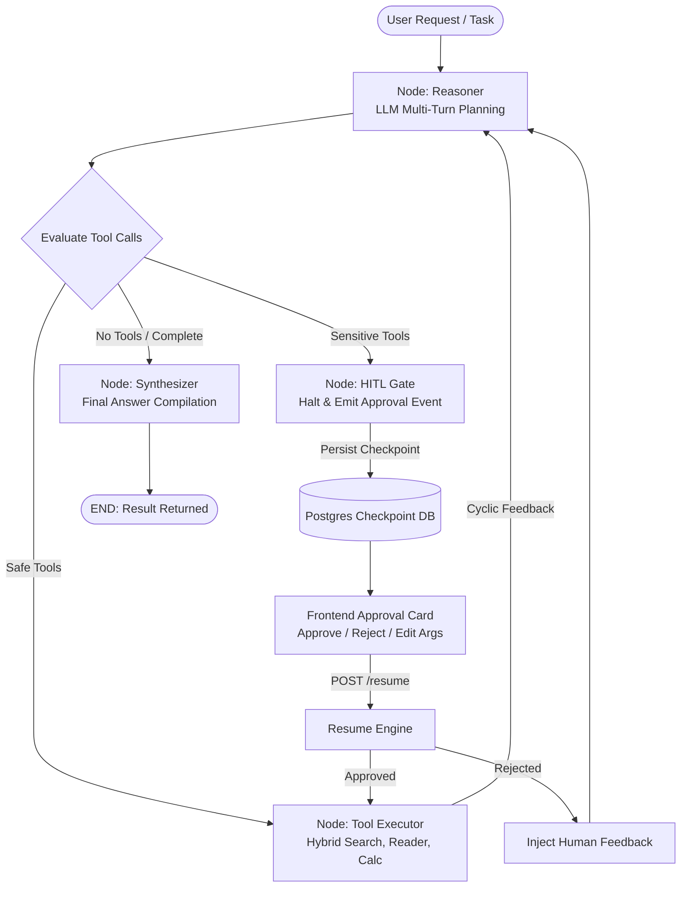

# Operational Runbook: LangGraph Cyclic Agentic Orchestration & Human-in-the-Loop (HITL) State Engine

**Milestone:** 91 (Phase L)  
**Version:** `v0.76.0`  
**Target Repos:** `retriever` & `Prateek_website`  
**Classification:** High-Leverage Cognitive Core Engine  

---

## 1. Architectural Overview & State Machine Topology

Milestone 91 upgrades Retriever's agent execution engine from a linear ReAct loop to a **stateful cyclic computation graph** powered by **LangGraph**. The engine decouples reasoning, action proposal, safety verification, and execution into distinct graph nodes connected by cyclic conditional edges.



### Graph Nodes
1. **`reasoner`**: Consults the LLM using current conversation messages, available tool schemas, and prior tool observations/human feedback. Produces internal `thought`, parsed `tool_calls`, and candidate `final_answer`.
2. **`_route_after_reasoner`**: Conditional edge inspects parsed tool calls:
   - If iteration counter $\ge$ `max_steps` or no tool calls: routes to `synthesizer`.
   - If any tool has `requires_approval = True` (or high/critical risk): routes to `hitl_gate`.
   - If all tools are safe: routes to `tool_executor`.
3. **`hitl_gate`**: Intercepts high-impact actions, persists a `ThreadCheckpoint` with `status = "waiting_approval"`, generates an `action_id`, and halts the graph execution until an explicit operator decision is submitted.
4. **`tool_executor`**: Executes registered tool functions via `ToolRegistry`, logs observations into `AgentStep`, increments iteration counter, persists an iterative checkpoint, and cycles back to `reasoner`.
5. **`synthesizer`**: Compiles the final response, marks `status = "completed"`, saves final checkpoint, and exits at `END`.

---

## 2. Tool Classification & Risk Tiers

The `ToolRegistry` enforces explicit separation between autonomous tools and sensitive operations:

| Tool Identifier | Category | Risk Tier | Requires Approval | Purpose |
| :--- | :--- | :--- | :---: | :--- |
| `calculator` | `math` | `low` | ❌ No | Safe AST mathematical evaluation without `eval()` vulnerabilities |
| `hybrid_search` | `retrieval` | `low` | ❌ No | Dense + sparse vector search across tenant documents |
| `document_reader` | `retrieval` | `low` | ❌ No | Full-text snippet extraction for a specific document ID |
| `system_metrics` | `system` | `low` | ❌ No | Active tenant usage, document count, and quota inspection |
| `document_delete` | `destructive` | `high` | ✅ **YES** | Permanent document and vector embedding purge |
| `tenant_prompt_update` | `configuration` | `high` | ✅ **YES** | Hot-reload active system prompt template |
| `api_key_revoke` | `security` | `critical` | ✅ **YES** | Instantly disables and invalidates active tenant credentials |

---

## 3. Persistent Checkpoints & Time-Travel Debugging

All graph state snapshots are persisted to PostgreSQL table `agent_checkpoints` using `SqlAgentCheckpointRepository`:

```sql
CREATE TABLE agent_checkpoints (
    checkpoint_id VARCHAR(128) PRIMARY KEY,
    thread_id VARCHAR(128) NOT NULL,
    tenant_id UUID NOT NULL REFERENCES tenants(tenant_id) ON DELETE CASCADE,
    node_name VARCHAR(64) NOT NULL,
    step_index INTEGER NOT NULL DEFAULT 0,
    state_snapshot JSONB NOT NULL DEFAULT '{}'::jsonb,
    created_at TIMESTAMPTZ NOT NULL DEFAULT NOW()
);

CREATE INDEX ix_agent_checkpoints_tenant_thread ON agent_checkpoints(tenant_id, thread_id);
CREATE INDEX ix_agent_checkpoints_thread_step ON agent_checkpoints(thread_id, step_index);
```

### Time-Travel Rollback Semantics
- **Inspection (`GET /history`)**: Retrieves the complete array of checkpoints sorted chronologically by `step_index`.
- **Rollback (`POST /rollback`)**: Restores state to target `checkpoint_id`.
  - With `fork = false` (default): Prunes any checkpoints where `step_index > target.step_index` from the active thread timeline.
  - With `fork = true`: Preserves original history while allowing new branches.

---

## 4. REST API Endpoint Specifications

All endpoints are scoped under `/v1` and require `X-Admin-Master-Key` authentication:

### 1. Execute Agent Workflow
`POST /v1/tenants/{tenantId}/agentic/execute`
```json
{
  "tenant_id": "tn_demo_enterprise",
  "prompt": "Calculate 18% GST on $4500 and search our refund terms",
  "thread_id": "thr_optional_uuid",
  "max_steps": 10,
  "allowed_tools": ["calculator", "hybrid_search"]
}
```

### 2. Resume Interrupted Thread
`POST /v1/tenants/{tenantId}/agentic/threads/{threadId}/resume`
```json
{
  "action_id": "act_8a2b3c4d",
  "decision": "approve",
  "modified_arguments": { "document_id": "doc_audited_clean" },
  "comment": "Approved by senior security engineer."
}
```

### 3. Checkpoint Timeline History
`GET /v1/tenants/{tenantId}/agentic/threads/{threadId}/history`
Returns `ThreadHistoryResponse` containing all chronological checkpoints.

### 4. Rollback State
`POST /v1/tenants/{tenantId}/agentic/threads/{threadId}/rollback`
```json
{
  "target_checkpoint_id": "chk_thr_test_step1",
  "fork": false
}
```

### 5. List Tools
`GET /v1/tenants/{tenantId}/agentic/tools`
Returns registered tool schemas with `requires_approval` and `risk_level` flags.

---

## 5. Dual Frontend Surfaces

### 1. Retriever Admin Dashboard (`retriever/apps/web`)
- Dedicated administrative page at **`/orchestration`** with sidebar icon (`Bot`).
- Features: Tenant context switcher, toolbox filter, live iteration trace flow, HITL approval card with JSON editor, and time-travel rollback history scrubber.

### 2. Retriever SaaS Studio (`Prateek_website`)
- Embedded in **`/rag/app`** under the **"Agent Studio" (`🤖`)** navigation tab.
- Conforms to **Design System 2.0** with full Azure/Noir dual-theme parity.
- Renders HITL approval dialogs via `<Portal>` (`src/components/ui/Portal.tsx`) to avoid containing block traps from Framer Motion transforms (ADR 05).

---

## 6. Hexagonal Architecture Invariants

1. **Domain Isolation (`src/domain/agentic/`)**:
   - `abstractions.py`, `tool_registry.py`, and `execution_engine.py` import **ONLY** standard Python libraries and Pydantic models.
   - Zero imports from `fastapi`, `sqlalchemy`, or `langgraph`.
2. **Adapter Encapsulation**:
   - `LangGraphOrchestrator` lives strictly in `src/adapters/cognitive/`.
   - `SqlAgentCheckpointRepository` lives strictly in `src/adapters/database/`.
3. **Multi-Tenancy**:
   - Every checkpoint query and write validates UUID formatting and strictly asserts `tenant_id`. Any mismatch raises `TenantIsolationViolationError`.
