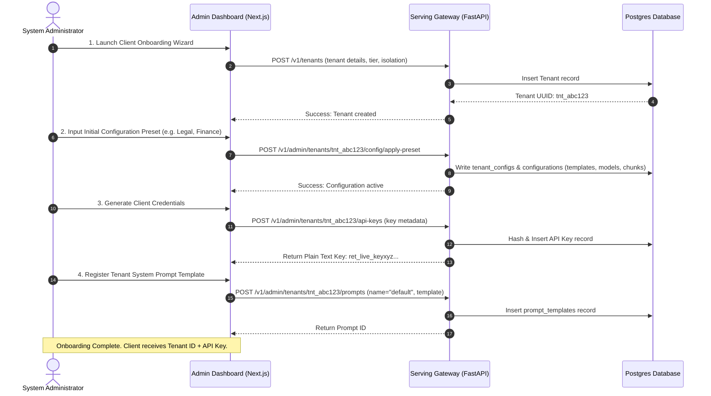

# Master Class: Retriever Core Platform Architecture & Operational Guide

Welcome to the Retriever learning session. This document is a comprehensive, production-oriented manual designed to teach you the system architecture, code organization, multi-tenancy mechanics, and setup procedures of the **Retriever Core Platform**.

---

## 1. Project Mental Model: What is Retriever?

Retriever is a **headless, multi-tenant RAG (Retrieval-Augmented Generation) engine**. It is designed to act as a backend service that powers diverse client-specific frontends.

```
                  +-----------------------------------+
                  |      Custom Frontends Layer       |
                  | (Coaching, Legal, CA Firm, etc.)  |
                  +-----------------+-----------------+
                                    |
                                    | (HTTPS + SSE)
                                    | Authorization: Bearer <client_api_key>
                                    | X-User-ID: <user-uuid>
                                    v
                  +-----------------------------------+
                  |       Retriever Core Engine       |
                  |  - Ingestion & Text Extraction   |
                  |  - Hierarchical Chunking (HNSW)   |
                  |  - Hybrid Search & Reranking      |
                  |  - Prompts & SSE Generation       |
                  +-----------------------------------+
```

### 1.1 Core Boundaries
1. **The API Key is the Contract:** Downstream clients authenticate using a single tenant-specific API key. 
2. **Retriever does NOT manage User Auth:** User authentication and UX are handled by the client frontend. The frontend identifies which user is acting by passing the `X-User-ID` header (as a UUID) on every request.
3. **Strict Tenancy Isolation:** Data separation between tenants is enforced logically using PostgreSQL **Row-Level Security (RLS)**. Any request that attempts to cross tenant boundaries triggers a permanent revocation of the API key (Breach Kill-Switch).
4. **Configuration-as-Data (CAD):** No prompts, LLM routes, or chunk sizes are hardcoded. Everything is fetched dynamically from the database configuration tables at request time.

---

## 2. Logical Architecture: Bounded Contexts

The codebase is structured around the **Ports and Adapters (Hexagonal)** model. The core domain logic is isolated from framework dependencies (FastAPI, SQLAlchemy, Celery, OpenAI SDKs) using abstract ports.

```
       +--------------------------------------------------------------+
       |                      Infrastructure Layer                    |
       |  - FastAPI (REST Gateway)      - pgvector (Vector Database)  |
       |  - Celery & RabbitMQ (Workers) - Boto3 S3 (Object Storage)   |
       +------------------------------|-------------------------------+
                                      |
                                      v [Dependency Injection]
       +--------------------------------------------------------------+
       |                          Ports Layer                         |
       |  [LlmProvider]   [VectorSearchProvider]  [StorageProvider]   |
       +------------------------------|-------------------------------+
                                      |
                                      v [Contracts]
       +--------------------------------------------------------------+
       |                          Core Domain                         |
       |  - Ingestion (Parsers)       - Knowledge (Chunk trees)       |
       |  - Retrieval (Hybrid Search) - Inference (Orchestrator)      |
       +--------------------------------------------------------------+
```

### 2.1 Bounded Contexts
* **`domain.identity`:** Resolves API keys and token signatures, enforcing tenant boundaries and access levels.
* **`domain.ingestion`:** Transforms raw binary files (PDFs, plain text) into clean, normalized plaintext blocks.
* **`domain.knowledge`:** Divides text into structured chunks and parent-child hierarchical trees.
* **`domain.retrieval`:** Coordinates parallel dense vector searches (`pgvector` cosine similarity) and sparse keyword queries (Postgres GIN index), merging them via **Reciprocal Rank Fusion (RRF)** and reranking.
* **`domain.inference`:** Handles context window packaging, dynamic system prompt templates, token budget compression, LLM API dispatch, and citation verification.

---

## 3. Database Schema & Row-Level Security (RLS)

All tenant-scoped tables implement PostgreSQL Row-Level Security. RLS ensures that a tenant can never read or write another tenant's rows, even if a query is missing a `WHERE` clause.

### 3.1 Core Entity Relational Diagram

```
 +--------------------+       +------------------------+       +-------------------+
 |      tenants       |<-----+     tenant_configs     |       |     api_keys      |
 |--------------------|       |------------------------|       |-------------------|
 | PK: tenant_id      |       | PK: tenant_id (FK)     |       | PK: key_id        |
 |    name, status    |       |    active_model        |       | FK: tenant_id     |
 |    tier            |       |    temperature         |       |    key_hash       |
 +--------------------+       +------------------------+       +-------------------+
           |                              ^                              ^
           +---------------+--------------+------------------------------+
                           |
                           v
 +--------------------+    |   +------------------------+       +-------------------+
 |     documents      |<---+---|     chat_sessions      |       |    audit_logs     |
 |--------------------|        |------------------------|       |-------------------|
 | PK: document_id    |        | PK: session_id         |       | PK: log_id        |
 | FK: tenant_id      |        | FK: tenant_id          |       | FK: tenant_id     |
 |    file_hash       |        | FK: user_id            |       |    entry_hash     |
 +--------------------+        +------------------------+       |    previous_hash  |
           |                                |                   +-------------------+
           v                                v
 +--------------------+        +------------------------+
 |  document_chunks   |        |     chat_messages      |
 |--------------------|        |------------------------|
 | PK: chunk_id       |        | PK: message_id         |
 | FK: document_id    |        | FK: session_id         |
 | FK: tenant_id      |        | FK: tenant_id          |
 | FK: parent_id      |        | FK: user_id            |
 +--------------------+        +------------------------+
           |
           v
 +--------------------+
 |   vector_records   |
 |--------------------|
 | PK: chunk_id (FK)  |
 | FK: tenant_id      |
 |    embedding (Vec) |
 +--------------------+
```

### 3.2 How RLS Works in Code
The setup script (`setup.py`) applies RLS policies to all tables containing `tenant_id`:
```sql
ALTER TABLE documents ENABLE ROW LEVEL SECURITY;

CREATE POLICY tenant_isolation_policy ON documents
FOR ALL
USING (
    tenant_id = NULLIF(current_setting('app.current_tenant_id', true), '')::uuid
    OR current_setting('app.bypass_rls', true) = 'true'
);
```

During a database transaction, the application context manager (`tenant_session` inside [connection.py](file:///Users/prateeksharma/Developer/retriever/apps/api/src/adapters/database/connection.py)) runs a session-local config query before executing actual queries:
```python
async with AsyncSessionLocal() as session:
    async with session.begin():
        if bypass_rls:
            await session.execute(text("SET LOCAL app.bypass_rls = 'true'"))
        elif tenant_id:
            await session.execute(text(f"SET LOCAL app.current_tenant_id = '{tenant_id}'"))
        else:
            await session.execute(text("SET LOCAL app.current_tenant_id = ''"))
        yield session
```
If a query fetches a row with a mismatching `tenant_id`, the database returns no rows (or fails if writing), preventing cross-tenant access.

---

## 4. Key Management, Storage, & Security

### 4.1 Client API Key Hashing
API keys are never stored as plain text. When a tenant is onboarded, the system generates a random key string and writes its SHA-256 hash to `api_keys.key_hash`. 
* During authentication, the gateway computes the SHA-256 hash of the incoming API key and matches it against the database.

### 4.2 LLM API Key Encryption
If a client wishes to "bring their own key" for cognitive models (e.g. OpenAI keys), the key is stored in the `tenant_configs` table. To protect these credentials, the system uses AES-256-GCM symmetric encryption:
* **The ConfigEncrypter:** Utilizes `cryptography.fernet` using a 32-byte key derived from the environment variable `KEY_ENCRYPTION_KEY`.
* Decryption occurs dynamically in Celery background workers and prompt execution paths.

### 4.3 LLM Key Priority Matrix
When Retriever dispatches a prompt to an LLM provider, it resolves the API key in this order:
1. **Request Override:** Header `X-LLM-Key` (passed from the client frontend).
2. **Tenant Configuration:** Saved encrypted key (`tenant_configs.llm_api_key_encrypted`).
3. **Environment Fallback:** System environment variable `OPENAI_API_KEY`.

---

## 5. Setting up Third-Party Infrastructure

### 5.1 Cloudflare Integration
Cloudflare serves three main purposes in a Retriever deployment:

#### 1. Cloudflare R2 (Document Storage)
Since Cloudflare R2 is fully S3-compatible, Retriever's `S3Storage` adapter works with it directly.
* **Environment variables setup:**
  ```env
  STORAGE_PROVIDER=s3
  STORAGE_BUCKET=my-retriever-bucket
  S3_ENDPOINT_URL=https://<account_id>.r2.cloudflarestorage.com
  AWS_ACCESS_KEY_ID=<r2_access_key_id>
  AWS_SECRET_ACCESS_KEY=<r2_secret_access_key>
  ```
* celry background tasks will download files from this endpoint to local temp folders, extract text, and clean up.

#### 2. Cloudflare DNS & Tunnels (Local Dev Sharing & Prod Deployment)
* **Cloudflare DNS:** Point `rag.prateeq.in` A record to your Oracle VM IP. WAF rules can be applied at the Cloudflare dashboard.
* **WAF & Rate Limiting:** Apply Cloudflare Web Application Firewall rules to block SQL injections and enforce request-rate thresholds before traffic hits your API nodes.

---

### 5.2 Supabase Integration
Retriever uses a standard PostgreSQL database with the `pgvector` extension. This makes Supabase an excellent managed hosting candidate.

#### 1. Connecting Retriever to Supabase Postgres
Configure the primary database URL to point to your Supabase connection string. Since the code utilizes SQLAlchemy's asynchronous extension (`asyncpg`), use the async connection string format:
```env
DATABASE_URL=postgresql+asyncpg://postgres:<password>@db.<project-id>.supabase.co:5432/postgres
```

#### 2. Preparing the Database
Run the database setup script to compile tables, HNSW vector indices, GIN text search indices, and RLS isolation policies:
```bash
uv run python -m src.adapters.database.setup
```

#### 3. Supabase Auth Integration
If your client frontend uses Supabase Auth for user accounts, Retriever can verify their identity tokens (JWTs) natively via **OIDC Token Signature Verification**:
* Set up `OIDC_ISSUER_URL`, `OIDC_JWKS_URI`, and `OIDC_AUDIENCE` to map to your Supabase project credentials.
* In the frontend, pass the Supabase JWT as the `Authorization: Bearer <JWT>` header. Retriever will automatically fetch Supabase JWKS, verify the signature, and map claims to `tenant_id` and `user_id` contexts.

---

## 6. The RAG Pipeline: Processing & Retrieval

The processing and search components represent the core capability of Retriever.

```
       [DOCUMENT INGESTION PATH]
       Multipart Binary -> Upload API -> S3 Store -> event: Uploaded
       -> Celery task: process_document -> pdfplumber -> Chunker (Fixed/Recursive/Semantic)
       -> metadata extraction -> DB Chunks -> event: Parsed
       -> Celery task: generate_embeddings -> OpenAI API -> DB vector_records -> event: Indexed

       [SEARCH & CHAT READ PATH]
       Client Search -> API -> Embedder -> Semantic Cache (Check) ──[Hit]──> Return JSON
                                   │
                                [Miss]
                                   v
                         Parallel Search (Fan-Out)
                         ├── pgvector (HNSW Cosine Similarity)
                         └── Postgres GIN Index (BM25 keyword matches)
                                   │
                                   v
                         Reciprocal Rank Fusion (RRF)
                                   │
                                   v
                         Cross-Encoder Reranking
                                   │
                                   v
                         Semantic Cache (Write) -> Return JSON
```

### 6.1 Chunking Strategy Options
Retriever provides three pluggable chunking strategies:
1. **`fixed_window`:** Simple sliding window using a fixed number of tokens and overlap.
2. **`recursive`:** Splits text recursively using character sequences (paragraphs, sentences, spaces) to avoid breaking sentences mid-token.
3. **`semantic`:** Calculates sentence similarity. Splits sentences into a new chunk only when the cosine similarity drop indicates a topic change or when the token length boundary is exceeded.

### 6.2 Metadata Extraction
During ingestion, background workers run metadata extraction:
* **Regex Extractor:** Extracts key values using regex groupings.
* **LLM Schema Extractor:** Sends the first 3000 characters of the document to an LLM alongside a JSON schema, saving returned fields inside chunk metadata.

### 6.3 Semantic Caching
To optimize API latency and reduce costs:
* Query embeddings are matched against a cache of previous queries (`semantic_cache` table) using a HNSW index.
* If a new query matches a cached query's coordinates above a similarity threshold (e.g., $> 0.99$), the system returns the cached search results immediately, bypassing the search index.

---

## 7. Operational Topology

The production system runs on bare systemd services (no Docker). See `ORACLE_DEPLOYMENT_REFERENCE.md` and `DEPLOYMENT.md` for full setup.

### 7.1 Production Architecture

```
rag.prateeq.in
        │
    ┌───▼──────────────┐
    │   Nginx (SSL)    │   port 443 → proxy_pass → port 8000
    │   Let's Encrypt  │
    └───┬──────────────┘
        │
    ┌───▼──────────────┐       ┌─────────────────────┐
    │  API (systemd)   │ ──→   │  Ollama (systemd)   │
    │  uvicorn :8000   │       │  :11434             │
    └───┬──────────────┘       │  nomic-embed-text   │
        │                      └─────────────────────┘
    ┌───▼──────────────┐
    │  Supabase        │
    │  PostgreSQL      │
    │  + pgvector      │
    └──────────────────┘
```

### 7.2 Key Commands

#### Restart the API
```bash
sudo systemctl restart retriever-api
```

#### View API logs
```bash
sudo journalctl -u retriever-api -n 50 --no-pager
```

#### Run database setup
```bash
uv run python -m src.adapters.database.setup
```

#### Run tests
```bash
cd apps/api && uv run pytest tests/
```

---

## 8. Onboarding Playbook: Client Integration

When a new client is onboarded onto the platform, use the following operational blueprint to establish their workspace.

### 8.1 Setup Sequence



### 8.2 Client Frontend Connection Contract
The client application accesses the RAG pipeline using this minimal configuration:

```typescript
import { RetrieverClient } from "@prat3010/retriever-client-js";

// Initialize client
const client = new RetrieverClient({
  baseUrl: "https://api.retriever.mycompany.com",
  apiKey: "ret_live_keyxyz...",
  tenantId: "tnt_abc123",
  userId: "user_client_unique_uuid" // Pass active user ID to isolate session chat history
});

// Step 1: Upload a file
const upload = await client.uploadDocument(file, "manual.pdf", "application/pdf");
console.log("Document indexed:", upload.documentId);

// Step 2: Open an interactive session
const { sessionId } = await client.createSession();

// Step 3: Stream generated response
const stream = client.chatStream(sessionId, "What is the return policy?");
for await (const chunk of stream) {
  if (chunk.content) {
    process.stdout.write(chunk.content);
  }
}
```

---

## 9. Codebase Quality & Technical Debt Sprint Ideas

During our audit, we identified several high-impact areas that could make onboarding clients and managing custom frontends much easier. These can be evaluated and implemented in future sessions:

### 1. Unified Tenant Scaffolder CLI (Onboarding helper)
* **Goal:** Create a simple CLI script `bin/onboard-tenant` that wraps administrative setup.
* **Why:** Instead of using the UI dashboard or curl calls, a developer can run a single terminal command:
  ```bash
  python bin/onboard-tenant --name "Client A" --preset legal --model claude-3-5 --create-key "web-key"
  ```
  to output the JSON configuration package directly.

### 2. Custom Client Frontend Template Generator
* **Goal:** Provide a boilerplate React/Next.js repository under `apps/client-boilerplate` that is pre-configured with tailwind styling, next-themes, the `@prat3010/retriever-client-js` SDK, and a responsive chat window.
* **Why:** Dramatically reduces client time-to-market. Frontend developers can clone the boilerplate, modify environment variables (`NEXT_PUBLIC_TENANT_ID`, `NEXT_PUBLIC_API_KEY`), customize CSS variables, and deploy immediately.

### 3. Dynamic Vector Dimension Adaptor
* **Goal:** Support mixed embedding vector dimensions (e.g. 1536 for OpenAI vs 384 for local HuggingFace) on the same database cluster.
* **Why:** Currently, the `vector_records` table specifies a hardcoded `Vector(1536)` database column type. Creating an automated model-to-column mapper or tenant-specific partition tables will prevent indexing failures during provider migrations.

---
*End of Guide.*
