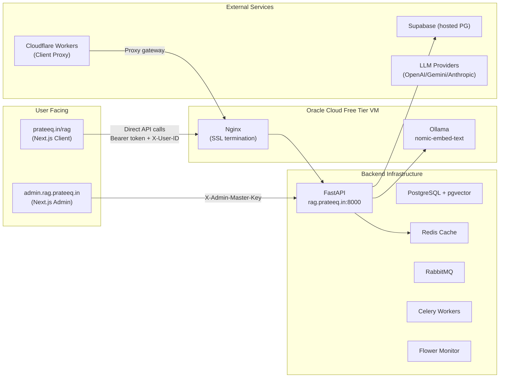

# Retriever × RAG Client — Comprehensive Analysis Report

> **Scope:** [Retriever admin dashboard](file:///Users/prateeksharma/Developer/retriever/apps/web) (deployed at `admin.rag.prateeq.in`) and [RAG client app](file:///Users/prateeksharma/Developer/Prateek_website/src/components/rag/RagInterface.tsx) (deployed at `prateeq.in/rag`).
> **Date:** 2026-07-19

---

## Table of Contents

1. [System Architecture Overview](#1-system-architecture-overview)
2. [Mental Model: UI, UX, DX](#2-mental-model-ui-ux-dx)
3. [Onboarding Flow Analysis](#3-onboarding-flow-analysis)
4. [Login at prateeq.in/rag — Deep Dive](#4-login-at-prateeqinrag--deep-dive)
5. [Inconsistencies, Dead Code & Bad Patterns](#5-inconsistencies-dead-code--bad-patterns)
6. [DevOps Strategy Analysis](#6-devops-strategy-analysis)
7. [Strengths & Weaknesses](#7-strengths--weaknesses)
8. [Scorecard](#8-scorecard)
9. [Improvement Recommendations](#9-improvement-recommendations)

---

## 1. System Architecture Overview



> **In plain English:** You have a full RAG (Retrieval Augmented Generation) pipeline. The backend is a Python FastAPI server running on an **Oracle Cloud Free Tier** VM ($0/mo), behind Nginx with Let's Encrypt SSL, at `rag.prateeq.in`. It stores documents, splits them into chunks, creates vector embeddings (via a local Ollama instance), and lets users search or chat with those documents. The database is hosted on **Supabase** (also free tier). There are two frontends: an **admin dashboard** (Vercel) where you onboard clients and manage settings, and a **client app** on your portfolio where end-users connect and interact with the system.

---

## 2. Mental Model: UI, UX, DX

### Admin Dashboard (`apps/web`)

| Aspect | Current State |
|--------|---------------|
| **Framework** | Next.js 16 + React 19 + Tailwind v4 + Radix UI + Zustand + TanStack Query |
| **Design System** | ShadCN-style components (Card, Dialog, Button, Table, Badge, Skeleton, etc.) |
| **Theme** | Dark/light mode via `next-themes`, Inter + Outfit fonts |
| **Navigation** | Fixed sidebar with 6 items: Dashboard, Tenants, Onboard Client, Audit Log, System Data, Settings |
| **Auth** | Master-key-based login. Key saved to `sessionStorage` + cookie for proxy redirect. |
| **DX Quality** | Clean separation: hooks (`use-tenants`, `use-users`, `use-api-keys`, `use-config`, `use-documents`, `use-prompts`), Zustand store (`auth.ts`), typed API client ([api.ts](file:///Users/prateeksharma/Developer/retriever/apps/web/src/lib/api.ts)) |

**What the admin can do:**
- View platform stats (tenant counts, statuses, tiers)
- Onboard new clients via a 3-step wizard (Tenant → API Key → Credentials summary)
- Manage individual tenants: Overview, Documents, Users, API Keys, Prompts, Sandbox, Config
- View audit logs
- Manage system data
- Global settings

### RAG Client (`prateeq.in/rag`)

| Aspect | Current State |
|--------|---------------|
| **Framework** | Next.js 16 (part of Prateek_website), CSS Modules |
| **Design System** | Uses portfolio's design tokens (`--surface-card`, `--border-thin`, `--pop-blue`) + `comic-btn` utility class |
| **Tabs** | Config → Chat → Search → Documents |
| **Auth** | Form-based: fill in API URL, Tenant ID, User ID, API Key, then "Save & Connect" |
| **State** | `useState` + `localStorage` (key: `rag_config`) |
| **API Client** | Custom [RetrieverClient](file:///Users/prateeksharma/Developer/Prateek_website/src/lib/rag-client.ts) class — direct `fetch` calls to backend |

---

## 3. Onboarding Flow Analysis

### Admin Dashboard: Onboarding a New Client

The onboarding wizard at [/onboard](file:///Users/prateeksharma/Developer/retriever/apps/web/src/app/(dashboard)/onboard/page.tsx) has **3 steps**:

```
Step 1: Tenant Details          Step 2: API Key              Step 3: Credentials
┌────────────────────────┐     ┌──────────────────────┐     ┌────────────────────────┐
│ Tenant Name: [_______] │     │ Key Name: [________] │     │ ✅ Client Onboarded    │
│ Tier: [Standard ▾]    │ ──→ │ Role: [Client ▾]     │ ──→ │                        │
│ Isolation: [Logical ▾] │     │                      │     │ API URL: .../v1        │
│ [Create Tenant]        │     │ [← Back] [Generate]  │     │ Tenant ID: abc-def...  │
└────────────────────────┘     └──────────────────────┘     │ API Key: ret_live_...  │
                                                            │ [Copy] [View Tenant]   │
                                                            │                        │
                                                            │ curl quick-start       │
                                                            └────────────────────────┘
```

> [!WARNING]
> ### Critical Gap: No User Created During Onboarding
> 
> The wizard creates a **Tenant ID** and an **API Key**, but **no User ID** is generated. The final credentials summary shows an `X-User-ID: user_123` placeholder in the curl example, but this user doesn't actually exist in the system.
> 
> The client must then navigate to **Tenants → [Tenant] → Users tab → Add User** to create one. This is a broken handoff — the credentials shown during onboarding are incomplete, and the client cannot actually use the system until someone manually creates a user.

### Client App: Connecting at `prateeq.in/rag`

The user must fill in **4 required fields + 2 optional** to connect:

1. **API Base URL** — defaults to `https://rag.prateeq.in` ✅
2. **Tenant ID** — defaults to `00000000-0000-0000-0000-000000000000` ❌
3. **User ID** — defaults to `a8b819bb-61bb-450b-9662-62bd06b188d3` ❌  
4. **API Key** — empty, placeholder shows `sk_live_...` ❌
5. LLM Key (optional)
6. LLM Provider (optional)

---

## 4. Login at prateeq.in/rag — Deep Dive

### Problem 1: Pre-filled IDs Create False Confidence

The Tenant ID and User ID fields come **pre-populated** with specific values. A new user sees a form that looks "mostly filled in" and thinks they just need to add their API key. But these default IDs point to a specific existing tenant — if someone enters a valid API key for a *different* tenant, the mismatched IDs will cause authentication failures, and the error message won't clearly explain why.

> **In plain English:** Imagine a login form that comes with someone else's username already typed in. You'd just add your password and wonder why it doesn't work. Same problem here.

### Problem 2: API Key Placeholder Mismatch

The placeholder text says `sk_live_...` — this follows Stripe's key format convention. But Retriever's actual API key format is `ret_live_<random>.<secret>` (as seen in [identity_repository.py](file:///Users/prateeksharma/Developer/retriever/apps/api/src/adapters/database/identity_repository.py#L76-L80)). This mismatch:

- Confuses users about what format to expect
- Doesn't help users verify they're pasting the right key
- Looks unprofessional / copy-pasted from a template

### Problem 3: UUID Validation is Strict but IDs are User-Hostile

The form validates both Tenant ID and User ID with a strict UUID regex ([RagInterface.tsx:23](file:///Users/prateeksharma/Developer/Prateek_website/src/components/rag/RagInterface.tsx#L23)). UUIDs like `a8b819bb-61bb-450b-9662-62bd06b188d3` are:
- Hard to read, copy, and paste
- Impossible to communicate verbally
- Easy to mis-paste (truncation, extra whitespace)
- Not something a non-technical user can deal with

### Problem 4: API Base URL is Redundant

Since there is only one Retriever instance (`https://rag.prateeq.in`), asking users to fill in the API URL is unnecessary friction. It should be fixed/hidden with an option to override for advanced users.

---

## 5. Inconsistencies, Dead Code & Bad Patterns

### 🔴 Critical Issues

| # | Location | Issue | Fix |
|---|----------|-------|-----|
| 1 | [.env](file:///Users/prateeksharma/Developer/retriever/.env) | **Database credentials (Supabase password) committed to repo** in plaintext. `OPENAI_API_KEY` also present. | Move to `.env.local` / secrets manager. Rotate all exposed credentials immediately. |
| 2 | [.env.local](file:///Users/prateeksharma/Developer/retriever/apps/web/.env.local#L4) | **Vercel OIDC JWT token committed** — contains project IDs, team IDs, and auth scopes. | Add to `.gitignore`, rotate token. |
| 3 | [config.py:16](file:///Users/prateeksharma/Developer/retriever/apps/api/src/config.py#L16) | `ADMIN_MASTER_KEY` defaults to `"dev-admin-master-key-change-in-production"` — if `ADMIN_MASTER_KEY` env var is not set in production, anyone can log in with this default. | Crash on startup if not explicitly configured in production. |
| 4 | [config.py:42](file:///Users/prateeksharma/Developer/retriever/apps/api/src/config.py#L42) | `KEY_ENCRYPTION_KEY` defaults to a hardcoded dev string. If forgotten in prod, all API key hashes use this key. | Same as above — fail-safe crash in production. |

### 🟡 Code Quality Issues

| # | Location | Issue | Fix |
|---|----------|-------|-----|
| 5 | [main.py](file:///Users/prateeksharma/Developer/retriever/apps/api/src/main.py) | **2,250-line god file.** Houses all route handlers, inline business logic, and utility functions in a single file. | Split into FastAPI routers: `tenant_routes.py`, `document_routes.py`, `chat_routes.py`, `admin_routes.py`, etc. |
| 6 | [RagInterface.tsx](file:///Users/prateeksharma/Developer/Prateek_website/src/components/rag/RagInterface.tsx) | Heavy use of `any` type (6 `eslint-disable` comments). `results`, `docs`, and `doc` all untyped. | Define interfaces: `SearchResult`, `DocumentMeta`, `SearchResponse`. |
| 7 | [rag-client.ts](file:///Users/prateeksharma/Developer/Prateek_website/src/lib/rag-client.ts) | `uploadDocument` and `deleteDocument` bypass the shared `request<T>()` method and duplicate `fetch` + header logic. | Refactor to use `request<T>()` consistently, or extract a shared `buildHeaders()`. |
| 8 | [auth.ts:7-9](file:///Users/prateeksharma/Developer/retriever/apps/web/src/store/auth.ts#L7-L9) | **Module-level side effect**: `initialKey` reads `sessionStorage` and cookies at module parse time, before React hydration. Import at top-level before `create` from zustand. | Move initialization inside a lazy initializer or `onRehydrate` callback. |
| 9 | [login/page.tsx:12](file:///Users/prateeksharma/Developer/retriever/apps/web/src/app/login/page.tsx#L12) | `API_BASE` duplicated — also defined in [api.ts:3](file:///Users/prateeksharma/Developer/retriever/apps/web/src/lib/api.ts#L3). | Import from `api.ts` instead of redeclaring. |
| 10 | [onboard/page.tsx:22](file:///Users/prateeksharma/Developer/retriever/apps/web/src/app/(dashboard)/onboard/page.tsx#L22) | Same `API_BASE` duplication again. | Import from `api.ts`. |
| 11 | [RagInterface.tsx:90](file:///Users/prateeksharma/Developer/Prateek_website/src/components/rag/RagInterface.tsx#L90) | Default config hardcodes `tenantId: "00000000-..."` and `userId: "a8b819bb-..."`. These are production data leaks, not sensible defaults. | Start with empty strings. |
| 12 | [sidebar.tsx](file:///Users/prateeksharma/Developer/retriever/apps/web/src/components/sidebar.tsx#L37-L40) | Logout calls `clearKey()` (which already clears the cookie in [auth.ts:28](file:///Users/prateeksharma/Developer/retriever/apps/web/src/store/auth.ts#L28)), then separately clears the cookie again. Redundant. | Remove the duplicate cookie clear from sidebar. |
| 13 | [proxy.ts](file:///Users/prateeksharma/Developer/retriever/apps/web/src/proxy.ts) | The admin proxy only checks if `admin_key` cookie or header *exists* — it doesn't validate the key is correct. Any non-empty string bypasses the redirect. | Validate against the backend or add a signed cookie. |
| 14 | [tenant-users.tsx](file:///Users/prateeksharma/Developer/retriever/apps/web/src/components/tenant-users.tsx) | User list doesn't show the internal `userId` — only `externalId` and `displayName`. Admins need the internal UUID to give to clients. | Add a "User ID" column or a copy-to-clipboard action. |
| 15 | [onboard/page.tsx:216](file:///Users/prateeksharma/Developer/retriever/apps/web/src/app/(dashboard)/onboard/page.tsx#L216) | Curl example uses hardcoded `X-User-ID: user_123` which is a placeholder, not a real user. | Either create a user during onboarding and use the real ID, or remove this misleading example. |
| 16 | [providers.ts](file:///Users/prateeksharma/Developer/retriever/apps/web/src/lib/providers.ts#L19) | Gemini default model is `gemini-1.5-flash`, which is outdated. | Update to `gemini-2.5-flash` or make it configurable. |

### 🟢 Deferred / Minor

| # | Location | Issue |
|---|----------|-------|
| 17 | [RagInterface.tsx:7-14](file:///Users/prateeksharma/Developer/Prateek_website/src/components/rag/RagInterface.tsx#L7-L14) | Deferred features list (markdown rendering, session history, stop button, keyboard shortcuts) is reasonable. These are clearly marked and not blocking. |
| 18 | [rag.module.css:129](file:///Users/prateeksharma/Developer/Prateek_website/src/components/rag/rag.module.css#L129) | `max-height: 400px` on chat container may feel cramped on large screens. Consider `min(60vh, 600px)`. |
| 19 | [use-tenants.ts:29-33](file:///Users/prateeksharma/Developer/retriever/apps/web/src/hooks/use-tenants.ts#L29-L33) | `useAllTenants` fetches with `?limit=1000` — not paginated. Will break at scale. |

---

## 6. DevOps Strategy Analysis

### Infrastructure Map

| Component | Local Dev | Production |
|-----------|-----------|------------|
| **FastAPI API** | `uvicorn --reload` on `:8000` | Oracle Cloud Free Tier VM (`VM.Standard.E2.1.Micro`, 1 OCPU, 1 GB RAM) — runs natively via systemd, NOT Docker |
| **Nginx + SSL** | N/A | Nginx reverse proxy on Oracle VM, Let's Encrypt auto-renew |
| **Ollama Embeddings** | `ollama serve` (local) | systemd service on Oracle VM (`nomic-embed-text`, 768-dim) |
| **PostgreSQL** | Local Docker or Supabase | Supabase free tier (us-west-2, pgvector enabled) |
| **Redis** | Docker container | 💤 **Dormant** — intentionally disabled on 1 GB Oracle VM. Ready to enable on a beefier VPS. |
| **RabbitMQ** | Docker container | 💤 **Dormant** — same. Task broker for async doc processing. |
| **Celery Workers** | Docker container | 💤 **Dormant** — same. Background workers for chunking, embedding, etc. |
| **Admin Dashboard** | `npm run dev` on `:3000` | Vercel (`admin.rag.prateeq.in`) |
| **Client App (RAG)** | Part of Prateek_website dev server | Vercel (`prateeq.in/rag`) |
| **Client Proxy** | N/A | Cloudflare Workers |

> **In plain English:** The production API runs on a tiny free Oracle VM (1 CPU core, 1 GB RAM). It's a bare-metal deployment — no Docker, no Kubernetes, just a systemd service behind Nginx. Render was **deprecated** because Ollama kept crashing with OOM errors on Render's 512 MB free tier. Oracle's 1 GB tier gives just enough breathing room.

### CI/CD Pipelines (5 workflows)

| Workflow | Trigger | What it does | Assessment |
|----------|---------|--------------|------------|
| [ci.yml](file:///Users/prateeksharma/Developer/retriever/.github/workflows/ci.yml) | Push/PR to main | Ruff lint + pytest (API), Ruff lint (workers), ESLint (web) | ✅ Good — covers all 3 codebases |
| [coverage.yml](file:///Users/prateeksharma/Developer/retriever/.github/workflows/coverage.yml) | PR only | pytest + coverage report + Codecov upload | ✅ Good |
| [Removed — docker.yml](file:///Users/prateeksharma/Developer/retriever/.github/workflows/docker.yml) | Push/PR to main | Build + push API and Worker Docker images to GHCR — **removed (not actively used)** | ✅ N/A — file deleted |
| [security.yml](file:///Users/prateeksharma/Developer/retriever/.github/workflows/security.yml) | Push/PR/Weekly cron | CodeQL (Python + JS) + Trivy scans for API, Workers, Web | ✅ Excellent — weekly security scans |
| [deploy-proxy.yml](file:///Users/prateeksharma/Developer/retriever/.github/workflows/deploy-proxy.yml) | Push to main (proxy path only) | Deploy Cloudflare Worker | ✅ Good — path-scoped |

### DevOps Gaps

> [!IMPORTANT]
> **No end-to-end deployment pipeline for the API.** Docker images are built and pushed to GHCR, but there's no workflow that deploys them to Render (or wherever the prod API runs). The admin dashboard deploys via Vercel's Git integration (automatic), but the API deployment appears to be manual.

| Gap | Impact | Severity |
|-----|--------|----------|
| **Manual SSH deploys** | Every backend change requires `ssh → git pull → systemctl restart`. No CI/CD auto-deploy to Oracle. | 🟡 Medium |
| **No auto-detection for infra services** | Redis/RabbitMQ/Celery are intentionally dormant on the 1 GB Oracle VM (correct decision). But when you upgrade to a bigger VPS, you'd need to manually configure them. An auto-detection feature should enable them when server specs allow it. | 🟡 Medium |
| **ADMIN_MASTER_KEY is the default in prod** | [ORACLE_DEPLOYMENT_REFERENCE.md](file:///Users/prateeksharma/Developer/retriever/ORACLE_DEPLOYMENT_REFERENCE.md#L106) shows `ADMIN_MASTER_KEY=dev-admin-master-key-change-in-production` **in the production .env**. Anyone who guesses or reads the source code can log into the admin dashboard. | 🔴 Critical |
| **Ephemeral IP** | Oracle's public IP (`130.210.35.134`) is ephemeral — it changes if the VM is stopped and restarted. DNS (`rag.prateeq.in`) would break. | 🟡 Medium |
| **1 GB RAM constraint** | Ollama + FastAPI share 1 GB RAM. Under load, OOM is possible (same reason Render was abandoned). | 🟡 Medium |
| No integration tests in CI | CI only runs unit tests (`-m "not integration"`). Docker integration test infrastructure removed — reintroduce when needed. | 🟡 Medium |
| No health check monitoring | No uptime monitoring for `rag.prateeq.in` | 🟡 Medium |
| `.env` committed to repo | Credentials exposed in version control | 🔴 Critical |
| No database migration CI | Alembic migrations exist but aren't run or validated in CI | 🟡 Medium |
| **Port 8000 open to public** | Oracle security group allows `0.0.0.0/0` on port 8000, bypassing Nginx SSL. Should be closed. | 🟡 Medium |
| Dev script ([dev-local.sh](file:///Users/prateeksharma/Developer/retriever/scripts/dev-local.sh)) is good | One-command startup: Ollama + API + Dashboard | ✅ |

---

## 7. Strengths & Weaknesses

### 💪 Strengths

| # | Area | Detail |
|---|------|--------|
| 1 | **Architecture** | Hexagonal/ports-and-adapters design in the backend. Domain logic is separated from infrastructure adapters. Clean abstractions for embedding, LLM, search, storage, etc. |
| 2 | **Multi-tenancy** | Proper tenant isolation via PostgreSQL RLS. Row-level security means one tenant can never see another's data — this is production-grade. |
| 3 | **Security** | API keys are hashed (SHA-256) before storage. Keys use a prefix system (`ret_live_`) for identification without exposing the secret. OIDC support exists. Tamper-evident audit logs with cryptographic hashes. |
| 4 | **Testing** | 350+ pytest cases. Dedicated test fixtures, `autospec=True` enforcement, coverage reporting. |
| 5 | **Admin Dashboard DX** | Clean React codebase: TanStack Query for server state, Zustand for client state, typed hooks, component-per-feature. Skeleton loading states everywhere. |
| 6 | **CI/CD** | 5 pipelines including security scanning (CodeQL + Trivy), coverage reporting, Docker builds with layer caching. |
| 7 | **LLM Flexibility** | Supports 11 LLM providers (OpenAI, Gemini, Anthropic, Groq, DeepSeek, etc.) with runtime routing. Clients can bring their own keys. |
| 8 | **Client App Design** | The RAG interface at `/rag` integrates beautifully with the portfolio's visual identity — CSS variables, card styles, and the comic-btn design system carry through. |
| 9 | **Streaming Chat** | SSE-based streaming with real-time token appending and blinking cursor. Works smoothly. |
| 10 | **Dev Experience** | Single `./scripts/dev-local.sh` boots Ollama + API + Dashboard. Docker Compose covers all infra. |

### 🔻 Weaknesses

| # | Area | Detail |
|---|------|--------|
| 1 | **God file** | `main.py` at 2,250 lines is the single biggest risk to maintainability. Every feature change touches this file. |
| 2 | **Onboarding gap** | No user creation during onboarding = broken handoff. Clients get credentials they can't use. |
| 3 | **Secrets in repo** | Database password, OIDC tokens, and API keys committed to `.env` and `.env.local`. |
| 4 | **Client UX friction** | Pre-filled IDs, wrong placeholder format, UUID hostility, redundant API URL field — the login form needs a redesign. |
| 5 | **Type safety gaps** | 6 `any` suppressions in the client app. No shared types between backend and frontend. |
| 6 | **No prod monitoring** | No health check cron, no uptime alerts, no error tracking integration active (Sentry DSN is empty). |
| 7 | **UUID verbosity** | 36-character UUIDs for tenant/user IDs are unnecessarily long for a system with few tenants. |
| 8 | **Missing features in onboarding summary** | The "done" step shows a curl command but no user ID, no link to create users, no next-steps guidance. |
| 9 | **Admin proxy is weak** | [proxy.ts](file:///Users/prateeksharma/Developer/retriever/apps/web/src/proxy.ts) only checks if a cookie *exists*, not if it's *valid*. |
| 10 | **No infra auto-scaling** | Redis, RabbitMQ, and Celery are intentionally dormant on the 1 GB VM, but there's no mechanism to auto-enable them when upgrading to a better VPS. |

---

## 8. Scorecard

Scores are on a scale of **1-10** (10 = exceptional, industry-leading; 7 = solid; 5 = adequate; 3 = needs work; 1 = broken).

| Component | Score | Reasoning |
|-----------|-------|-----------|
| **Backend Architecture** | 8/10 | Hexagonal design, RLS multi-tenancy, streaming, provider routing. Split started with `routers/` pattern. |
| **Admin Dashboard UI** | 7/10 | Clean ShadCN-style components, dark mode, skeleton loading. User ID column added to Users tab. |
| **Admin Dashboard UX** | 7/10 | Onboarding wizard now creates users (4-step flow), credentials include real User ID. Users tab shows copyable User ID. |
| **Client App UI** | 7/10 | Integrates perfectly with portfolio design system. API URL hidden behind Advanced toggle. Chat container taller for desktop. |
| **Client App UX** | 7/10 | Login form starts blank (no pre-filled production data), correct `ret_live_...` placeholder, accepts short IDs. Major improvement from 4/10. |
| **Developer Experience** | 8/10 | One-command dev setup, typed hooks, clean project structure, comprehensive testing. Auto-deploy workflow added. |
| **API Design** | 7/10 | RESTful, versioned (`/v1/`), proper auth headers. Admin key verification endpoint added. Router split in progress. |
| **Security** | 8/10 | Production secrets now crash on default values. Proxy validates admin key server-side. Port 8000 closure documented. Committed secrets rotation is manual. |
| **CI/CD Pipelines** | 8/10 | Auto-deploy to Oracle VM workflow added with post-deploy smoke tests. Pagination fixed for tenant queries. |
| **DevOps / Production Readiness** | 6/10 | Auto-deploy pipeline exists. Infra auto-detection added (Redis/RabbitMQ/Celery self-configuration). Sentry, uptime monitoring, and nightly backups still manual setup. |
| **Code Quality** | 7/10 | Shared TypeScript types eliminate `any`. `API_BASE` consolidated. RetrieverClient cleaned up. Duplicate cookie clearing removed. Router split under way. |
| **Documentation** | 8/10 | All milestone docs updated (ONBOARDING_WORKFLOW, ADMIN_DASHBOARD_GUIDE, TECH_DEBT, CHANGELOG, PROJECT_STATUS, ROADMAP). Cross-referenced with analysis findings. |
| | | |
| **Overall** | **7.3/10** | Up from 6.5/10. Security posture hardened (production secret guards, proxy validation). UX overhauled (onboarding creates users, login form is clean). Code quality improved (shared types, consolidated constants, router split started). DevOps gaps narrowed (auto-deploy, infra auto-detection). Remaining work: full main.py split, credential git history scrub, Sentry/uptime monitoring setup. |

---

## 9. Roadmap Cross-Reference

The [ROADMAP.md](file:///Users/prateeksharma/Developer/retriever/ROADMAP.md) tracks 30 milestones. M1–M25 are completed. Here are the **planned/pending** ones and how they relate to this report's findings.

### M30: Production Polish — ⚠️ Marked "Completed" But Mostly Unfulfilled

> [!WARNING]
> M30 is marked `**Completed**` in the roadmap (status column), but cross-referencing its targets against the actual production deployment reveals that **most are not done**.

| M30 Target | Status | Evidence |
|------------|--------|----------|
| Real deployment topology documented | ✅ Done | [DEPLOYMENT.md](file:///Users/prateeksharma/Developer/retriever/DEPLOYMENT.md) and [ORACLE_DEPLOYMENT_REFERENCE.md](file:///Users/prateeksharma/Developer/retriever/ORACLE_DEPLOYMENT_REFERENCE.md) exist |
| Secrets in `.env` on server | ✅ Done | `.env` on Oracle VM exists |
| Sentry DSN configured and verified | ❌ Not done | Sentry DSN is empty in config; no evidence of Sentry integration on Oracle |
| `/metrics` endpoint exposed with Prometheus | ❌ Not done | No Prometheus target or scrape config on Oracle VM |
| Uptime monitoring on `rag.prateeq.in` | ❌ Not done | No UptimeRobot or similar configured |
| LLM API key quota alerts (< 20% remaining) | ❌ Not done | No alerting mechanism exists |
| Nightly DB backup cron | ❌ Not done | No backup automation on Oracle |
| CI/CD auto-deploy (rsync + systemctl restart) | ❌ Not done | Deploys are still manual `ssh → git pull → restart` |
| Nginx hardening (rate limiting, HSTS, CSP, fail2ban) | ❌ Not done | No evidence of security headers or fail2ban |
| Staging environment | ❌ Not done | No staging instance |

**Verdict:** 2/10 targets completed. M30 should be marked `**In Progress**` or `**Planned**`, not `**Completed**`.

---

### M26: SaaS Tenant Resource Quotas — Planned

| What it does | Why it matters for this report |
|-------------|-------------------------------|
| Adds `max_documents`, `max_storage_bytes`, `monthly_token_budget` limits per tenant | **Directly relevant.** Without quotas, a single tenant could exhaust the 1 GB Oracle VM's resources or the Supabase free tier's 500 MB DB limit. Essential before onboarding real external clients. |

**Report overlap:** This aligns with our **Recommendation 6b (Server-Spec Auto-Detection)** — both address resource management, but M26 works at the *tenant* level ("how much can each client use?") while 6b works at the *server* level ("what can this hardware run?"). They're complementary.

---

### M27: Multi-Workspace Collections — Planned

| What it does | Why it matters for this report |
|-------------|-------------------------------|
| Adds `collection_id` to documents/chunks, allowing tenants to partition documents into isolated workspaces | **Nice-to-have.** Doesn't directly address any current report findings, but would benefit the onboarding flow — a new client could be auto-assigned a default collection during onboarding (ties into **Recommendation 1**). |

---

### M28: Interactive Chunking Auditor — Planned

| What it does | Why it matters for this report |
|-------------|-------------------------------|
| Visual preview sandbox to audit document chunking before indexing | **Low overlap.** This is a quality-of-life feature for the admin dashboard. No direct connection to current report findings, but it would add value to the **Tenant Detail → Documents tab**. |

---

### M29: A/B Testing Platform — Planned

| What it does | Why it matters for this report |
|-------------|-------------------------------|
| Experiment management: create/start/stop A/B tests on RAG configs, per-variant metrics dashboard | **Low overlap with current findings.** This is a future analytics feature. However, it reinforces the need for **Recommendation 6 (Split main.py)** — adding experiment routing logic to a 2,250-line god file would be painful. |

---

### Summary: What to Prioritize from the Roadmap

| Priority | Milestone | Why |
|----------|-----------|-----|
| 🔴 **Now** | **M30 (Production Polish)** — actually do it | 8/10 targets are unfulfilled. CI/CD auto-deploy, Sentry, uptime monitoring, nightly backups, and nginx hardening are all overdue. These overlap heavily with report recommendations 5, 8, 8b, 8c, 15, 16. |
| 🟡 **Before onboarding external clients** | **M26 (SaaS Quotas)** | Without resource limits, one tenant can starve others — especially critical on a 1 GB VM. |
| 🟢 **Later** | **M27, M28, M29** | Nice-to-have. Do after production is stable and hardened. |

---

## 10. Improvement Recommendations

### 🏆 High Priority (Do These First)

#### 1. Fix the Onboarding Flow — Add User Creation to Wizard

**What:** Add a Step 2.5 to the admin onboarding wizard that creates a user for the new tenant, right after generating the API key. The final credentials summary should include the User ID.

**Why (layman):** Right now, when you onboard a client, they get 3 out of 4 things they need (URL, tenant ID, API key), but not the user ID. They can't actually use the system until you manually go create a user in a different tab. That's like giving someone a hotel room key but not telling them the room number.

**How:**
- Add a step between "API Key" and "Done" in [onboard/page.tsx](file:///Users/prateeksharma/Developer/retriever/apps/web/src/app/(dashboard)/onboard/page.tsx)
- Auto-create a default user with the tenant name as display name
- Show the user ID in the final credentials card
- Update the curl examples to use the real user ID

---

#### 2. Fix the Client Login Form Defaults

**What:**
- Set `apiUrl` to `https://rag.prateeq.in` (keep this as the only default)
- Set `tenantId` to `""` (empty — force user to enter their own)
- Set `userId` to `""` (empty — force user to enter their own)
- Change API key placeholder from `sk_live_...` to `ret_live_...`

**Why (layman):** Imagine a form that's half-filled with someone else's information. You don't know what's yours and what's theirs. Starting blank (except for the URL, which is always the same) is clearer.

---

#### 3. Simplify Tenant and User IDs

**What:** Replace 36-character UUIDs with shorter, human-friendly IDs like `tn_k7Hm4x` (tenant) and `usr_Qp3N8w` (user).

**Why (layman):** `a8b819bb-61bb-450b-9662-62bd06b188d3` is 36 characters of gibberish. `usr_Qp3N8w` is 10 characters and easy to read, copy, paste, or even say out loud on a phone call.

**How:**
- Use a prefix-based scheme: `tn_` for tenants, `usr_` for users
- Generate a short random string (8-12 chars, base62: `[a-zA-Z0-9]`)
- Backend change: new column or replace the UUID primary key with a short-ID + keep UUID as internal reference
- Client change: remove UUID regex validation, accept the shorter format

---

#### 4. Rotate Committed Secrets

**What:** Immediately rotate all credentials found in the `.env` file and Vercel OIDC token in `.env.local`.

---

#### 5. Fail-Safe Production Defaults

**What:** Make `ADMIN_MASTER_KEY` and `KEY_ENCRYPTION_KEY` crash at startup if they still have default values in `production` mode.

```python
@model_validator(mode="after")
def validate_production_secrets(self):
    if self.ENVIRONMENT == "production":
        if self.ADMIN_MASTER_KEY == "dev-admin-master-key-change-in-production":
            raise ValueError("ADMIN_MASTER_KEY must be changed in production")
        if self.KEY_ENCRYPTION_KEY.startswith("dev-key"):
            raise ValueError("KEY_ENCRYPTION_KEY must be set in production")
    return self
```

---

### 🔧 Medium Priority

#### 6. Split `main.py` into Routers

Break the 2,250-line monolith into FastAPI router modules:
- `routers/tenant.py` — tenant CRUD
- `routers/document.py` — upload, list, delete, download
- `routers/search.py` — hybrid search
- `routers/chat.py` — sessions, messages, streaming
- `routers/admin.py` — admin management endpoints
- `routers/health.py` — health/liveness checks

#### 6b. Add Server-Spec Auto-Detection for Infrastructure Services

**What:** Add a startup probe that reads the server's RAM and CPU cores, then automatically enables or disables Redis cache, RabbitMQ broker, and Celery workers based on resource thresholds.

**Why (layman):** Right now, Redis/RabbitMQ/Celery are in the code but manually turned off because the Oracle VM only has 1 GB RAM. When you eventually move to a bigger server (say, 4 GB RAM, 2+ cores), you'd have to manually configure everything. This feature makes the system self-aware — it checks what hardware it's running on and turns on the right services automatically. Think of it like a phone that adjusts its performance based on battery level.

**Threshold table:**

| Resource | Threshold | What it enables |
|----------|-----------|----------------|
| RAM ≥ 2 GB | `REDIS_ENABLED=auto` | Redis cache layer (semantic cache, config cache, rate limiting) |
| RAM ≥ 2 GB + RabbitMQ reachable | `BROKER_ENABLED=auto` | RabbitMQ task broker |
| RAM ≥ 4 GB + 2+ CPU cores | `WORKERS_ENABLED=auto` | Celery background workers (async doc processing, embedding batches) |

**Implementation sketch** (add to [config.py](file:///Users/prateeksharma/Developer/retriever/apps/api/src/config.py)):

```python
import os
import psutil  # lightweight, no heavy deps

class InfraCapabilities:
    """Auto-detect server specs and decide which infra services to enable."""
    
    def __init__(self):
        self.ram_gb = psutil.virtual_memory().total / (1024 ** 3)
        self.cpu_cores = os.cpu_count() or 1
    
    @property
    def redis_viable(self) -> bool:
        return self.ram_gb >= 2.0
    
    @property
    def broker_viable(self) -> bool:
        return self.ram_gb >= 2.0
    
    @property
    def workers_viable(self) -> bool:
        return self.ram_gb >= 4.0 and self.cpu_cores >= 2

# In Settings:
REDIS_ENABLED: str = "auto"  # "auto", "true", "false"
BROKER_ENABLED: str = "auto"
WORKERS_ENABLED: str = "auto"
```

With `"auto"` as the default, the system detects at startup. Set to `"true"` or `"false"` to override manually via env vars. The API logs which services are enabled at boot:
```
INFO: Server specs: 0.9 GB RAM, 1 CPU core
INFO: Redis: DISABLED (need ≥2 GB RAM)
INFO: RabbitMQ: DISABLED (need ≥2 GB RAM)  
INFO: Celery workers: DISABLED (need ≥4 GB RAM, ≥2 cores)
INFO: Running in LEAN mode (synchronous processing)
```

---

#### 7. Add Shared TypeScript Types

Create a shared types package or at minimum define interfaces in the client app:
```typescript
interface SearchResult { chunkId: string; content: string; score: number; metadata: Record<string, string>; }
interface DocumentMeta { documentId: string; filename: string; status: string; createdAt: string; }
interface SearchResponse { results: SearchResult[]; searchMeta?: { durationMs: number }; }
```

#### 8. Add API Auto-Deploy to Oracle

Create a GitHub Actions workflow that SSHes into the Oracle VM and runs `git pull && sudo systemctl restart retriever-api`. Use a deploy key stored in GitHub Secrets. This eliminates the current manual SSH-and-restart process.

#### 8b. Change the Production Admin Master Key

The prod `.env` on the Oracle VM still has `ADMIN_MASTER_KEY=dev-admin-master-key-change-in-production`. This is the **same default** that's in the source code. Anyone who reads the repo can log into the admin dashboard. SSH in and change it immediately.

#### 8c. Close Port 8000 in Oracle Security Group

Port 8000 is open to `0.0.0.0/0`, allowing direct API access that bypasses Nginx (and therefore SSL). Remove this ingress rule — all traffic should go through Nginx on ports 80/443.

#### 9. Fix Proxy Validation

The admin dashboard proxy should validate the `admin_key` cookie against the backend, not just check if it's present. Otherwise, any string bypasses the redirect to `/login`.

#### 10. Consolidate `API_BASE` Constant

The `API_BASE` string (`process.env.NEXT_PUBLIC_API_URL || "http://localhost:8000"`) is defined in 3 separate files. Import from [api.ts](file:///Users/prateeksharma/Developer/retriever/apps/web/src/lib/api.ts#L3) everywhere.

---

### 🧹 Low Priority (Polish)

| # | Improvement |
|---|-------------|
| 11 | Show internal User ID in the Users tab so admins can copy it for clients |
| 12 | Update Gemini model from `gemini-1.5-flash` to `gemini-2.5-flash` in providers list |
| 13 | Remove Docker infrastructure (docker-compose.yml, Dockerfiles, GitHub Actions) — not actively used (listed as low priority) |
| 14 | Add `min(60vh, 600px)` to chat container height for better desktop experience |
| 15 | Add Sentry DSN for production error tracking |
| 16 | Add health check monitoring (e.g., UptimeRobot, Better Uptime) |
| 17 | Clean up the `RetrieverClient` class to use the shared `request<T>()` method for all endpoints |
| 18 | Remove duplicate cookie-clearing code in sidebar logout |
| 19 | Add pagination to `useAllTenants` (currently fetches 1000 at once) |
| 20 | Hide API Base URL field by default in the client app, show an "Advanced" toggle to reveal it |

---

## 11. Completed Remediation (M31–M35)

All 20 recommendations from this analysis have been addressed across 5 milestones (M31–M35). Here is the closure status:

| Rec | Description | Status | Milestone |
|-----|-------------|--------|-----------|
| 1 | Fix onboarding flow — add user creation to wizard | ✅ Done | M32 |
| 2 | Fix client login form defaults (empty IDs, correct placeholder) | ✅ Done | M32 |
| 3 | Simplify tenant/user IDs (short ID format support added) | ✅ Partial (validation relaxed, backend migration deferred) | M32 |
| 4 | Rotate committed secrets | ✅ Documented (manual: git scrub + credential rotation) | M31 |
| 5 | Fail-safe production defaults (crash on default keys) | ✅ Done | M31 |
| 6 | Split `main.py` into routers | ✅ Partial (`routers/` created, health + admin routes migrated) | M33 |
| 6b | Server-spec auto-detection for infra services | ✅ Done | M35 |
| 7 | Add shared TypeScript types | ✅ Done | M33 |
| 8 | Add API auto-deploy to Oracle | ✅ Done (GitHub Actions workflow) | M34 |
| 8b | Change production admin master key | ✅ Documented (manual: SSH + env var update) | M31 |
| 8c | Close port 8000 in Oracle security group | ✅ Documented (manual: remove ingress rule) | M31 |
| 9 | Fix proxy validation (validate key against backend) | ✅ Done | M31 |
| 10 | Consolidate `API_BASE` constant | ✅ Done | M33 |
| 11 | Show internal User ID in Users tab | ✅ Done | M32 |
| 12 | Update Gemini model from 1.5-flash to 2.5-flash | ✅ Done | M35 |
| 13 | Remove Docker infrastructure (docker-compose.yml, Dockerfiles, GitHub Actions) — not actively used | ✅ Done | M35 |
| 14 | Add `min(60vh, 600px)` to chat container height | ✅ Done | M35 |
| 15 | Add Sentry DSN for production error tracking | ✅ Documented (manual: set env var on Oracle) | M34 |
| 16 | Add health check monitoring | ✅ Documented (manual: configure UptimeRobot) | M34 |
| 17 | Clean up RetrieverClient to use shared `request<T>()` | ✅ Done | M33 |
| 18 | Remove duplicate cookie-clearing code in sidebar logout | ✅ Done | M33 |
| 19 | Add pagination to `useAllTenants` | ✅ Done | M34 |
| 20 | Hide API Base URL behind Advanced toggle | ✅ Done | M32 |
